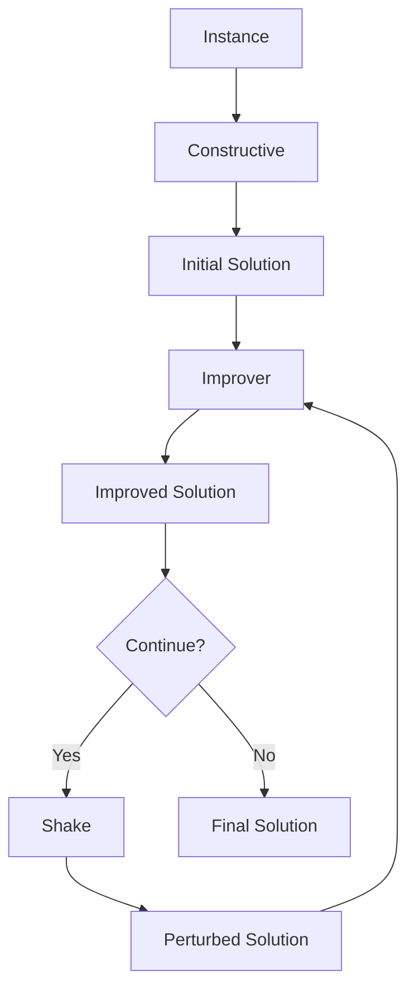

# List of Algorithm Components

This page provides a comprehensive overview of all algorithm components available in the Mork framework. Components are organized by their role in the optimization process.

## Metaheuristics

High-level algorithmic strategies that guide the search process. These are the main algorithms you'll use to solve optimization problems.

| Algorithm | Description | Documentation |
|-----------|-------------|---------------|
| **Variable Neighborhood Search (VNS)** | Systematically changes neighborhood structures to escape local optima | [VNS Documentation](metaheuristics/vns.md) |
| **Simulated Annealing (SA)** | Temperature-based probabilistic technique inspired by metallurgy | [SA Documentation](metaheuristics/simulated-annealing.md) |
| **Iterated Greedy (IG)** | Destruction-reconstruction metaheuristic that iteratively destroys and rebuilds solutions | [IG Documentation](metaheuristics/iterated-greedy.md) |
| **Scatter Search** | Population-based metaheuristic using reference sets and solution combination | [Scatter Search Documentation](metaheuristics/scatter-search.md) |
| **Multi-Start Algorithm** | Simple but effective strategy that runs constructive+improvement methods multiple times | [Multi-Start Documentation](metaheuristics/multi-start.md) |
| **Variable Neighborhood Descent (VND)** | Systematic exploration of multiple neighborhood structures in a descent manner | [VND Documentation](metaheuristics/vnd.md) |

## Constructive Methods

Components that build initial solutions from scratch. These methods create feasible solutions that can then be improved.

| Constructor | Description | Documentation |
|-------------|-------------|---------------|
| **Constructive (Base)** | Abstract base class for all constructive methods | [Constructive Documentation](constructors/constructive.md) |
| **GRASP Constructive** | Greedy Randomized Adaptive Search Procedure for construction phase | [GRASP Documentation](constructors/grasp.md) |
| **Greedy Random GRASP** | GRASP variant that builds solutions element by element with randomized greedy selection | [Greedy Random Documentation](constructors/greedy-random-grasp.md) |
| **Random Greedy GRASP** | GRASP variant that randomizes the order before applying greedy selection | [Random Greedy Documentation](constructors/random-greedy-grasp.md) |
| **Reconstructive** | Specialized constructor for rebuilding partially destroyed solutions | [Reconstructive Documentation](constructors/reconstructive.md) |

## Improvement Methods

Components that take a solution and try to improve it. These methods cannot return worse solutions than their input.

| Improver | Description | Documentation |
|----------|-------------|---------------|
| **Improver (Base)** | Abstract base class for all improvement methods | [Improver Documentation](improvers/improver.md) |
| **Local Search** | Base class for local search algorithms that explore solution neighborhoods | [Local Search Documentation](improvers/local-search.md) |
| **Best Improvement LS** | Local search that always picks the best move in the neighborhood | [Best Improvement Documentation](improvers/best-improvement.md) |
| **First Improvement LS** | Local search that applies the first improving move found | [First Improvement Documentation](improvers/first-improvement.md) |
| **Simulated Annealing (as Improver)** | SA can be used as an improvement method with temperature-based acceptance | [SA Documentation](metaheuristics/simulated-annealing.md) |

## Shake/Perturbation Methods

Components that perturb solutions to escape local optima. Unlike improvers, these can worsen the solution.

| Shake Method | Description | Documentation |
|--------------|-------------|---------------|
| **Shake (Base)** | Abstract base class for all perturbation methods | [Shake Documentation](shakes/shake.md) |
| **Destructive** | Interface for destruction operators that remove parts of a solution | [Destructive Documentation](shakes/destructive.md) |
| **Destroy-Rebuild** | Combined operator that destroys part of a solution and rebuilds it | [Destroy-Rebuild Documentation](shakes/destroy-rebuild.md) |
| **Random Move Shake** | Simple perturbation that applies random moves to the solution | [Random Move Documentation](shakes/random-move.md) |

## Component Integration

All components follow a consistent design pattern and can be combined flexibly:



## Using Components

Components are designed to be:

- **Modular**: Each component has a single, well-defined responsibility
- **Composable**: Components can be combined in different ways to create complex algorithms
- **Reusable**: The same component can be used in multiple algorithms
- **Extensible**: Easy to create new components by extending existing ones

### Example: Building a GRASP Algorithm

```java
// Create components
var constructor = new MyGRASPConstructive(0.3); // alpha = 0.3
var improver = new MyLocalSearch();

// Combine into an algorithm
var grasp = new MultiStartAlgorithm<>(
    "GRASP",
    constructor,
    improver,
    100  // iterations
);
```

### Example: Building VNS

```java
var vns = new VNSBuilder<MySolution, MyInstance>()
    .withConstructive(new MyConstructive())
    .withImprover(new MyLocalSearch())
    .withShake(new MyShake())
    .withNeighChange(5)  // kmax = 5
    .build("VNS");
```

## Advanced Topics

### Component Autodetection

Components are automatically detected by the framework when annotated with `@AlgorithmComponent` or when extending framework-provided base classes.

### Automatic Algorithm Configuration

Components can be automatically configured using irace integration. See [irace documentation](../../features/irace.md) for details.

### Custom Component Types

You can create your own component hierarchies by extending existing types or creating new ones. See [intro documentation](intro.md#creating-custom-types) for more information.