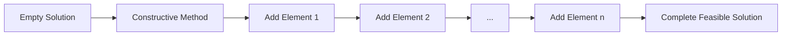

# Constructive Methods

Constructive methods (also called construction heuristics) build solutions from scratch. They start with an empty or partial solution and incrementally add elements until a complete, feasible solution is obtained.

## Overview

All constructive methods in Mork extend the `Constructive<S, I>` base class and must implement the `construct` method that takes a solution (usually empty) and returns a complete, feasible solution.



## Base Constructive Interface

```java
public abstract class Constructive<S extends Solution<S, I>, I extends Instance> 
        extends AlgorithmComponent {
    
    /**
     * Construct a complete solution from the given (usually empty) solution
     * @param solution Starting solution, typically empty
     * @return Complete, feasible solution
     */
    public abstract S construct(S solution);
}
```

## Common Construction Strategies

### 1. Random Construction

Build solutions by randomly selecting elements:

```java
public class RandomConstructive<S extends Solution<S, I>, I extends Instance> 
        extends Constructive<S, I> {
    
    @Override
    public S construct(S solution) {
        while (!solution.isComplete()) {
            var candidates = solution.getAvailableElements();
            var random = candidates.get(ThreadLocalRandom.current().nextInt(candidates.size()));
            solution.add(random);
        }
        return solution;
    }
}
```

### 2. Greedy Construction

Build solutions by always selecting the best available element:

```java
public class GreedyConstructive<S extends Solution<S, I>, I extends Instance> 
        extends Constructive<S, I> {
    
    @Override
    public S construct(S solution) {
        while (!solution.isComplete()) {
            var candidates = solution.getAvailableElements();
            var best = candidates.stream()
                .min(Comparator.comparingDouble(c -> evaluateCost(solution, c)))
                .orElseThrow();
            solution.add(best);
        }
        return solution;
    }
    
    protected double evaluateCost(S solution, Element element) {
        // Problem-specific evaluation
        return element.getCost();
    }
}
```

### 3. GRASP Construction

See [GRASP documentation](grasp.md) for details on Greedy Randomized Adaptive Search Procedure.

## How to Use

### As Part of an Algorithm

```java
// Use in a multi-start algorithm
var constructor = new MyGreedyConstructive();
var improver = new MyLocalSearch();

var multiStart = new MultiStartAlgorithm<>(
    "GRASP",
    constructor,
    improver,
    100  // iterations
);
```

### Standalone

```java
// Build a single solution
var constructor = new MyRandomConstructive();
var instance = loadInstance();
var solution = constructor.construct(newSolution(instance));
```

### In VNS

```java
var vns = new VNSBuilder<MySolution, MyInstance>()
    .withConstructive(new MyGreedyConstructive())  // Initial solution
    .withImprover(new MyLocalSearch())
    .withShake(new MyShake())
    .build("VNS");
```

## Implementation Guidelines

### Solution Feasibility

**Critical**: Constructive methods MUST return feasible solutions. The framework validates this in development mode.

```java
@Override
public S construct(S solution) {
    while (!solution.isComplete()) {
        var element = selectNext(solution);
        solution.add(element);
    }
    
    // Framework automatically validates feasibility
    assert solution.isFeasible() : "Constructed solution must be feasible";
    
    return solution;
}
```

### Candidate List Management

Efficiently manage which elements can still be added:

```java
public abstract class ListBasedConstructive<S extends Solution<S, I>, I extends Instance> 
        extends Constructive<S, I> {
    
    @Override
    public S construct(S solution) {
        var candidateList = initializeCandidateList(solution);
        
        while (!candidateList.isEmpty()) {
            var selected = selectFromCandidateList(candidateList, solution);
            solution.add(selected);
            updateCandidateList(candidateList, selected, solution);
        }
        
        return solution;
    }
    
    protected abstract List<Element> initializeCandidateList(S solution);
    protected abstract Element selectFromCandidateList(List<Element> candidates, S solution);
    protected abstract void updateCandidateList(List<Element> candidates, Element selected, S solution);
}
```

### Performance Considerations

```java
// Efficient: pre-calculate evaluation data
public class EfficientGreedy<S extends Solution<S, I>, I extends Instance> 
        extends Constructive<S, I> {
    
    @Override
    public S construct(S solution) {
        // Pre-calculate costs once
        Map<Element, Double> costs = calculateAllCosts(solution);
        
        while (!solution.isComplete()) {
            var best = costs.entrySet().stream()
                .filter(e -> isAvailable(e.getKey(), solution))
                .min(Map.Entry.comparingByValue())
                .map(Map.Entry::getKey)
                .orElseThrow();
            
            solution.add(best);
            
            // Incrementally update affected costs only
            updateAffectedCosts(costs, best, solution);
        }
        
        return solution;
    }
}
```

## Types of Constructive Methods

Mork provides several specialized constructive method types:

| Type | Description | Link |
|------|-------------|------|
| **GRASP** | Randomized greedy with restricted candidate lists | [GRASP](grasp.md) |
| **Reconstructive** | Rebuilds partially destroyed solutions | [Reconstructive](reconstructive.md) |
| **Greedy Random GRASP** | Element-by-element GRASP | [Greedy Random](greedy-random-grasp.md) |
| **Random Greedy GRASP** | Randomize-then-greedy GRASP | [Random Greedy](random-greedy-grasp.md) |

## Related Java Classes

- **[`Constructive<S, I>`](../../../../apidocs/es/urjc/etsii/grafo/create/Constructive.html)**: Base class for all constructive methods
- **[`GRASPConstructive<S, I>`](../../../../apidocs/es/urjc/etsii/grafo/create/grasp/GRASPConstructive.html)**: Base for GRASP constructive methods
- **[`Reconstructive<S, I>`](../../../../apidocs/es/urjc/etsii/grafo/create/Reconstructive.html)**: Base for reconstruction methods
- **[`Algorithm<S, I>`](../../../../apidocs/es/urjc/etsii/grafo/algorithm/Algorithm.html)**: Base algorithm class

## Example Use Cases

### TSP Nearest Neighbor

```java
public class NearestNeighborTSP extends Constructive<TSPSolution, TSPInstance> {
    
    @Override
    public TSPSolution construct(TSPSolution solution) {
        int current = 0;  // Start from depot
        solution.addCity(current);
        
        while (!solution.isComplete()) {
            int nearest = findNearestUnvisited(solution, current);
            solution.addCity(nearest);
            current = nearest;
        }
        
        return solution;
    }
    
    private int findNearestUnvisited(TSPSolution solution, int from) {
        var instance = solution.getInstance();
        return IntStream.range(0, instance.numberOfCities())
            .filter(city -> !solution.contains(city))
            .boxed()
            .min(Comparator.comparingDouble(city -> instance.distance(from, city)))
            .orElseThrow();
    }
}
```

### Knapsack Value/Weight Greedy

```java
public class ValueDensityKnapsack extends Constructive<KnapsackSolution, KnapsackInstance> {
    
    @Override
    public KnapsackSolution construct(KnapsackSolution solution) {
        var instance = solution.getInstance();
        
        // Sort items by value/weight ratio
        var items = instance.getItems().stream()
            .sorted(Comparator.comparingDouble(
                item -> -item.getValue() / (double) item.getWeight()
            ))
            .toList();
        
        // Add items until capacity reached
        for (var item : items) {
            if (solution.canAdd(item)) {
                solution.add(item);
            }
        }
        
        return solution;
    }
}
```

## Best Practices

1. **Always return feasible solutions**: This is mandatory
2. **Efficient data structures**: Use appropriate data structures for candidate management
3. **Incremental evaluation**: Update costs incrementally when possible
4. **Problem-specific knowledge**: Leverage domain knowledge for better construction
5. **Deterministic vs random**: Provide both deterministic (for testing) and random variants
6. **Parameter tuning**: Allow parameterization (e.g., GRASP alpha)

## References

[1] Resende, M. G., & Ribeiro, C. C. (2003). Greedy randomized adaptive search procedures. In *Handbook of Metaheuristics* (pp. 219-249). Springer.

[2] Blum, C., & Roli, A. (2003). Metaheuristics in combinatorial optimization: Overview and conceptual comparison. *ACM Computing Surveys*, 35(3), 268-308.

[3] Papadimitriou, C. H., & Steiglitz, K. (1998). *Combinatorial optimization: algorithms and complexity*. Courier Corporation.
