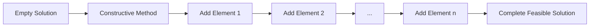

# Constructive Methods

Constructive methods (also called construction heuristics) build solutions from scratch. They start with an empty or partial solution and incrementally add elements until a complete, feasible solution is obtained.

## Overview

All constructive methods in Mork extend the `Constructive<S, I>` base class and must implement the `construct` method that takes a solution (usually empty) and returns a complete, feasible solution.


```mermaid
graph LR
    A[Empty Solution] --> B[Constructive Method]
    B --> C[Add Element 1]
    C --> D[Add Element 2]
    D --> E[...]
    E --> F[Add Element n]
    F --> G[Complete Feasible Solution]
```

## Common Construction Strategies

### 1. Random Construction

Build solutions by randomly selecting elements:

```java
public class RandomConstructive extends Constructive<MySolution, MyInstance> {

    /**
     * Example simple constructive method that takes a list of unassigned elements from the solution
     * and randomly chooses them until the solution is feasible or complete.
     * @param solution empty solution
     * @return feasible solution
     */
    @Override
    public MySolution construct(MySolution solution) {
        var rnd = RandomManager.getRandom();
        while (!solution.isComplete()) {
            var candidates = solution.getAvailableElements();
            var i = rnd.nextInt(candidates.size());
            solution.add(candidates.get(i));
        }
        return solution;
    }
}
```

### 2. Greedy Construction

Build solutions by always selecting the best available element:

```java
public class GreedyConstructive extends Constructive<MySolution, MyInstance> {

    /**
     * Simple constructive that takes the best available candidate and assigns it
     * @param solution empty solution
     * @return feasible solution
     */
    @Override
    public MySolution construct(MySolution solution) {
        while (!solution.isComplete()) {
            var candidates = solution.getAvailableElements();
            MySolution best = null;
            for(var candidate: candidates){
                if(best == null || candidate.isBetterThan(best)){ 
                    // isBetterThan to be implemented by the user, can be a direct comparison using > < etc. or use the Objective object.
                    best = candidate;
                }
            }
            
            solution.add(best);
        }
        return solution;
    }
}
```

### 3. GRASP Construction

See [GRASP documentation](grasp.md) for details on Greedy Randomized Adaptive Search Procedure.

## How to Use

### As Part of an Algorithm

```java
// Use in a multi-start algorithm
var constructor = new MyGreedyConstructive();
var improver = new MyLocalSearch();

var multiStart = new MultiStartAlgorithm<>(
    "GRASP",
    constructor,
    improver,
    100  // iterations
);
```

### Standalone

```java
// Build a single solution
var constructor = new MyRandomConstructive();
var instance = loadInstance();
var solution = constructor.construct(newSolution(instance));
```

## Best Practices

1. Constructive methods MUST return feasible solutions. The framework validates this and will complain if any solution is not feasible after the construction phase.
2. We recommend implementing Moves to model changes to the solution, and use them in the constructive methods. This is not mandatory. // TODO document example using addmove.
3. Do create parameters to configure the constructive behaviour, and expose them in the class constructor. Configuration parameters should be final. If using autoconfig, annotate them with `@*Param` annotations so the autoconfig module can infer the correct usage of your classes. See [Autoconfig](../../../features/autoconfig.md) for the full annotation reference.
4. Do NOT store state as fields in the constructive class. All state must be either as local variables, or in the solution class. It will never work as you expect.
