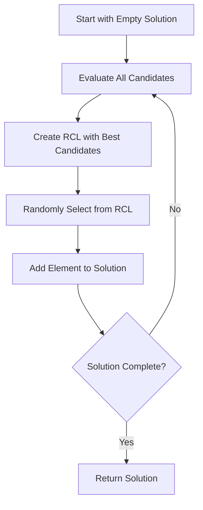

# GRASP Constructive

GRASP (Greedy Randomized Adaptive Search Procedure) is a construction method that combines greedy selection with randomization. It builds solutions iteratively by selecting elements from a Restricted Candidate List (RCL) that contains the best available options.

## Overview

GRASP construction balances between pure greedy (deterministic) and pure random (too exploratory) by restricting choices to high-quality candidates and then selecting randomly among them.



## Key Concept: Restricted Candidate List (RCL)

The RCL contains elements that are "good enough" according to a threshold parameter alpha (α):

- **α = 0**: Pure greedy (only best element in RCL)
- **α = 1**: Pure random (all elements in RCL)
- **α ∈ (0, 1)**: Restricted randomization (typical: 0.1-0.5)

### RCL Construction Methods

**Cardinality-based**: Include top k elements
```
RCL = {k best elements}
```

**Value-based** (most common): Include elements within threshold
```
RCL = {e : cost(e) ≤ min_cost + α × (max_cost - min_cost)}
```

## Algorithm Outline

```
GRASP-Construct(alpha):
    solution = empty
    
    while (solution not complete) {
        CL = getCandidateList(solution)
        costs = evaluate(CL, solution)
        
        min_cost = min(costs)
        max_cost = max(costs)
        threshold = min_cost + alpha * (max_cost - min_cost)
        
        RCL = {e in CL : costs[e] <= threshold}
        selected = randomSelect(RCL)
        
        solution.add(selected)
    }
    
    return solution
```

## How to Use

### Basic Example

```java
// Define how to evaluate candidates
public class MyGRASPConstructive 
        extends GRASPConstructive<MySolution, MyInstance> {
    
    public MyGRASPConstructive(double alpha) {
        super("MyGRASP", alpha);
    }
    
    @Override
    protected List<Element> getCandidateList(MySolution solution) {
        // Return all elements that can be added
        return solution.getAvailableElements();
    }
    
    @Override
    protected double evaluateElement(Element element, MySolution solution) {
        // Return cost of adding this element
        // Lower is better
        return solution.evaluateAddition(element);
    }
    
    @Override
    protected void addElement(MySolution solution, Element element) {
        // Add the selected element to solution
        solution.add(element);
    }
}

// Use it
var grasp = new MyGRASPConstructive(0.3);  // alpha = 0.3
var solution = grasp.construct(newSolution(instance));
```

### Cardinality-Based RCL

```java
public class CardinalityGRASP<S extends Solution<S, I>, I extends Instance> 
        extends GRASPConstructive<S, I> {
    
    private final int rclSize;
    
    public CardinalityGRASP(int rclSize) {
        super("CardinalityGRASP", 0.0);  // alpha not used
        this.rclSize = rclSize;
    }
    
    @Override
    protected List<Element> buildRCL(List<Element> candidates, 
                                     Map<Element, Double> costs) {
        // Return top k candidates
        return candidates.stream()
            .sorted(Comparator.comparingDouble(costs::get))
            .limit(rclSize)
            .collect(Collectors.toList());
    }
    
    @Override
    protected List<Element> getCandidateList(S solution) {
        return solution.getAvailableElements();
    }
    
    @Override
    protected double evaluateElement(Element element, S solution) {
        return solution.evaluateAddition(element);
    }
    
    @Override
    protected void addElement(S solution, Element element) {
        solution.add(element);
    }
}
```

### With Adaptive Alpha

```java
public class AdaptiveGRASP<S extends Solution<S, I>, I extends Instance> 
        extends GRASPConstructive<S, I> {
    
    private double[] alphaValues = {0.0, 0.1, 0.3, 0.5, 0.7, 1.0};
    private int[] alphaScores;
    private int iteration = 0;
    
    public AdaptiveGRASP() {
        super("AdaptiveGRASP", 0.3);  // Initial alpha
        this.alphaScores = new int[alphaValues.length];
    }
    
    @Override
    public S construct(S solution) {
        // Select alpha based on past performance
        int alphaIndex = selectAlphaIndex();
        this.alpha = alphaValues[alphaIndex];
        
        S result = super.construct(solution);
        
        // Update alpha scores based on solution quality
        updateAlphaScore(alphaIndex, result.getScore());
        iteration++;
        
        return result;
    }
    
    private int selectAlphaIndex() {
        if (iteration < alphaValues.length * 10) {
            // Exploration phase: round-robin
            return iteration % alphaValues.length;
        } else {
            // Exploitation: select best alpha with some randomization
            return selectWeightedRandom(alphaScores);
        }
    }
}
```

## GRASP Variants

### 1. Greedy Random GRASP

See [Greedy Random GRASP](greedy-random-grasp.md) - builds solution element by element with GRASP selection at each step.

### 2. Random Greedy GRASP

See [Random Greedy GRASP](random-greedy-grasp.md) - randomizes element order first, then applies greedy selection.

### 3. Reactive GRASP

Adapts alpha based on solution quality:

```java
public class ReactiveGRASP<S extends Solution<S, I>, I extends Instance> 
        extends GRASPConstructive<S, I> {
    
    @Override
    public S construct(S solution) {
        // Adjust alpha based on recent solution quality
        adjustAlpha();
        return super.construct(solution);
    }
    
    private void adjustAlpha() {
        // If recent solutions are poor, increase diversification
        if (averageRecentQuality < targetQuality) {
            alpha = Math.min(1.0, alpha + 0.1);
        } else {
            alpha = Math.max(0.0, alpha - 0.05);
        }
    }
}
```

## Implementation Notes

### Efficient RCL Management

```java
// Efficient: pre-sort and threshold
public class EfficientGRASP<S extends Solution<S, I>, I extends Instance> 
        extends GRASPConstructive<S, I> {
    
    @Override
    protected List<Element> buildRCL(List<Element> candidates, 
                                     Map<Element, Double> costs) {
        if (candidates.isEmpty()) return candidates;
        
        // Find min and max costs
        double minCost = Double.MAX_VALUE;
        double maxCost = Double.MIN_VALUE;
        for (double cost : costs.values()) {
            minCost = Math.min(minCost, cost);
            maxCost = Math.max(maxCost, cost);
        }
        
        // Build RCL with threshold
        double threshold = minCost + alpha * (maxCost - minCost);
        return candidates.stream()
            .filter(c -> costs.get(c) <= threshold)
            .collect(Collectors.toList());
    }
}
```

### Incremental Evaluation

```java
public abstract class IncrementalGRASP<S extends Solution<S, I>, I extends Instance> 
        extends GRASPConstructive<S, I> {
    
    private Map<Element, Double> cachedCosts;
    
    @Override
    public S construct(S solution) {
        cachedCosts = new HashMap<>();
        // Initialize all costs
        for (Element e : solution.getAllElements()) {
            cachedCosts.put(e, evaluateElement(e, solution));
        }
        
        return super.construct(solution);
    }
    
    @Override
    protected void addElement(S solution, Element element) {
        super.addElement(solution, element);
        // Only update affected elements' costs
        updateAffectedCosts(element, solution);
    }
    
    protected abstract void updateAffectedCosts(Element added, S solution);
}
```

## Parameter Tuning

### Recommended Alpha Values

| α Value | Behavior | Use Case |
|---------|----------|----------|
| 0.0 | Pure greedy | Quick, deterministic solutions |
| 0.1-0.2 | Slightly random | Good balance, small search space |
| 0.3-0.5 | Balanced | General purpose, most common |
| 0.6-0.8 | More random | Large search space, more diversity |
| 1.0 | Pure random | Maximum diversity, weak solutions |

### Auto-tuning Alpha

```java
// Use irace for automatic configuration
@AutoconfigConstructor
public class TunableGRASP<S extends Solution<S, I>, I extends Instance> 
        extends GRASPConstructive<S, I> {
    
    public TunableGRASP(
        @Param(min = 0.0, max = 1.0) double alpha) {
        super("TunableGRASP", alpha);
    }
    
    // Implementation...
}
```

## Related Java Classes

- **[`GRASPConstructive<S, I>`](../../../../apidocs/es/urjc/etsii/grafo/create/grasp/GRASPConstructive.html)**: Base class for GRASP constructors
- **[`GreedyRandomGRASPConstructive<S, I>`](../../../../apidocs/es/urjc/etsii/grafo/create/grasp/GreedyRandomGRASPConstructive.html)**: Element-by-element GRASP
- **[`RandomGreedyGRASPConstructive<S, I>`](../../../../apidocs/es/urjc/etsii/grafo/create/grasp/RandomGreedyGRASPConstructive.html)**: Randomize-then-greedy
- **[`GRASPListManager<S, I>`](../../../../apidocs/es/urjc/etsii/grafo/create/grasp/GRASPListManager.html)**: Manages candidate lists

## Example Use Cases

### TSP with GRASP

```java
public class TSPGRASPConstructive extends GRASPConstructive<TSPSolution, TSPInstance> {
    
    public TSPGRASPConstructive(double alpha) {
        super("TSP-GRASP", alpha);
    }
    
    @Override
    protected List<City> getCandidateList(TSPSolution solution) {
        return solution.getUnvisitedCities();
    }
    
    @Override
    protected double evaluateElement(City city, TSPSolution solution) {
        // Cost = distance from current city
        return solution.getInstance().distance(solution.getCurrentCity(), city);
    }
    
    @Override
    protected void addElement(TSPSolution solution, City city) {
        solution.visit(city);
    }
}
```

### Job Scheduling with GRASP

```java
public class SchedulingGRASP extends GRASPConstructive<ScheduleSolution, ScheduleInstance> {
    
    @Override
    protected List<Job> getCandidateList(ScheduleSolution solution) {
        return solution.getUnscheduledJobs();
    }
    
    @Override
    protected double evaluateElement(Job job, ScheduleSolution solution) {
        // Minimize completion time
        return solution.evaluateJobInsertion(job);
    }
    
    @Override
    protected void addElement(ScheduleSolution solution, Job job) {
        solution.scheduleJob(job);
    }
}
```

## Best Practices

1. **Alpha tuning**: Start with α ∈ [0.2, 0.4] and tune based on results
2. **Efficient evaluation**: Cache and incrementally update element costs
3. **Appropriate RCL**: Use value-based for continuous costs, cardinality for discrete
4. **Combine with LS**: GRASP typically followed by local search (GRASP = Construction + LS loop)
5. **Monitor RCL size**: Too small → greedy, too large → random
6. **Problem-specific costs**: Use domain knowledge for better evaluation functions

## References

[1] Feo, T. A., & Resende, M. G. (1995). Greedy randomized adaptive search procedures. *Journal of Global Optimization*, 6(2), 109-133.

[2] Resende, M. G., & Ribeiro, C. C. (2003). Greedy randomized adaptive search procedures. In *Handbook of Metaheuristics* (pp. 219-249). Springer.

[3] Prais, M., & Ribeiro, C. C. (2000). Reactive GRASP: An application to a matrix decomposition problem in TDMA traffic assignment. *INFORMS Journal on Computing*, 12(3), 164-176.
