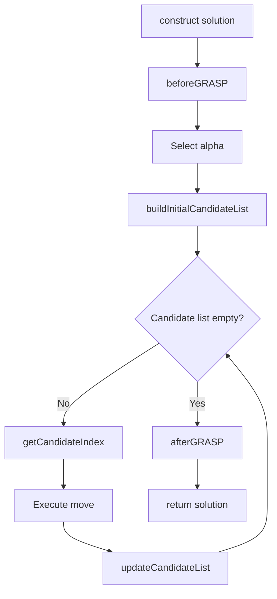

# GRASP Constructive

GRASP (Greedy Randomized Adaptive Search Procedure) is a constructive method that balances **solution quality** and **diversification**. In Mork, a GRASP constructor builds a candidate list of moves, selects one move with a configurable strategy, executes it, and refreshes the candidate list until no more moves are available.

## Overview


```mermaid
graph TD
    A[construct solution] --> B[beforeGRASP]
    B --> C[Select alpha]
    C --> D[buildInitialCandidateList]
    D --> E{Candidate list empty?}
    E -->|No| F[getCandidateIndex]
    F --> H[Execute move]
    H --> I[updateCandidateList]
    I --> E
    E -->|Yes| J[afterGRASP]
    J --> K[return solution]
```


Mork provides GRASP as a configurable constructive method built from three pieces:

- `GraspBuilder<M, S, I>`: chooses the GRASP strategy and alpha configuration.
- `GRASPListManager<M, S, I>`: builds and updates the candidate list after each move.
- `Objective<M, S, I>`: evaluates candidate moves and determines whether the problem is being minimized or maximized.


## How Mork GRASP works

All GRASP constructors in Mork extend `GRASPConstructive<M, S, I>`. The framework flow is:

```text
construct(solution):
    listManager.beforeGRASP(solution) 
    alpha = alphaProvider.getAlpha()
    candidateList = listManager.buildInitialCandidateList(solution)

    while candidateList is not empty:
        index = strategy.getCandidateIndex(alpha, candidateList)
        move = candidateList.get(index)
        move.execute(solution)
        candidateList = listManager.updateCandidateList(solution, move, candidateList, index)

    listManager.afterGRASP(solution) 
    return solution
```

`beforeGRASP` and `afterGRASP` do nothing by default, but are ideal hook points where you can provide any piece of code to be executed before the main GRASP loop, or after the main loop finishes.

Implementation details:

1. The process stops when the candidate list becomes empty, so your `GRASPListManager` defines when construction is finished.
2. The candidate list is never sorted for performance reasons.
3. The strategy decides **which move** to execute from the current candidate list; it does not create moves by itself. There are two strategies available by default: random-greedy and greedy-random.
4. alphaProvider generates an alpha value for the current construction. See below why and the strategies available. When using fixed values, `alpha = 0` means greedy, and `alpha = 1` fully random

## Configuring a GRASP constructor

The recommended way to initialize a GRASP constructive is by using the `GraspBuilder` class, for example:

```java
var constructive = new GraspBuilder<MyMove, MySolution, MyInstance>()
    .withStrategyGreedyRandom()
    .withAlphaValue(0.30)
    .withListManager(new MyListManager())
    .build();
```

### Alpha values

Alpha is always in the range `[0, 1]`:

- `alpha = 0`: greedy behavior.
- `alpha = 1`: random behavior.
- intermediate values: trade off greediness and diversification.

You can configure alpha in three ways:

- `.withAlphaValue(0.30)`: fixed alpha, never changes in repeated construction invocations.
- `.withAlphaInRange(0.10, 0.40)`: sample one alpha value per construction, with the min and max values provided. 
- `.withAlphaProvider(...)`: custom adaptive or reactive strategy.

You can also set a specific greedy function to use with GRASP with `.withObjective(...)`. If you do not override the objective, the builder uses the current main objective from the current execution context.

## Strategy specifics

### Greedy Random GRASP

Greedy Random GRASP evaluates the full candidate list, keeps the moves whose score is close enough to the best one, and then picks **one random move from that restricted candidate list**.

- for minimization, the acceptance limit is `min + alpha * (max - min)`;
- for maximization, the acceptance limit is `max + alpha * (min - max)`.

A move is accepted into the restricted candidate list when its value is **at least as good as
the limit**, evaluated with `objective.isBetterOrEqual(value, limit)`. Because the check is
direction-aware, for maximization this means `value >= limit`, while for minimization it means
`value <= limit`. A random move is then returned from the restricted candidate list.

Builder example:

```java
var constructive = new GraspBuilder<MyMove, MySolution, MyInstance>()
    .withStrategyGreedyRandom()
    .withAlphaValue(0.25)
    .withListManager(new MyListManager())
    .build();
```

### Random Greedy GRASP

Random Greedy GRASP flips the order of decisions: it first creates a **random subset** of the candidate list and then picks the **best move inside that subset**. If the subset is empty, it falls back to a random move.

```text
RandomGreedy(alpha, candidateList):
    build random subset from candidateList
    if subset is empty:
        return a random move
    bestMoves = all subset moves tied with the best score
    return a random move from bestMoves
```

Builder example:

```java
var constructive = new GraspBuilder<MyMove, MySolution, MyInstance>()
    .withStrategyRandomGreedy()
    .withAlphaInRange(0.10, 0.60)
    .withListManager(new MyListManager())
    .build();
```

## Implementing the candidate list manager

`GRASPListManager` is where you define how moves are created and refreshed.

```java
public class MyListManager extends GRASPListManager<MyMove, MySolution, MyInstance> {

    @Override
    public void beforeGRASP(MySolution solution) {
        // optional, can be empty, same as afterGRASP
    }

    @Override
    public List<MyMove> buildInitialCandidateList(MySolution solution) {
        return solution.getUnassignedJobs().stream()
            .map(job -> new AssignJobMove(solution, job))
            .toList();
    }

    @Override
    public List<MyMove> updateCandidateList(
            MySolution solution,
            MyMove move,
            List<MyMove> candidateList,
            int index) {
        return solution.getUnassignedJobs().stream()
            .map(job -> new AssignJobMove(solution, job))
            .toList();
    }
}
```

## Using GRASP inside an algorithm

GRASP is usually paired with an improver such as local search, because the constructive phase gives you a diversified starting solution and the improvement phase intensifies around it.

```java
var constructive = new GraspBuilder<MyMove, MySolution, MyInstance>()
    .withStrategyGreedyRandom()
    .withAlphaValue(0.30)
    .withListManager(new MyListManager())
    .build();

// MultiStartAlgorithm wraps another Algorithm: build the base algorithm first...
var base = new SimpleAlgorithm<>("GRASP", constructive, new MyLocalSearch());
// ...and then wrap it, configuring the number of iterations through the builder
var algorithm = new MultiStartAlgorithmBuilder<MySolution, MyInstance>()
    .withMaxIterations(100)
    .build(base);
```


## Best practices

1. Keep the candidate list feasible: if a move cannot be executed, it should not be in the candidate list.
2. Put problem-specific logic in the list manager and moves, not in the constructor itself.
