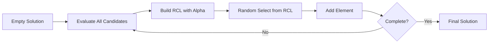

# Greedy Random GRASP

Greedy Random GRASP is a variant of GRASP that builds solutions element by element, applying GRASP's randomized greedy selection at each construction step.

## Overview

This variant focuses on the **element-by-element** construction process, where each element added to the solution is selected using GRASP's RCL mechanism.



## Key Characteristics

- **Sequential construction**: Elements added one at a time
- **Adaptive selection**: RCL updated after each addition
- **Incremental evaluation**: Costs recalculated as solution grows

## Algorithm Outline

```
GreedyRandomGRASP(alpha):
    solution = empty
    
    while (solution not complete) {
        candidates = getAvailableCandidates(solution)
        costs = evaluateAll(candidates, solution)
        
        rcl = buildRCL(candidates, costs, alpha)
        selected = randomSelect(rcl)
        
        add(selected, solution)
    }
    
    return solution
```

## How to Use

### Basic Implementation

```java
public class MyGreedyRandomGRASP 
        extends GreedyRandomGRASPConstructive<MySolution, MyInstance> {
    
    public MyGreedyRandomGRASP(double alpha) {
        super(alpha);
    }
    
    @Override
    protected List<Element> getCandidates(MySolution solution) {
        // Return elements that can still be added
        return solution.getAvailableElements();
    }
    
    @Override
    protected double evaluate(Element element, MySolution solution) {
        // Cost of adding this element given current solution state
        return solution.evaluateIncrementalCost(element);
    }
    
    @Override
    protected void add(Element element, MySolution solution) {
        solution.addElement(element);
    }
}
```

### Usage Example

```java
// Create constructor
var constructor = new MyGreedyRandomGRASP(0.3);

// Use in algorithm
var grasp = new MultiStartAlgorithm<>(
    "GRASP",
    constructor,
    new MyLocalSearch(),
    100  // iterations
);
```

## Comparison with Standard GRASP

| Aspect | Greedy Random GRASP | Standard GRASP |
|--------|---------------------|----------------|
| **Construction** | Element-by-element | Can be batch or element-wise |
| **RCL Updates** | After each element | Typically after each element |
| **Implementation** | Provided by framework | Abstract base to implement |
| **Use Case** | Most construction problems | General purpose |

## Implementation Notes

### Performance Optimization

```java
public class EfficientGreedyRandomGRASP<S extends Solution<S, I>, I extends Instance>
        extends GreedyRandomGRASPConstructive<S, I> {
    
    private Map<Element, Double> costCache;
    
    @Override
    public S construct(S solution) {
        costCache = new HashMap<>();
        return super.construct(solution);
    }
    
    @Override
    protected double evaluate(Element element, S solution) {
        // Use cached cost if available and not invalidated
        return costCache.computeIfAbsent(element, 
            e -> solution.evaluateIncrementalCost(e));
    }
    
    @Override
    protected void add(Element element, S solution) {
        super.add(element, solution);
        // Invalidate affected cached costs
        invalidateAffectedCosts(element);
    }
}
```

### With List Manager

```java
// Use GRASPListManager for efficient candidate management
var listManager = new GRASPListManager<MySolution, MyInstance>() {
    @Override
    public List<Element> initialize(MySolution solution) {
        return solution.getAllElements();
    }
    
    @Override
    public double evaluate(Element element, MySolution solution) {
        return solution.evaluateIncrementalCost(element);
    }
    
    @Override
    public void update(Element selected, MySolution solution) {
        // Remove selected and any now-invalid elements
        removeElement(selected);
        removeInvalidElements(solution);
    }
};

var constructor = new GreedyRandomGRASPConstructive<>(0.3, listManager);
```

## Related Java Classes

- **[`GreedyRandomGRASPConstructive<S, I>`](../../../../apidocs/es/urjc/etsii/grafo/create/grasp/GreedyRandomGRASPConstructive.html)**: Main implementation
- **[`GRASPConstructive<S, I>`](../../../../apidocs/es/urjc/etsii/grafo/create/grasp/GRASPConstructive.html)**: Base GRASP class
- **[`GRASPListManager<S, I>`](../../../../apidocs/es/urjc/etsii/grafo/create/grasp/GRASPListManager.html)**: Candidate list management
- **[`Constructive<S, I>`](../../../../apidocs/es/urjc/etsii/grafo/create/Constructive.html)**: Base constructive class

## Example Use Cases

### TSP Nearest Neighbor with Randomization

```java
public class TSPGreedyRandomGRASP 
        extends GreedyRandomGRASPConstructive<TSPSolution, TSPInstance> {
    
    @Override
    protected List<City> getCandidates(TSPSolution solution) {
        return solution.getUnvisitedCities();
    }
    
    @Override
    protected double evaluate(City city, TSPSolution solution) {
        return solution.getInstance()
            .distance(solution.getLastCity(), city);
    }
    
    @Override
    protected void add(City city, TSPSolution solution) {
        solution.addCity(city);
    }
}
```

### Knapsack Item Selection

```java
public class KnapsackGreedyRandomGRASP 
        extends GreedyRandomGRASPConstructive<KnapsackSolution, KnapsackInstance> {
    
    @Override
    protected List<Item> getCandidates(KnapsackSolution solution) {
        return solution.getUnselectedItems().stream()
            .filter(item -> solution.hasCapacityFor(item))
            .collect(Collectors.toList());
    }
    
    @Override
    protected double evaluate(Item item, KnapsackSolution solution) {
        // Minimize negative value/weight ratio (maximize ratio)
        return -item.getValue() / (double) item.getWeight();
    }
    
    @Override
    protected void add(Item item, KnapsackSolution solution) {
        solution.addItem(item);
    }
}
```

## Best Practices

1. **Efficient candidate management**: Update available candidates incrementally
2. **Incremental cost evaluation**: Avoid full re-evaluation at each step
3. **Alpha tuning**: Typical range 0.2-0.4 works well for most problems
4. **Cache when possible**: Store and update costs instead of recalculating
5. **Early termination**: Check feasibility constraints before full evaluation

## When to Use

**Good for:**
- Problems where each element addition significantly changes costs
- Sequential decision-making problems
- When incremental evaluation is much cheaper than batch evaluation

**Consider alternatives when:**
- All elements can be evaluated independently (use standard GRASP)
- Construction order doesn't matter much (use random greedy variant)

## References

[1] Feo, T. A., & Resende, M. G. (1995). Greedy randomized adaptive search procedures. *Journal of Global Optimization*, 6(2), 109-133.

[2] Resende, M. G., & Ribeiro, C. C. (2003). Greedy randomized adaptive search procedures. In *Handbook of Metaheuristics* (pp. 219-249). Springer.
