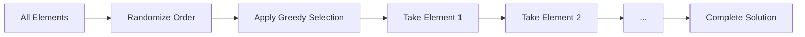

# Random Greedy GRASP

Random Greedy GRASP is a GRASP variant that first randomizes the order of elements, then applies greedy selection. This approach is useful when the construction order can be predetermined or randomized independently of element costs.

## Overview

Instead of evaluating and selecting elements one-by-one, this variant:
1. **Randomizes** the construction order first
2. **Applies greedy selection** within that randomized order



## Key Characteristics

- **Pre-randomization**: Order determined before construction
- **Greedy within order**: Select greedily respecting the randomized sequence
- **Faster**: Often requires fewer evaluations than element-by-element GRASP
- **Different diversity**: Exploration comes from order randomization, not selection

## Algorithm Outline

```
RandomGreedyGRASP(alpha):
    elements = getAllElements()
    randomizedOrder = randomize(elements, alpha)
    
    solution = empty
    for element in randomizedOrder {
        if (canAdd(element, solution)) {
            add(element, solution)
        }
    }
    
    return solution
```

## How to Use

### Basic Implementation

```java
public class MyRandomGreedyGRASP 
        extends RandomGreedyGRASPConstructive<MySolution, MyInstance> {
    
    public MyRandomGreedyGRASP(double alpha) {
        super(alpha);
    }
    
    @Override
    protected List<Element> getAllElements(MySolution solution) {
        // Return all possible elements
        return solution.getInstance().getAllElements();
    }
    
    @Override
    protected List<Element> randomizeOrder(List<Element> elements, double alpha) {
        // Create RCL and randomize order
        var costs = elements.stream()
            .collect(Collectors.toMap(e -> e, this::evaluateCost));
        
        double minCost = costs.values().stream().min(Double::compare).orElse(0.0);
        double maxCost = costs.values().stream().max(Double::compare).orElse(1.0);
        double threshold = minCost + alpha * (maxCost - minCost);
        
        // Separate into RCL and non-RCL
        var rcl = elements.stream()
            .filter(e -> costs.get(e) <= threshold)
            .collect(Collectors.toList());
        var rest = elements.stream()
            .filter(e -> costs.get(e) > threshold)
            .collect(Collectors.toList());
        
        // Shuffle RCL, then append rest
        Collections.shuffle(rcl);
        rcl.addAll(rest);
        return rcl;
    }
    
    @Override
    protected boolean canAdd(Element element, MySolution solution) {
        return solution.isFeasibleToAdd(element);
    }
    
    @Override
    protected void add(Element element, MySolution solution) {
        solution.addElement(element);
    }
}
```

### Simple Order Randomization

```java
public class SimpleRandomGreedyGRASP<S extends Solution<S, I>, I extends Instance>
        extends RandomGreedyGRASPConstructive<S, I> {
    
    @Override
    protected List<Element> randomizeOrder(List<Element> elements, double alpha) {
        // Simple: just shuffle with some bias towards better elements
        List<Element> result = new ArrayList<>(elements);
        
        if (alpha == 0.0) {
            // Pure greedy: sort by cost
            result.sort(Comparator.comparingDouble(this::evaluateCost));
        } else if (alpha == 1.0) {
            // Pure random: complete shuffle
            Collections.shuffle(result);
        } else {
            // Partial randomization: weighted shuffle
            weightedShuffle(result, alpha);
        }
        
        return result;
    }
    
    private void weightedShuffle(List<Element> elements, double alpha) {
        // Better elements have higher probability of appearing first
        // Implementation depends on problem specifics
    }
}
```

## Comparison with Other GRASP Variants

| Aspect | Random Greedy | Greedy Random | Standard GRASP |
|--------|---------------|---------------|----------------|
| **Randomization** | Before construction | During construction | During construction |
| **Evaluations** | Once | At each step | At each step |
| **Speed** | Fastest | Medium | Medium |
| **Diversity** | From order | From selection | From selection |
| **Best for** | Order-sensitive problems | Cost-sensitive problems | General purpose |

## Implementation Notes

### Efficient Batch Evaluation

```java
@Override
protected List<Element> randomizeOrder(List<Element> elements, double alpha) {
    // Evaluate all elements once in batch
    Map<Element, Double> costs = batchEvaluate(elements);
    
    // Use costs to create biased random order
    return createBiasedOrder(elements, costs, alpha);
}

private Map<Element, Double> batchEvaluate(List<Element> elements) {
    // Evaluate all elements in parallel if possible
    return elements.parallelStream()
        .collect(Collectors.toMap(
            e -> e,
            e -> evaluateCost(e)
        ));
}
```

### Adaptive Order Generation

```java
public class AdaptiveRandomGreedy<S extends Solution<S, I>, I extends Instance>
        extends RandomGreedyGRASPConstructive<S, I> {
    
    private List<Double> alphaValues = List.of(0.0, 0.25, 0.5, 0.75, 1.0);
    private Map<Double, Double> alphaQuality = new HashMap<>();
    
    @Override
    public S construct(S solution) {
        // Select alpha based on past performance
        double selectedAlpha = selectBestAlpha();
        
        S result = constructWithAlpha(solution, selectedAlpha);
        
        // Update alpha quality
        updateAlphaQuality(selectedAlpha, result.getScore());
        
        return result;
    }
}
```

## Related Java Classes

- **[`RandomGreedyGRASPConstructive<S, I>`](../../../../apidocs/es/urjc/etsii/grafo/create/grasp/RandomGreedyGRASPConstructive.html)**: Main implementation
- **[`GRASPConstructive<S, I>`](../../../../apidocs/es/urjc/etsii/grafo/create/grasp/GRASPConstructive.html)**: Base GRASP class
- **[`GreedyRandomGRASPConstructive<S, I>`](../../../../apidocs/es/urjc/etsii/grafo/create/grasp/GreedyRandomGRASPConstructive.html)**: Alternative variant
- **[`Constructive<S, I>`](../../../../apidocs/es/urjc/etsii/grafo/create/Constructive.html)**: Base constructive class

## Example Use Cases

### Graph Coloring

```java
public class ColoringRandomGreedyGRASP 
        extends RandomGreedyGRASPConstructive<ColoringSolution, GraphInstance> {
    
    @Override
    protected List<Vertex> getAllElements(ColoringSolution solution) {
        return solution.getInstance().getVertices();
    }
    
    @Override
    protected List<Vertex> randomizeOrder(List<Vertex> vertices, double alpha) {
        // Order by degree with randomization
        var sortedByDegree = vertices.stream()
            .sorted(Comparator.comparingInt(Vertex::getDegree).reversed())
            .collect(Collectors.toList());
        
        // Randomize top (1-alpha)% of list
        int rclSize = (int) ((1 - alpha) * vertices.size());
        Collections.shuffle(sortedByDegree.subList(0, rclSize));
        
        return sortedByDegree;
    }
    
    @Override
    protected void add(Vertex vertex, ColoringSolution solution) {
        solution.assignSmallestValidColor(vertex);
    }
}
```

### Bin Packing

```java
public class BinPackingRandomGreedyGRASP 
        extends RandomGreedyGRASPConstructive<BinSolution, BinInstance> {
    
    @Override
    protected List<Item> getAllElements(BinSolution solution) {
        return solution.getInstance().getItems();
    }
    
    @Override
    protected List<Item> randomizeOrder(List<Item> items, double alpha) {
        // Randomize order with bias towards larger items
        var sorted = items.stream()
            .sorted(Comparator.comparingInt(Item::getSize).reversed())
            .collect(Collectors.toList());
        
        // Apply alpha-based partial randomization
        applyPartialShuffle(sorted, alpha);
        return sorted;
    }
    
    @Override
    protected void add(Item item, BinSolution solution) {
        solution.packItemInBestBin(item);
    }
}
```

## Best Practices

1. **Choose based on problem**: Use when element ordering matters
2. **Batch evaluation**: Evaluate all elements once for efficiency
3. **Bias towards quality**: Even with randomization, favor better elements
4. **Alpha interpretation**: Different from standard GRASP (affects order, not selection)
5. **Combine with local search**: Like all GRASP, typically followed by improvement

## When to Use

**Good for:**
- Problems where construction order is critical
- When batch evaluation is available
- Sequential assignment problems
- When faster construction is needed

**Not ideal for:**
- Problems where each addition significantly changes remaining costs
- When incremental evaluation is much cheaper than batch
- Dynamic problems where costs change frequently

## Performance Characteristics

**Advantages:**
- **Speed**: Single evaluation phase, no repeated RCL building
- **Simplicity**: Easier to implement for some problems
- **Predictability**: Deterministic given a random seed

**Disadvantages:**
- **Less adaptive**: Cannot react to partial solution state
- **Different diversity**: May miss solutions accessible via adaptive selection

## References

[1] Feo, T. A., & Resende, M. G. (1995). Greedy randomized adaptive search procedures. *Journal of Global Optimization*, 6(2), 109-133.

[2] Resende, M. G., & Ribeiro, C. C. (2003). Greedy randomized adaptive search procedures. In *Handbook of Metaheuristics* (pp. 219-249). Springer.
