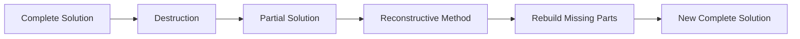

# Reconstructive

Reconstructive methods are specialized constructive methods designed to rebuild partially destroyed solutions. They are commonly used in destruction-reconstruction metaheuristics like Iterated Greedy and Large Neighborhood Search.

## Overview

Unlike regular constructive methods that start from empty solutions, reconstructive methods:
- Take **partially complete** solutions as input
- **Rebuild** the missing parts
- Preserve the existing structure where possible



## Key Differences from Constructive

| Aspect | Constructive | Reconstructive |
|--------|--------------|----------------|
| **Input** | Empty solution | Partial solution |
| **Goal** | Build from scratch | Complete existing |
| **Context** | No prior structure | Existing structure to respect |
| **Use** | Initial solutions | Iterated algorithms |

## Algorithm Outline

```
Reconstruct(partialSolution):
    while (partialSolution not complete) {
        candidates = getUnassignedElements(partialSolution)
        selected = selectElement(candidates, partialSolution)
        add(selected, partialSolution)
    }
    
    return partialSolution
```

## How to Use

### Basic Implementation

```java
public class MyReconstructor 
        extends Reconstructive<MySolution, MyInstance> {
    
    public MyReconstructor() {
        super("MyReconstructor");
    }
    
    @Override
    public MySolution reconstruct(MySolution partial) {
        // Get elements that were removed
        var missing = partial.getMissingElements();
        
        // Add them back using some strategy
        while (!missing.isEmpty()) {
            var best = findBestToAdd(missing, partial);
            partial.add(best);
            missing.remove(best);
        }
        
        return partial;
    }
    
    private Element findBestToAdd(List<Element> candidates, MySolution solution) {
        return candidates.stream()
            .min(Comparator.comparingDouble(e -> evaluateInsertion(e, solution)))
            .orElseThrow();
    }
}
```

### GRASP-based Reconstruction

```java
public class GRASPReconstructor 
        extends Reconstructive<MySolution, MyInstance> {
    
    private final double alpha;
    
    public GRASPReconstructor(double alpha) {
        super("GRASP-Reconstructor");
        this.alpha = alpha;
    }
    
    @Override
    public MySolution reconstruct(MySolution partial) {
        var missing = partial.getMissingElements();
        
        while (!missing.isEmpty()) {
            // Evaluate all missing elements
            var costs = missing.stream()
                .collect(Collectors.toMap(
                    e -> e,
                    e -> evaluateInsertion(e, partial)
                ));
            
            // Build RCL
            var rcl = buildRCL(missing, costs, alpha);
            
            // Random selection from RCL
            var selected = rcl.get(ThreadLocalRandom.current().nextInt(rcl.size()));
            
            partial.add(selected);
            missing.remove(selected);
        }
        
        return partial;
    }
}
```

### With Position Awareness

```java
public class PositionAwareReconstructor 
        extends Reconstructive<MySolution, MyInstance> {
    
    @Override
    public MySolution reconstruct(MySolution partial) {
        var missing = partial.getMissingElements();
        
        while (!missing.isEmpty()) {
            // For each missing element, find best insertion position
            Element bestElement = null;
            int bestPosition = -1;
            double bestCost = Double.MAX_VALUE;
            
            for (Element element : missing) {
                for (int pos = 0; pos <= partial.size(); pos++) {
                    double cost = evaluateInsertion(element, pos, partial);
                    if (cost < bestCost) {
                        bestCost = cost;
                        bestElement = element;
                        bestPosition = pos;
                    }
                }
            }
            
            partial.insert(bestElement, bestPosition);
            missing.remove(bestElement);
        }
        
        return partial;
    }
}
```

## Use in Iterated Greedy

```java
// Destructor removes elements
Destructive<MySolution, MyInstance> destructor = 
    new RandomDestructor<>(4);  // Remove 4 elements

// Reconstructor adds them back
Reconstructive<MySolution, MyInstance> reconstructor = 
    new GRASPReconstructor<>(0.3);

// Combine in Iterated Greedy
var ig = new IteratedGreedy<>(
    "IG",
    constructor,      // Initial solution
    destructor,       // Remove 4 elements
    reconstructor,    // Add them back
    improver          // Optional LS
);
```

## Use in Destroy-Rebuild Shake

```java
// Combined destroy-rebuild operator
var destroyRebuild = new DestroyRebuild<>(
    new WorstDestructor<>(5),     // Remove 5 worst elements
    new GreedyReconstructor<>()   // Add them back greedily
);

// Use as shake in VNS
var vns = new VNSBuilder<MySolution, MyInstance>()
    .withConstructive(constructor)
    .withImprover(improver)
    .withShake(destroyRebuild)  // Use destroy-rebuild as perturbation
    .build("VNS");
```

## Implementation Strategies

### 1. Greedy Reconstruction

Always add the best element:

```java
@Override
public MySolution reconstruct(MySolution partial) {
    var missing = partial.getMissingElements();
    missing.sort(Comparator.comparingDouble(e -> evaluateCost(e, partial)));
    
    for (Element element : missing) {
        partial.add(element);
    }
    
    return partial;
}
```

### 2. Nearest Neighbor Reconstruction

Add elements based on proximity to existing elements:

```java
@Override
public MySolution reconstruct(MySolution partial) {
    var missing = new HashSet<>(partial.getMissingElements());
    
    while (!missing.isEmpty()) {
        // Find missing element nearest to any existing element
        Element nearest = findNearestToExisting(missing, partial);
        partial.add(nearest);
        missing.remove(nearest);
    }
    
    return partial;
}
```

### 3. Regret-based Reconstruction

Consider the "regret" of not adding an element now:

```java
@Override
public MySolution reconstruct(MySolution partial) {
    var missing = partial.getMissingElements();
    
    while (!missing.isEmpty()) {
        Element bestRegret = null;
        double maxRegret = Double.MIN_VALUE;
        
        for (Element element : missing) {
            // Regret = difference between best and second-best insertion cost
            double regret = calculateRegret(element, partial);
            if (regret > maxRegret) {
                maxRegret = regret;
                bestRegret = element;
            }
        }
        
        partial.add(bestRegret);
        missing.remove(bestRegret);
    }
    
    return partial;
}
```

## Related Java Classes

- **[`Reconstructive<S, I>`](../../../../apidocs/es/urjc/etsii/grafo/create/Reconstructive.html)**: Base class for reconstruction methods
- **[`Constructive<S, I>`](../../../../apidocs/es/urjc/etsii/grafo/create/Constructive.html)**: Parent class
- **[`Destructive<S, I>`](../../../../apidocs/es/urjc/etsii/grafo/shake/Destructive.html)**: Destruction operators
- **[`DestroyRebuild<S, I>`](../../../../apidocs/es/urjc/etsii/grafo/shake/DestroyRebuild.html)**: Combined operator
- **[`IteratedGreedy<S, I>`](../../../../apidocs/es/urjc/etsii/grafo/algorithms/IteratedGreedy.html)**: Uses reconstructors

## Example Use Cases

### TSP Reconstruction

```java
public class TSPReconstructor extends Reconstructive<TSPSolution, TSPInstance> {
    
    @Override
    public TSPSolution reconstruct(TSPSolution partial) {
        var instance = partial.getInstance();
        var missing = partial.getMissingCities();
        
        while (!missing.isEmpty()) {
            // For each missing city, find best insertion position
            City bestCity = null;
            int bestPos = -1;
            double minIncrease = Double.MAX_VALUE;
            
            for (City city : missing) {
                for (int i = 0; i < partial.size(); i++) {
                    // Cost of inserting city between positions i and i+1
                    double increase = instance.distance(partial.get(i), city)
                                    + instance.distance(city, partial.get(i+1))
                                    - instance.distance(partial.get(i), partial.get(i+1));
                    
                    if (increase < minIncrease) {
                        minIncrease = increase;
                        bestCity = city;
                        bestPos = i + 1;
                    }
                }
            }
            
            partial.insert(bestCity, bestPos);
            missing.remove(bestCity);
        }
        
        return partial;
    }
}
```

### Job Scheduling Reconstruction

```java
public class ScheduleReconstructor extends Reconstructive<ScheduleSolution, ScheduleInstance> {
    
    @Override
    public ScheduleSolution reconstruct(ScheduleSolution partial) {
        var unscheduled = partial.getUnscheduledJobs();
        
        // Sort by priority or earliest due date
        unscheduled.sort(Comparator.comparingInt(Job::getDueDate));
        
        for (Job job : unscheduled) {
            // Insert at position that minimizes tardiness
            int bestPos = findBestPosition(job, partial);
            partial.insertJob(job, bestPos);
        }
        
        return partial;
    }
}
```

## Best Practices

1. **Context awareness**: Use information from the partial solution
2. **Efficient insertion**: Pre-calculate costs when possible
3. **Problem-specific heuristics**: Leverage domain knowledge
4. **Flexible strategies**: Support both greedy and randomized reconstruction
5. **Maintain feasibility**: Ensure reconstructed solutions remain valid

## Performance Tips

- **Cache evaluations**: Many insertions have similar costs
- **Incremental updates**: Update costs as elements are added
- **Parallel evaluation**: Evaluate insertion costs in parallel
- **Limit search**: Don't always evaluate all positions for all elements

## References

[1] Ruiz, R., & Stützle, T. (2007). A simple and effective iterated greedy algorithm for the permutation flowshop scheduling problem. *European Journal of Operational Research*, 177(3), 2033-2049.

[2] Shaw, P. (1998). Using constraint programming and local search methods to solve vehicle routing problems. In *CP* (Vol. 98, pp. 417-431).

[3] Pisinger, D., & Ropke, S. (2007). A general heuristic for vehicle routing problems. *Computers & Operations Research*, 34(8), 2403-2435.
