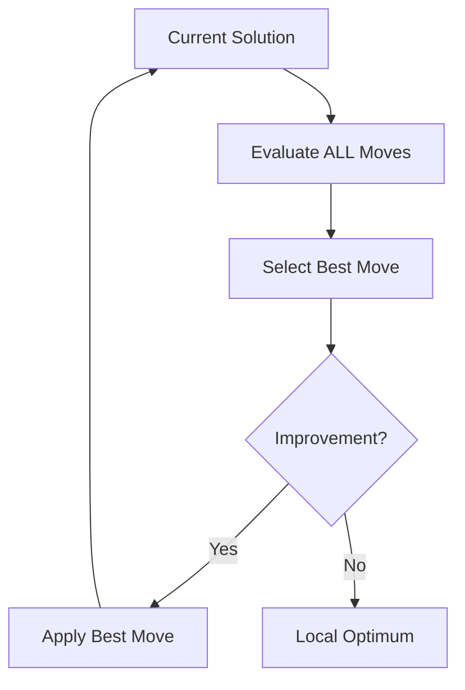

# Best Improvement Local Search

Best Improvement (also known as Steepest Descent) is a local search strategy that evaluates all moves in the neighborhood and always applies the move with the largest improvement.

## Overview

Best Improvement explores the **entire neighborhood** at each iteration and selects the single best move to apply.



## Algorithm Outline

```
BestImprovementLS(solution):
    improved = true
    
    while (improved) {
        bestMove = null
        bestDelta = 0
        
        for (move in neighborhood(solution)) {
            delta = evaluate(move, solution)
            if (delta < bestDelta) {  // For minimization
                bestDelta = delta
                bestMove = move
            }
        }
        
        if (bestMove != null) {
            apply(bestMove, solution)
            improved = true
        } else {
            improved = false  // No improving move found
        }
    }
    
    return solution
```

## Key Characteristics

| Aspect | Best Improvement |
|--------|------------------|
| **Exploration** | Complete neighborhood each iteration |
| **Move Selection** | Best improving move |
| **Evaluations** | O(n×k) where n=neighborhood size, k=iterations |
| **Speed** | Slower per iteration |
| **Quality** | Better local optima |
| **Iterations** | Fewer iterations to convergence |

## How to Use

### Basic Usage

```java
// Create best improvement local search
var bestLS = new LocalSearchBestImprovement<MySolution, MyInstance>() {
    @Override
    protected Iterable<Move> getNeighborhood(MySolution solution) {
        return generateAllMoves(solution);
    }
};

// Apply to solution
solution = bestLS.improve(solution);
```

### Custom Implementation

```java
public class MyBestImprovementLS<S extends Solution<S, I>, I extends Instance>
        extends LocalSearchBestImprovement<S, I> {
    
    public MyBestImprovementLS() {
        super("MyBestLS");
    }
    
    @Override
    protected Iterable<Move> getNeighborhood(S solution) {
        List<Move> moves = new ArrayList<>();
        
        // Generate all possible moves
        for (int i = 0; i < solution.size(); i++) {
            for (int j = i + 1; j < solution.size(); j++) {
                moves.add(new SwapMove(i, j));
            }
        }
        
        return moves;
    }
}
```

### With Early Termination

```java
public class EfficientBestImprovement<S extends Solution<S, I>, I extends Instance>
        extends LocalSearchBestImprovement<S, I> {
    
    private final double improvementThreshold;
    
    public EfficientBestImprovement(double threshold) {
        super("EfficientBestLS");
        this.improvementThreshold = threshold;
    }
    
    @Override
    public S improve(S solution) {
        boolean improved = true;
        
        while (improved && !TimeControl.isTimeUp()) {
            Move bestMove = null;
            double bestDelta = -improvementThreshold;  // Only accept significant improvements
            
            for (Move move : getNeighborhood(solution)) {
                double delta = move.evaluate(solution);
                if (delta < bestDelta) {
                    bestDelta = delta;
                    bestMove = move;
                }
            }
            
            if (bestMove != null && bestDelta < -improvementThreshold) {
                bestMove.apply(solution);
                improved = true;
            } else {
                improved = false;
            }
        }
        
        return solution;
    }
}
```

## Comparison with First Improvement

| Aspect | Best Improvement | First Improvement |
|--------|-----------------|-------------------|
| **Evaluations per iteration** | All moves | Until first improvement |
| **Time per iteration** | Longer | Shorter |
| **Iterations to convergence** | Fewer | More |
| **Total time** | Variable (problem-dependent) | Variable |
| **Local optimum quality** | Often better | Often worse |
| **Recommended for** | Small neighborhoods | Large neighborhoods |

## When to Use

### Use Best Improvement When:

✅ **Small neighborhood**: O(n) or O(n²) moves
✅ **Expensive moves**: Evaluation dominates iteration overhead
✅ **Quality matters**: Need best possible local optimum
✅ **Plateau navigation**: Many equal-value neighbors

### Use First Improvement When:

❌ **Large neighborhood**: O(n³) or more moves
❌ **Cheap moves**: Iteration overhead significant
❌ **Speed matters**: Need quick improvement
❌ **Diverse search**: Want more exploration

## Implementation Techniques

### Parallel Evaluation

```java
@Override
public S improve(S solution) {
    boolean improved = true;
    
    while (improved && !TimeControl.isTimeUp()) {
        var moves = getNeighborhood(solution);
        
        // Evaluate moves in parallel
        Move bestMove = moves.parallelStream()
            .min(Comparator.comparingDouble(m -> m.evaluate(solution)))
            .filter(m -> m.improves(solution))
            .orElse(null);
        
        if (bestMove != null) {
            bestMove.apply(solution);
            improved = true;
        } else {
            improved = false;
        }
    }
    
    return solution;
}
```

### Incremental Best Move Selection

```java
public class IncrementalBestImprovement<S extends Solution<S, I>, I extends Instance>
        extends LocalSearchBestImprovement<S, I> {
    
    private Map<Move, Double> moveDeltas;
    
    @Override
    public S improve(S solution) {
        moveDeltas = new HashMap<>();
        
        boolean improved = true;
        while (improved && !TimeControl.isTimeUp()) {
            improved = false;
            
            // Find best move from cache or evaluate
            Move bestMove = null;
            double bestDelta = 0;
            
            for (Move move : getNeighborhood(solution)) {
                double delta = moveDeltas.computeIfAbsent(move, 
                    m -> m.evaluate(solution));
                
                if (delta < bestDelta) {
                    bestDelta = delta;
                    bestMove = move;
                }
            }
            
            if (bestMove != null) {
                bestMove.apply(solution);
                // Invalidate affected moves
                invalidateAffectedMoves(bestMove, solution);
                improved = true;
            }
        }
        
        return solution;
    }
    
    private void invalidateAffectedMoves(Move applied, S solution) {
        // Remove moves that are no longer valid or whose deltas changed
        moveDeltas.keySet().removeIf(move -> isAffectedBy(move, applied));
    }
}
```

## Related Java Classes

- **[`LocalSearchBestImprovement<S, I>`](../../../../apidocs/es/urjc/etsii/grafo/improve/ls/LocalSearchBestImprovement.html)**: Best improvement implementation
- **[`LocalSearch<S, I>`](../../../../apidocs/es/urjc/etsii/grafo/improve/ls/LocalSearch.html)**: Base local search class
- **[`FirstImprovementLS<S, I>`](../../../../apidocs/es/urjc/etsii/grafo/improve/ls/LocalSearchFirstImprovement.html)**: Alternative strategy
- **[`Improver<S, I>`](../../../../apidocs/es/urjc/etsii/grafo/improve/Improver.html)**: Base improver class

## Example Use Cases

### TSP 2-Opt Best Improvement

```java
public class TSPBestImprovement2Opt 
        extends LocalSearchBestImprovement<TSPSolution, TSPInstance> {
    
    @Override
    protected Iterable<TwoOptMove> getNeighborhood(TSPSolution solution) {
        List<TwoOptMove> moves = new ArrayList<>();
        int n = solution.size();
        
        // Generate all 2-opt moves
        for (int i = 0; i < n - 1; i++) {
            for (int j = i + 2; j < n; j++) {
                moves.add(new TwoOptMove(i, j));
            }
        }
        
        return moves;
    }
}
```

### Knapsack Flip Best Improvement

```java
public class KnapsackBestFlip 
        extends LocalSearchBestImprovement<KnapsackSolution, KnapsackInstance> {
    
    @Override
    protected Iterable<FlipMove> getNeighborhood(KnapsackSolution solution) {
        var instance = solution.getInstance();
        return IntStream.range(0, instance.getNumItems())
            .mapToObj(i -> new FlipMove(i))  // Flip in/out of knapsack
            .collect(Collectors.toList());
    }
}
```

## Best Practices

1. **Profile first**: Measure if best improvement is actually faster for your problem
2. **Parallel evaluation**: Use parallel streams for independent move evaluation
3. **Cache smartly**: Cache evaluations but invalidate correctly
4. **Hybrid approach**: Start with best, switch to first when improvement slows
5. **Consider VND**: If you have multiple neighborhoods, use VND with best improvement per neighborhood

## Performance Optimization

```java
// Optimize by exploiting problem structure
public class OptimizedBestImprovement<S extends Solution<S, I>, I extends Instance>
        extends LocalSearchBestImprovement<S, I> {
    
    @Override
    public S improve(S solution) {
        boolean improved = true;
        
        while (improved && !TimeControl.isTimeUp()) {
            improved = false;
            
            // Pre-calculate data structures for fast evaluation
            var evalData = prepareEvaluationData(solution);
            
            Move bestMove = null;
            double bestDelta = 0;
            
            for (Move move : getNeighborhood(solution)) {
                // Use pre-calculated data for O(1) evaluation
                double delta = move.fastEvaluate(solution, evalData);
                if (delta < bestDelta) {
                    bestDelta = delta;
                    bestMove = move;
                }
            }
            
            if (bestMove != null) {
                bestMove.apply(solution);
                improved = true;
            }
        }
        
        return solution;
    }
}
```

## References

[1] Aarts, E., & Lenstra, J. K. (Eds.). (2003). *Local search in combinatorial optimization*. Princeton University Press.

[2] Johnson, D. S., & McGeoch, L. A. (1997). The traveling salesman problem: A case study in local optimization. *Local Search in Combinatorial Optimization*, 215-310.

[3] Papadimitriou, C. H., & Steiglitz, K. (1998). *Combinatorial optimization: algorithms and complexity*. Courier Corporation.
