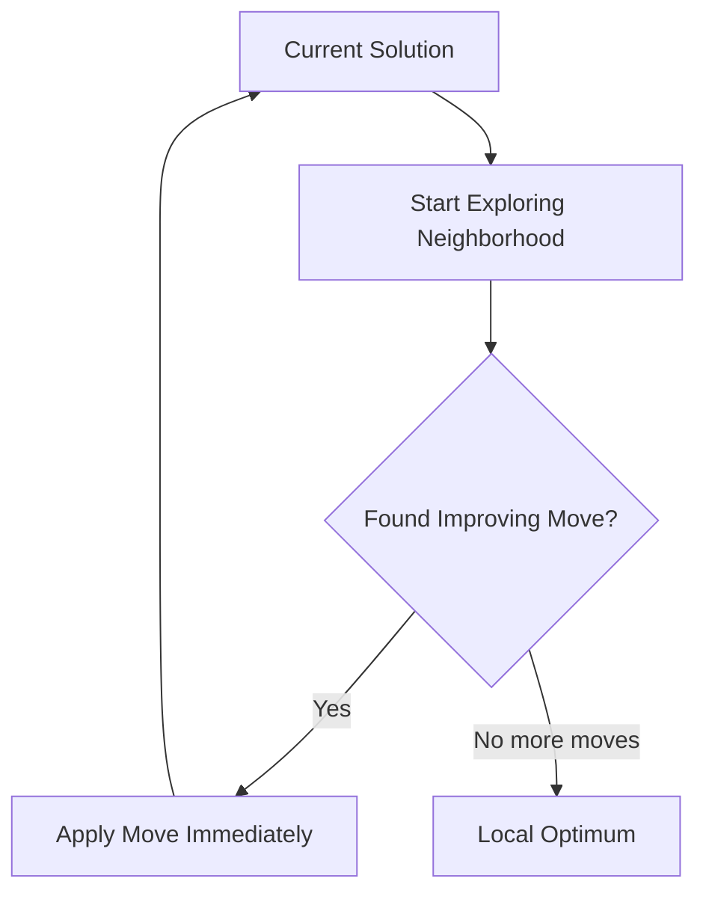

# First Improvement Local Search

First Improvement (also known as Next Descent) is a local search strategy that applies the first improving move found, without evaluating the entire neighborhood.

## Overview

First Improvement stops searching as soon as an improving move is found and immediately applies it.



## Algorithm Outline

```
FirstImprovementLS(solution):
    improved = true
    
    while (improved) {
        improved = false
        
        for (move in neighborhood(solution)) {
            delta = evaluate(move, solution)
            
            if (delta < 0) {  // For minimization
                apply(move, solution)
                improved = true
                break  // Stop searching, restart from beginning
            }
        }
    }
    
    return solution
```

## Key Characteristics

| Aspect | First Improvement |
|--------|-------------------|
| **Exploration** | Partial neighborhood per iteration |
| **Move Selection** | First improving move |
| **Evaluations** | O(k×m) where k=iterations, m=avg moves to improvement |
| **Speed** | Faster per iteration |
| **Quality** | Potentially weaker local optima |
| **Iterations** | More iterations to convergence |

## How to Use

### Basic Usage

```java
// Create first improvement local search
var firstLS = new LocalSearchFirstImprovement<MySolution, MyInstance>() {
    @Override
    protected Iterable<Move> getNeighborhood(MySolution solution) {
        return generateMoves(solution);
    }
};

// Apply to solution
solution = firstLS.improve(solution);
```

### Custom Implementation

```java
public class MyFirstImprovementLS<S extends Solution<S, I>, I extends Instance>
        extends LocalSearchFirstImprovement<S, I> {
    
    public MyFirstImprovementLS() {
        super("MyFirstLS");
    }
    
    @Override
    protected Iterable<Move> getNeighborhood(S solution) {
        // Generate moves lazily for efficiency
        return () -> new MoveIterator(solution);
    }
    
    @Override
    public S improve(S solution) {
        boolean improved = true;
        
        while (improved && !TimeControl.isTimeUp()) {
            improved = false;
            
            // Stop at first improvement
            for (Move move : getNeighborhood(solution)) {
                if (move.improves(solution)) {
                    move.apply(solution);
                    improved = true;
                    break;  // Key: break immediately
                }
            }
        }
        
        return solution;
    }
}
```

### With Randomized Order

```java
public class RandomFirstImprovement<S extends Solution<S, I>, I extends Instance>
        extends LocalSearchFirstImprovement<S, I> {
    
    @Override
    public S improve(S solution) {
        boolean improved = true;
        
        while (improved && !TimeControl.isTimeUp()) {
            // Generate moves in random order
            var moves = new ArrayList<>(getNeighborhood(solution));
            Collections.shuffle(moves);
            
            improved = false;
            for (Move move : moves) {
                if (move.improves(solution)) {
                    move.apply(solution);
                    improved = true;
                    break;
                }
            }
        }
        
        return solution;
    }
}
```

## Comparison with Best Improvement

| Aspect | First Improvement | Best Improvement |
|--------|------------------|------------------|
| **Evaluations per iteration** | Until first improvement | All moves |
| **Time per iteration** | Shorter | Longer |
| **Iterations to convergence** | More | Fewer |
| **Total time** | Often faster | Often slower |
| **Local optimum quality** | Often worse | Often better |
| **Memory usage** | Lower | Higher (if caching) |
| **Recommended for** | Large neighborhoods | Small neighborhoods |

## When to Use

### Use First Improvement When:

✅ **Large neighborhood**: O(n³) or more moves
✅ **Cheap evaluations**: Move evaluation is fast
✅ **Time-critical**: Need results quickly
✅ **Many improvements**: Dense neighborhoods with many improving moves

### Use Best Improvement When:

❌ **Small neighborhood**: O(n) or O(n²) moves
❌ **Expensive evaluations**: Move evaluation is costly
❌ **Quality-critical**: Need best local optimum
❌ **Few improvements**: Sparse neighborhoods

## Implementation Techniques

### Lazy Move Generation

```java
// Efficient: generate moves one at a time
@Override
protected Iterable<Move> getNeighborhood(S solution) {
    return () -> new Iterator<Move>() {
        private int i = 0;
        private int j = 1;
        
        @Override
        public boolean hasNext() {
            return i < solution.size() - 1;
        }
        
        @Override
        public Move next() {
            Move move = new SwapMove(i, j);
            j++;
            if (j >= solution.size()) {
                i++;
                j = i + 1;
            }
            return move;
        }
    };
}
```

### Early Feasibility Check

```java
@Override
public S improve(S solution) {
    boolean improved = true;
    
    while (improved && !TimeControl.isTimeUp()) {
        improved = false;
        
        for (Move move : getNeighborhood(solution)) {
            // Check feasibility before expensive evaluation
            if (!move.isFeasible(solution)) {
                continue;
            }
            
            // Only evaluate if feasible
            if (move.improves(solution)) {
                move.apply(solution);
                improved = true;
                break;
            }
        }
    }
    
    return solution;
}
```

### Neighborhood Ordering

```java
public class OrderedFirstImprovement<S extends Solution<S, I>, I extends Instance>
        extends LocalSearchFirstImprovement<S, I> {
    
    @Override
    protected Iterable<Move> getNeighborhood(S solution) {
        var moves = generateAllMoves(solution);
        
        // Order moves by likelihood of improvement
        // E.g., based on historical data or problem-specific heuristics
        moves.sort(Comparator.comparingDouble(this::estimateImprovement).reversed());
        
        return moves;
    }
    
    private double estimateImprovement(Move move) {
        // Quick estimate without full evaluation
        return move.estimatedDelta();
    }
}
```

## Advanced Variants

### Cycling First Improvement

```java
public class CyclingFirstImprovement<S extends Solution<S, I>, I extends Instance>
        extends LocalSearchFirstImprovement<S, I> {
    
    private int lastMoveIndex = 0;
    
    @Override
    public S improve(S solution) {
        boolean improved = true;
        
        while (improved && !TimeControl.isTimeUp()) {
            var moves = new ArrayList<>(getNeighborhood(solution));
            improved = false;
            
            // Start from where we left off last time
            for (int k = 0; k < moves.size(); k++) {
                int idx = (lastMoveIndex + k) % moves.size();
                Move move = moves.get(idx);
                
                if (move.improves(solution)) {
                    move.apply(solution);
                    lastMoveIndex = idx + 1;
                    improved = true;
                    break;
                }
            }
        }
        
        return solution;
    }
}
```

### Adaptive First Improvement

```java
public class AdaptiveFirstImprovement<S extends Solution<S, I>, I extends Instance>
        extends LocalSearchFirstImprovement<S, I> {
    
    private int consecutiveNoImprovements = 0;
    private final int switchThreshold = 5;
    
    @Override
    public S improve(S solution) {
        boolean improved = true;
        
        while (improved && !TimeControl.isTimeUp()) {
            improved = false;
            
            var moves = getNeighborhood(solution);
            
            // If stuck, switch to randomized order
            if (consecutiveNoImprovements > switchThreshold) {
                var moveList = new ArrayList<>(moves);
                Collections.shuffle(moveList);
                moves = moveList;
            }
            
            for (Move move : moves) {
                if (move.improves(solution)) {
                    move.apply(solution);
                    improved = true;
                    consecutiveNoImprovements = 0;
                    break;
                }
            }
            
            if (!improved) {
                consecutiveNoImprovements++;
            }
        }
        
        return solution;
    }
}
```

## Related Java Classes

- **[`LocalSearchFirstImprovement<S, I>`](../../../../apidocs/es/urjc/etsii/grafo/improve/ls/LocalSearchFirstImprovement.html)**: First improvement implementation
- **[`LocalSearch<S, I>`](../../../../apidocs/es/urjc/etsii/grafo/improve/ls/LocalSearch.html)**: Base local search class
- **[`BestImprovementLS<S, I>`](../../../../apidocs/es/urjc/etsii/grafo/improve/ls/LocalSearchBestImprovement.html)**: Alternative strategy
- **[`Improver<S, I>`](../../../../apidocs/es/urjc/etsii/grafo/improve/Improver.html)**: Base improver class

## Example Use Cases

### TSP 2-Opt First Improvement

```java
public class TSPFirstImprovement2Opt 
        extends LocalSearchFirstImprovement<TSPSolution, TSPInstance> {
    
    @Override
    protected Iterable<TwoOptMove> getNeighborhood(TSPSolution solution) {
        // Lazy iterator - generates moves one at a time
        return () -> new TwoOptIterator(solution);
    }
}

class TwoOptIterator implements Iterator<TwoOptMove> {
    private final TSPSolution solution;
    private int i = 0;
    private int j = 2;
    
    TwoOptIterator(TSPSolution solution) {
        this.solution = solution;
    }
    
    @Override
    public boolean hasNext() {
        return i < solution.size() - 1;
    }
    
    @Override
    public TwoOptMove next() {
        TwoOptMove move = new TwoOptMove(i, j);
        j++;
        if (j >= solution.size()) {
            i++;
            j = i + 2;
        }
        return move;
    }
}
```

### VRP First Improvement

```java
public class VRPFirstImprovement 
        extends LocalSearchFirstImprovement<VRPSolution, VRPInstance> {
    
    @Override
    protected Iterable<Move> getNeighborhood(VRPSolution solution) {
        return generateVRPMoves(solution);
    }
    
    private Iterable<Move> generateVRPMoves(VRPSolution solution) {
        return () -> new Iterator<Move>() {
            // Try intra-route moves first (cheaper)
            Iterator<Move> intraRoute = new IntraRouteMoveIterator(solution);
            // Then inter-route moves (more expensive)
            Iterator<Move> interRoute = new InterRouteMoveIterator(solution);
            
            @Override
            public boolean hasNext() {
                return intraRoute.hasNext() || interRoute.hasNext();
            }
            
            @Override
            public Move next() {
                return intraRoute.hasNext() ? intraRoute.next() : interRoute.next();
            }
        };
    }
}
```

## Best Practices

1. **Lazy generation**: Generate moves on-demand, don't pre-compute all
2. **Order matters**: Explore more promising moves first
3. **Randomization**: Shuffle move order to avoid bias
4. **Feasibility first**: Check feasibility before expensive evaluation
5. **Monitor progress**: Track improvements to detect when stuck
6. **Combine with diversification**: Use shake/perturbation when stuck

## Performance Considerations

**Memory**: Lower than best improvement (no need to store all moves)

**CPU**: Often faster total time despite more iterations

**Scalability**: Scales better to large neighborhoods

**Predictability**: More variation in runtime between runs

## References

[1] Aarts, E., & Lenstra, J. K. (Eds.). (2003). *Local search in combinatorial optimization*. Princeton University Press.

[2] Hoos, H. H., & Stützle, T. (2004). *Stochastic local search: Foundations and applications*. Elsevier.

[3] Johnson, D. S., & McGeoch, L. A. (1997). The traveling salesman problem: A case study in local optimization. *Local Search in Combinatorial Optimization*, 215-310.
