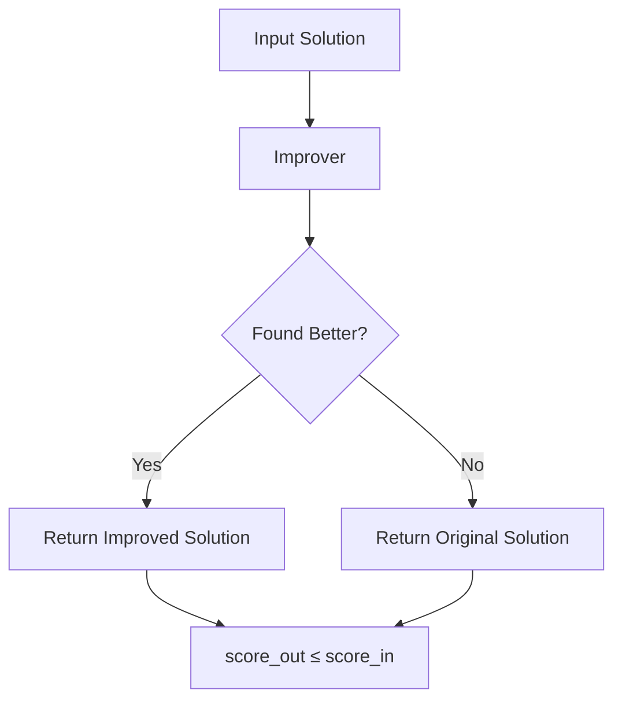

# Improver

Improvers are algorithm components that take a solution and try to improve its objective function value. The key constraint is that improvers **cannot return a worse solution** than the input.

## Overview

Improvers implement local optimization strategies. They explore the neighborhood of a solution, looking for improvements, and return a solution that is at least as good as the input.



## Base Improver Interface

```java
public abstract class Improver<S extends Solution<S, I>, I extends Instance> 
        extends AlgorithmComponent {
    
    /**
     * Improve the given solution
     * @param solution Solution to improve
     * @return Improved solution (or original if no improvement found)
     * @ensures returnedSolution.getScore() <= solution.getScore()
     */
    public abstract S improve(S solution);
}
```

## Key Principle: Non-Worsening

**Critical**: Improvers MUST NOT return worse solutions:

```java
@Override
public S improve(S solution) {
    S improved = tryToImprove(solution);
    
    // Framework validates in development mode
    assert !improved.isWorseThan(solution) : "Improver returned worse solution!";
    
    return improved;
}
```

## Common Improver Types

| Improver Type | Description | Documentation |
|---------------|-------------|---------------|
| **Local Search** | Explores solution neighborhoods | [Local Search](local-search.md) |
| **Best Improvement** | Always selects best move | [Best Improvement](best-improvement.md) |
| **First Improvement** | Accepts first improvement found | [First Improvement](first-improvement.md) |
| **VND** | Systematic multi-neighborhood search | [VND](../metaheuristics/vnd.md) |
| **Simulated Annealing** | Probabilistic acceptance (used as improver) | [SA](../metaheuristics/simulated-annealing.md) |

## How to Use

### Standalone

```java
var improver = new MyLocalSearch();
var solution = constructor.construct(instance);
solution = improver.improve(solution);  // solution is now at local optimum
```

### In Multi-Start Algorithm

```java
var multiStart = new MultiStartAlgorithm<>(
    "GRASP",
    constructor,
    improver,  // Applied to each constructed solution
    100
);
```

### Chain Multiple Improvers

```java
// Sequential application of multiple improvers
var chainedImprover = new SequentialImprover<>(
    new FastLocalSearch<>(),
    new SlowButThoroughSearch<>()
);

// Or manually chain
solution = improver1.improve(solution);
solution = improver2.improve(solution);
solution = improver3.improve(solution);
```

## Implementation Guidelines

### Basic Pattern

```java
public class MyImprover<S extends Solution<S, I>, I extends Instance> 
        extends Improver<S, I> {
    
    public MyImprover() {
        super("MyImprover");
    }
    
    @Override
    public S improve(S solution) {
        boolean improved = true;
        
        while (improved && !TimeControl.isTimeUp()) {
            improved = false;
            
            // Try to find an improving move
            for (Move move : generateMoves(solution)) {
                double delta = move.evaluateDelta(solution);
                
                if (delta < 0) {  // Improvement found (minimization)
                    move.apply(solution);
                    improved = true;
                    break;  // First improvement
                }
            }
        }
        
        return solution;
    }
}
```

### With Move Management

```java
public abstract class MoveBasedImprover<S extends Solution<S, I>, I extends Instance>
        extends Improver<S, I> {
    
    @Override
    public S improve(S solution) {
        while (!isLocalOptimum(solution) && !TimeControl.isTimeUp()) {
            Move bestMove = selectMove(solution);
            if (bestMove != null && bestMove.improves()) {
                bestMove.apply(solution);
            } else {
                break;  // Local optimum reached
            }
        }
        return solution;
    }
    
    protected abstract Move selectMove(S solution);
    protected abstract boolean isLocalOptimum(S solution);
}
```

### Efficient Implementation

```java
public class EfficientImprover<S extends Solution<S, I>, I extends Instance>
        extends Improver<S, I> {
    
    private MoveCache<S, I> moveCache;
    
    @Override
    public S improve(S solution) {
        // Initialize data structures once
        moveCache = new MoveCache<>(solution);
        
        while (!moveCache.isEmpty() && !TimeControl.isTimeUp()) {
            Move move = moveCache.getBestMove();
            
            if (move.getDelta() < 0) {
                move.apply(solution);
                // Incrementally update only affected moves
                moveCache.updateAffectedMoves(move, solution);
            } else {
                break;  // No improving moves
            }
        }
        
        return solution;
    }
}
```

## Advanced Features

### Null Improver

For algorithms that don't need improvement:

```java
var algorithm = new MultiStartAlgorithm<>(
    "PureConstruction",
    constructor,
    new NullImprover<>(),  // No improvement phase
    100
);
```

### Conditional Improver

Apply improvement conditionally:

```java
public class ConditionalImprover<S extends Solution<S, I>, I extends Instance>
        extends Improver<S, I> {
    
    private final Improver<S, I> wrapped;
    private final Predicate<S> condition;
    
    @Override
    public S improve(S solution) {
        if (condition.test(solution)) {
            return wrapped.improve(solution);
        }
        return solution;  // Skip improvement
    }
}

// Usage: only improve every 10th solution
var conditional = new ConditionalImprover<>(
    localSearch,
    solution -> iteration % 10 == 0
);
```

### Time-Limited Improver

```java
public class TimeLimitedImprover<S extends Solution<S, I>, I extends Instance>
        extends Improver<S, I> {
    
    private final Improver<S, I> wrapped;
    private final long maxMillis;
    
    @Override
    public S improve(S solution) {
        long start = System.currentTimeMillis();
        S current = solution;
        
        while (System.currentTimeMillis() - start < maxMillis) {
            S improved = wrapped.improve(current);
            if (improved.isBetterThan(current)) {
                current = improved;
            } else {
                break;  // Local optimum reached
            }
        }
        
        return current;
    }
}
```

## Related Java Classes

- **[`Improver<S, I>`](../../../../apidocs/es/urjc/etsii/grafo/improve/Improver.html)**: Base class
- **[`LocalSearch<S, I>`](../../../../apidocs/es/urjc/etsii/grafo/improve/ls/LocalSearch.html)**: Local search base
- **[`VND<S, I>`](../../../../apidocs/es/urjc/etsii/grafo/improve/VND.html)**: Variable neighborhood descent
- **[`SequentialImprover<S, I>`](../../../../apidocs/es/urjc/etsii/grafo/improve/SequentialImprover.html)**: Chain improvers
- **[`NullImprover<S, I>`](../../../../apidocs/es/urjc/etsii/grafo/improve/NullImprover.html)**: No-op improver

## Best Practices

1. **Guarantee non-worsening**: Always check `returnedSolution.getScore() <= inputSolution.getScore()`
2. **Check time limits**: Use `TimeControl.isTimeUp()` in loops
3. **Efficient neighborhoods**: Use incremental evaluation
4. **Track improvements**: Log or metric when improvements occur
5. **Local optimum detection**: Stop when no improving move exists
6. **In-place vs cloning**: Document whether improver modifies input solution

## Common Patterns

### First Improvement Pattern

```java
while (improved) {
    improved = false;
    for (Move move : neighborhood) {
        if (move.improves()) {
            move.apply(solution);
            improved = true;
            break;  // Accept first improvement
        }
    }
}
```

### Best Improvement Pattern

```java
while (true) {
    Move bestMove = null;
    double bestDelta = 0;
    
    for (Move move : neighborhood) {
        double delta = move.evaluate();
        if (delta < bestDelta) {
            bestDelta = delta;
            bestMove = move;
        }
    }
    
    if (bestMove != null) {
        bestMove.apply(solution);
    } else {
        break;  // No improving move found
    }
}
```

## Performance Considerations

- **Move evaluation**: Most expensive operation, optimize carefully
- **Neighborhood size**: Balance completeness vs speed
- **Caching**: Cache move evaluations when possible
- **Incremental updates**: Update data structures incrementally
- **Early termination**: Stop when time is up or quality threshold reached

## References

[1] Aarts, E., & Lenstra, J. K. (Eds.). (2003). *Local search in combinatorial optimization*. Princeton University Press.

[2] Hoos, H. H., & Stützle, T. (2004). *Stochastic local search: Foundations and applications*. Elsevier.

[3] Gendreau, M., & Potvin, J. Y. (Eds.). (2010). *Handbook of metaheuristics* (Vol. 2). Springer.
