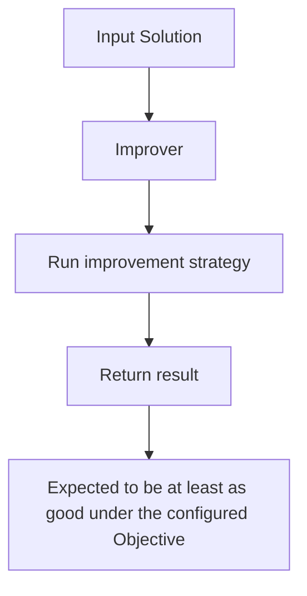

# Improver

Improvers are algorithm components that take a solution and try to improve its objective function value. By convention, an improver should return a solution that is at least as good as its input according to the configured `Objective`. Custom implementations are responsible for preserving this contract, and the framework may trigger an exception if this contract is broken.

## Overview

Improvers commonly implement local optimization strategies. Neighborhood-based improvers look for improving moves and return the current solution when no improvement is available. Other strategies, such as simulated annealing, may temporarily accept worsening moves while still returning the best solution found.


```mermaid
graph TD
    A[Input Solution] --> B[Improver]
    B --> C[Run improvement strategy]
    C --> D[Return result]
    D --> E[Expected to be at least as good under the configured Objective]
```

Improvers are allowed to modify the supplied solution in place. Clone the solution before calling `improve(...)` if the original state must be preserved.

## Common Improver Types

| Improver Type | Description | Documentation |
|---------------|-------------|---------------|
| **Local Search** | Base page for neighborhood-based improvers | [Local Search](local-search.md) |
| **LocalSearchBestImprovement** | Local search that always selects the best improving move | [Best-improvement strategy](local-search.md#localsearchbestimprovement) |
| **LocalSearchCachedBestImprovement** | Heuristic best improvement that reuses and refreshes cached candidates | [Cached best-improvement strategy](local-search.md#localsearchcachedbestimprovement) |
| **LocalSearchFirstImprovement** | Local search that accepts the first improving move found | [First-improvement strategy](local-search.md#localsearchfirstimprovement) |
| **VND** | Systematic multi-neighborhood search | [VND](../metaheuristics/vnd.md) |
| **Simulated Annealing** | Probabilistic acceptance (used as improver) | [SA](../metaheuristics/simulated-annealing.md) |

## How to Use

### Standalone

```java
var improver = new MyLocalSearch();
var solution = constructor.construct(instance);
solution = improver.improve(solution);  
// If the search stopped because no improving move remained, solution is a
// local optimum for this neighborhood. Note that the solution may not be 
// locally optimal if the local search stopped early due to the time limit.
```

### Multi-Start Algorithm example

```java
// MultiStartAlgorithm wraps another Algorithm. The improver is applied to each
// constructed solution by the wrapped SimpleAlgorithm.
var base = new SimpleAlgorithm<>("GRASP", constructor, improver);
var multiStart = new MultiStartAlgorithmBuilder<MySolution, MyInstance>()
    .withMaxIterations(100)
    .build(base);
```

## Implementation Guidelines

### Basic Pattern

```java
public class MyImprover<S extends Solution<S, I>, I extends Instance> 
        extends Improver<S, I> {
    
    public MyImprover() {
        // Improver stores an Objective for subclasses to use. Forward the main
        // objective from the execution context, or accept a custom Objective
        // as a constructor parameter.
        super(Context.getMainObjective());
    }
    
    @Override
    public S improve(S solution) {
        boolean improved = true;
        
        while (improved && !TimeControl.isTimeUp()) {
            improved = false;
            // Do something to try to improve the solution. If improved, flip improved variable.
        }
        
        return solution;
    }
}
```

Check `TimeControl.isTimeUp()` in any time-consuming loop so the algorithm can finish cleanly under time constraints.

## Common Patterns

### Chaining improvers

Improvers can be chained with `Improver.serial(...)`:

```java
var chainedImprover = Improver.serial(
    new FastLocalSearch<>(),
    new SlowButThoroughSearch<>()
);
```

The overload that accepts an `Objective` sets the objective exposed by the sequential wrapper. Each contained improver still uses its own configured objective.

Manually chaining improvement methods is not recommended because it complicates algorithm implementations unnecessarily:

```java
// Alternative: manually chain, but requires the algorithm to accept multiple improvers, or to handle arrays. Not recommended.
solution = improver1.improve(solution);
solution = improver2.improve(solution);
solution = improver3.improve(solution);
```

### Null Improver

Most algorithms require an improver as an argument. It is always valid to generate an improver that does nothing, example:

```java
// Improver.nul() does nothing --> Skips improvement phase
var base = new SimpleAlgorithm<>("OnlyConstruct", constructor, Improver.nul());
var algorithm = new MultiStartAlgorithmBuilder<MySolution, MyInstance>()
    .withMaxIterations(100)
    .build(base);
```
