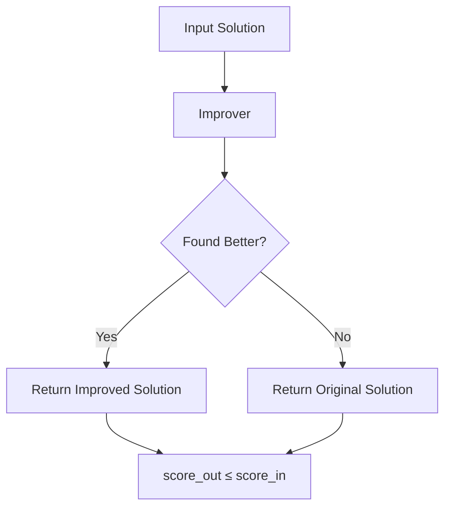

# Improver

Improvers are algorithm components that take a solution and try to improve its objective function value. The key constraint is that improvers **cannot return a worse solution** than the input.

## Overview

Improvers usually implement local optimization strategies. They explore the neighborhood of a solution, looking for improvements, and if they do not find any they usually return the solution as is. 


```mermaid
graph TD
    A[Input Solution] --> B[Improver]
    B --> C{Found Better?}
    C -->|Yes| D[Return Improved Solution]
    C -->|No| E[Return Original Solution]
    D --> F[score_out ≤ score_in]
    E --> F
```


## Common Improver Types

| Improver Type | Description | Documentation |
|---------------|-------------|---------------|
| **Local Search** | Base page for neighborhood-based improvers | [Local Search](local-search.md) |
| **LocalSearchBestImprovement** | Local search that always selects the best improving move | [Best-improvement strategy](local-search.md#localsearchbestimprovement) |
| **LocalSearchFirstImprovement** | Local search that accepts the first improving move found | [First-improvement strategy](local-search.md#localsearchfirstimprovement) |
| **VND** | Systematic multi-neighborhood search | [VND](../metaheuristics/vnd.md) |
| **Simulated Annealing** | Probabilistic acceptance (used as improver) | [SA](../metaheuristics/simulated-annealing.md) |

## How to Use

### Standalone

```java
var improver = new MyLocalSearch();
var solution = constructor.construct(instance);
solution = improver.improve(solution);  
// solution is now at local optimum for that improver
```

### Multi-Start Algorithm example

```java
var multiStart = new MultiStartAlgorithm<>(
    "GRASP",
    constructor,
    improver,  // Improver is applied to each constructed solution
    100
);
```

## Implementation Guidelines

### Basic Pattern

```java
public class MyImprover<S extends Solution<S, I>, I extends Instance> 
        extends Improver<S, I> {
    
    public MyImprover() {
        super("MyImprover");
    }
    
    @Override
    public S improve(S solution) {
        boolean improved = true;
        
        while (improved && !TimeControl.isTimeUp()) {
            improved = false;
            // Do something to try to improve the solution. If improved, flip improved variable.
        }
        
        return solution;
    }
}
```

Note that it is important to check the output of the `TimeControl.isTimeUp()` in any time consuming loop, so the algorithm can cleanly finish under time constrains.

## Common Patterns

### Chaining improvers

Improvers can be easily chained by using the Improver::serial method. Example:
```java
var chainedImprover = Improver.serial(
    new FastLocalSearch<>(),
    new SlowButThoroughSearch<>()
);
```

If you want, you can use a different objective than the main one, by passing it as the first argument.

Manually chaining improvement methods is not recommended as it complicates algorithm implementations unnecesarily:
```java
// Alternative: manually chain, but requires the algorithm to accept multiple improvers, or to handle arrays. Not recommended.
solution = improver1.improve(solution);
solution = improver2.improve(solution);
solution = improver3.improve(solution);
```

### Null Improver

Most algorithms require an improver as an argument. It is always valid to generate an improver that does nothing, example:

```java
var algorithm = new MultiStartAlgorithm<>(
    "OnlyConstruct",
    constructor,
    Improver.nul(),  // Null Improver does nothing --> Skips improvement phase
    100
);
```
