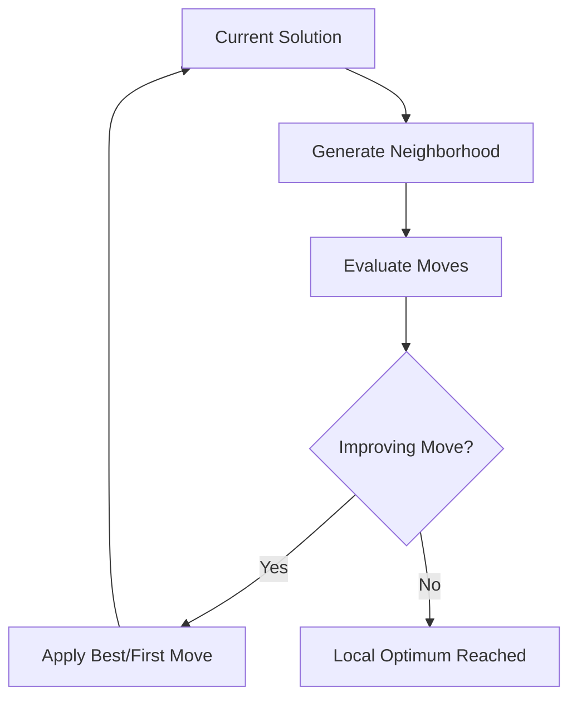

# Local Search

Local Search is a fundamental improvement method that iteratively explores the neighborhood of a solution, applying moves that improve the objective function until a local optimum is reached.

## Overview

Local Search defines a **neighborhood structure** (set of possible moves) and systematically explores it, accepting moves that improve the solution.



## Key Concepts

### Neighborhood

A **neighborhood** N(s) of a solution s is the set of solutions reachable by applying a single move:

```
N(s) = {s' : s' can be obtained from s by applying one move}
```

### Local Optimum

A solution s* is a **local optimum** if:

```
∀s' ∈ N(s*): f(s*) ≤ f(s')  (for minimization)
```

### Move

A **move** is an operation that transforms one solution into another:
- **Swap**: Exchange two elements
- **Insert**: Move an element to a different position
- **2-opt**: Reverse a subsequence (TSP)
- **k-opt**: More complex rearrangements

## Algorithm Outline

```
LocalSearch(solution):
    while (true) {
        neighborhood = generateNeighborhood(solution)
        bestMove = null
        
        for (move in neighborhood) {
            if (move.improves(solution)) {
                if (bestMove == null || move.isBetterThan(bestMove)) {
                    bestMove = move
                    if (FIRST_IMPROVEMENT) break  // Accept immediately
                }
            }
        }
        
        if (bestMove != null) {
            apply(bestMove, solution)
        } else {
            break  // Local optimum
        }
    }
    
    return solution
```

## How to Use

### Basic Implementation

```java
public abstract class LocalSearch<S extends Solution<S, I>, I extends Instance>
        extends Improver<S, I> {
    
    protected final boolean firstImprovement;
    
    public LocalSearch(String name, boolean firstImprovement) {
        super(name);
        this.firstImprovement = firstImprovement;
    }
    
    @Override
    public S improve(S solution) {
        boolean improved = true;
        
        while (improved && !TimeControl.isTimeUp()) {
            improved = false;
            var moves = generateMoves(solution);
            
            if (firstImprovement) {
                // First improvement: accept first improving move
                for (Move move : moves) {
                    if (move.improves(solution)) {
                        move.apply(solution);
                        improved = true;
                        break;
                    }
                }
            } else {
                // Best improvement: find best move
                Move bestMove = null;
                double bestDelta = 0;
                
                for (Move move : moves) {
                    double delta = move.evaluate(solution);
                    if (delta < bestDelta) {
                        bestDelta = delta;
                        bestMove = move;
                    }
                }
                
                if (bestMove != null) {
                    bestMove.apply(solution);
                    improved = true;
                }
            }
        }
        
        return solution;
    }
    
    protected abstract Iterable<Move> generateMoves(S solution);
}
```

### Concrete Example: TSP 2-Opt

```java
public class TwoOptLS extends LocalSearch<TSPSolution, TSPInstance> {
    
    public TwoOptLS(boolean firstImprovement) {
        super("2-Opt", firstImprovement);
    }
    
    @Override
    protected Iterable<Move> generateMoves(TSPSolution solution) {
        List<TwoOptMove> moves = new ArrayList<>();
        int n = solution.size();
        
        for (int i = 0; i < n - 1; i++) {
            for (int j = i + 2; j < n; j++) {
                moves.add(new TwoOptMove(i, j));
            }
        }
        
        return moves;
    }
}

class TwoOptMove implements Move {
    private final int i, j;
    
    @Override
    public double evaluate(TSPSolution solution) {
        // Calculate change in tour length if we reverse segment [i+1, j]
        var instance = solution.getInstance();
        int before_i = solution.get(i);
        int after_i = solution.get(i + 1);
        int before_j = solution.get(j);
        int after_j = solution.get((j + 1) % solution.size());
        
        double currentCost = instance.distance(before_i, after_i) 
                           + instance.distance(before_j, after_j);
        double newCost = instance.distance(before_i, before_j) 
                       + instance.distance(after_i, after_j);
        
        return newCost - currentCost;
    }
    
    @Override
    public void apply(TSPSolution solution) {
        solution.reverse(i + 1, j);
    }
}
```

## Variants

### 1. Best Improvement

See [Best Improvement Local Search](best-improvement.md) - explores entire neighborhood, applies best move.

### 2. First Improvement

See [First Improvement Local Search](first-improvement.md) - applies first improving move found.

### 3. Random Descent

```java
public class RandomDescent<S extends Solution<S, I>, I extends Instance>
        extends LocalSearch<S, I> {
    
    @Override
    public S improve(S solution) {
        boolean improved = true;
        
        while (improved && !TimeControl.isTimeUp()) {
            var moves = new ArrayList<>(generateMoves(solution));
            Collections.shuffle(moves);  // Random order
            
            improved = false;
            for (Move move : moves) {
                if (move.improves(solution)) {
                    move.apply(solution);
                    improved = true;
                    break;
                }
            }
        }
        
        return solution;
    }
}
```

## Implementation Strategies

### Efficient Move Evaluation

```java
// Bad: Full re-evaluation
double evaluate(Move move, Solution solution) {
    Solution copy = solution.clone();
    move.apply(copy);
    return copy.getScore() - solution.getScore();
}

// Good: Incremental evaluation
double evaluate(Move move, Solution solution) {
    return move.evaluateDelta(solution);  // Calculate change only
}
```

### Move Caching

```java
public class CachedLocalSearch<S extends Solution<S, I>, I extends Instance>
        extends LocalSearch<S, I> {
    
    private List<Move> cachedMoves;
    private Map<Move, Double> cachedDeltas;
    
    @Override
    public S improve(S solution) {
        // Generate and cache all moves once
        cachedMoves = new ArrayList<>(generateMoves(solution));
        cachedDeltas = new HashMap<>();
        
        boolean improved = true;
        while (improved && !TimeControl.isTimeUp()) {
            improved = false;
            Move bestMove = null;
            double bestDelta = 0;
            
            for (Move move : cachedMoves) {
                // Use cached delta if valid
                double delta = cachedDeltas.computeIfAbsent(move, 
                    m -> m.evaluate(solution));
                
                if (delta < bestDelta) {
                    bestDelta = delta;
                    bestMove = move;
                }
            }
            
            if (bestMove != null) {
                bestMove.apply(solution);
                // Invalidate affected deltas
                invalidateAffectedDeltas(bestMove);
                improved = true;
            }
        }
        
        return solution;
    }
}
```

## Neighborhood Design

### Small Neighborhoods

Fast but may get stuck:
- **Swap**: O(n²) moves
- **Insert**: O(n²) moves

### Large Neighborhoods

Slower but better quality:
- **k-opt (k>2)**: Exponential in k
- **Block moves**: O(n³) or more
- **Variable size**: Adaptive neighborhood size

### Multiple Neighborhoods

Use VND to systematically explore multiple neighborhoods:

```java
var vnd = new VND<>(
    "Multi-Neighborhood",
    List.of(
        new SwapLS<>(),
        new InsertLS<>(),
        new TwoOptLS<>()
    )
);
```

## Related Java Classes

- **[`LocalSearch<S, I>`](../../../../apidocs/es/urjc/etsii/grafo/improve/ls/LocalSearch.html)**: Base local search class
- **[`BestImprovementLS<S, I>`](../../../../apidocs/es/urjc/etsii/grafo/improve/ls/LocalSearchBestImprovement.html)**: Best improvement variant
- **[`FirstImprovementLS<S, I>`](../../../../apidocs/es/urjc/etsii/grafo/improve/ls/LocalSearchFirstImprovement.html)**: First improvement variant
- **[`Improver<S, I>`](../../../../apidocs/es/urjc/etsii/grafo/improve/Improver.html)**: Base improver class
- **[`VND<S, I>`](../../../../apidocs/es/urjc/etsii/grafo/improve/VND.html)**: Variable neighborhood descent

## Example Use Cases

### TSP with Multiple Neighborhoods

```java
// 2-opt
public class TwoOptLS extends LocalSearch<TSPSolution, TSPInstance> { /* ... */ }

// Or-opt
public class OrOptLS extends LocalSearch<TSPSolution, TSPInstance> { /* ... */ }

// 3-opt
public class ThreeOptLS extends LocalSearch<TSPSolution, TSPInstance> { /* ... */ }

// Combine with VND
var vnd = new VND<>("TSP-VND", List.of(
    new TwoOptLS(true),      // Fast 2-opt
    new OrOptLS(true),       // Medium Or-opt
    new ThreeOptLS(false)    // Slower 3-opt (best improvement)
));
```

### VRP Intra-Route and Inter-Route

```java
// Within same route
public class IntraRouteSwap extends LocalSearch<VRPSolution, VRPInstance> { /* ... */ }

// Between different routes
public class InterRouteSwap extends LocalSearch<VRPSolution, VRPInstance> { /* ... */ }

// Relocate customer
public class RelocateLS extends LocalSearch<VRPSolution, VRPInstance> { /* ... */ }
```

## Best Practices

1. **Incremental evaluation**: Never clone solutions to evaluate moves
2. **Early termination**: Check `TimeControl.isTimeUp()` in loops
3. **Choose appropriate variant**: First improvement for speed, best for quality
4. **Multiple neighborhoods**: Use VND for better local optima
5. **Problem-specific moves**: Design moves that exploit problem structure
6. **Efficient data structures**: Use appropriate structures for move generation

## Performance Tips

- **Lazy evaluation**: Only evaluate moves that pass cheap feasibility checks
- **Move ordering**: Evaluate more promising moves first
- **Parallel evaluation**: Evaluate independent moves in parallel
- **Aspiration criteria**: Sometimes accept slightly worsening moves to escape plateaus

## When to Use

**Local Search is ideal for:**
- Finding good solutions quickly
- Improving constructed solutions
- As part of metaheuristics (GRASP, ILS, VNS)
- Problems with well-defined neighborhoods

**Consider alternatives when:**
- Solutions have many local optima (use metaheuristics)
- Evaluation is very expensive (use sampling-based methods)
- Need global optimum guarantee (use exact methods)

## References

[1] Aarts, E., & Lenstra, J. K. (Eds.). (2003). *Local search in combinatorial optimization*. Princeton University Press.

[2] Hoos, H. H., & Stützle, T. (2004). *Stochastic local search: Foundations and applications*. Elsevier.

[3] Johnson, D. S., & McGeoch, L. A. (1997). The traveling salesman problem: A case study in local optimization. *Local Search in Combinatorial Optimization*, 215-310.
