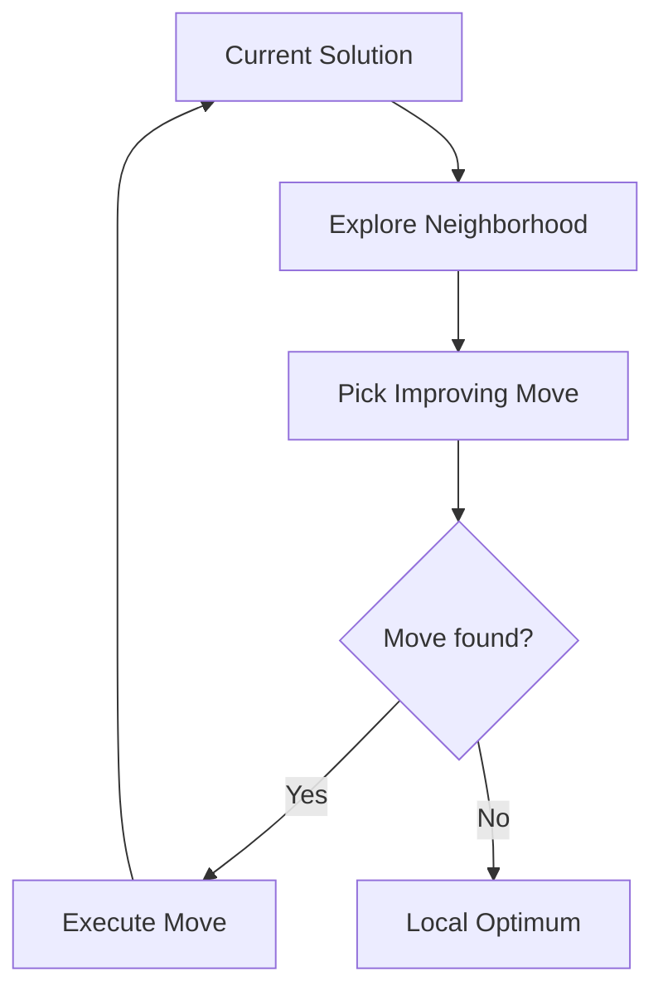

# Local Search

Local search is the main family of improvement procedures in Mork. It starts from a feasible solution, explores a `Neighborhood<M, S, I>`, executes an improving move, and repeats until no improving move remains or time runs out.

In the current API, the concrete strategies are:

- `LocalSearchBestImprovement<M, S, I>`
- `LocalSearchFirstImprovement<M, S, I>`

There are no standalone `BestImprovement` or `FirstImprovement` improver classes.

## Overview

`LocalSearch<M, S, I>` is the shared base class for local-search improvers. It combines:

- an `Objective<M, S, I>` used to evaluate moves;
- a `Neighborhood<M, S, I>` that generates candidate moves;
- a strategy-specific `getMove(solution)` implementation that decides which improving move to execute next.


```mermaid
graph TD
    A[Current Solution] --> B[Explore Neighborhood]
    B --> C[Pick Improving Move]
    C --> D{Move found?}
    D -->|Yes| E[Execute Move]
    E --> A
    D -->|No| F[Local Optimum]
```

## How it works in Mork

The shared loop in `LocalSearch` is:

```text
improve(solution):
    while time remains:
        move = getMove(solution)
        if move == null:
            stop
        move.execute(solution)
```

The important design point is that `LocalSearch` does not generate moves itself. Move generation lives in the `Neighborhood`, while the concrete subclass decides how to select the next move from the explored neighborhood.

## Using a neighborhood

`Neighborhood<M, S, I>` is the extension point used by local search.

```java
public class MyNeighborhood
        extends Neighborhood<MyMove, MySolution, MyInstance> {

    @Override
    public ExploreResult<MyMove, MySolution, MyInstance> explore(MySolution solution) {
        return ExploreResult.fromList(
            solution.getCandidates().stream()
                .map(candidate -> new MyMove(solution, candidate))
                .toList()
        );
    }
}
```

The neighborhood can return:

- a list-backed result, which is convenient when all moves are already materialized;
- or a streamed result, which is useful when moves should be generated lazily.

That distinction matters because the concrete local-search strategies exploit both forms differently.

## Creating a local search improver

The simplest way is to instantiate one of the two existing concrete classes with a neighborhood.

```java
var bestImprovement = new LocalSearchBestImprovement<MyMove, MySolution, MyInstance>(
    new MyNeighborhood()
);

var firstImprovement = new LocalSearchFirstImprovement<MyMove, MySolution, MyInstance>(
    new MyNeighborhood()
);
```

If needed, you can also provide an explicit objective instead of relying on the main objective from the execution context.

```java
var ls = new LocalSearchBestImprovement<MyMove, MySolution, MyInstance>(
    myObjective,
    new MyNeighborhood()
);
```

## Strategy specifics

### LocalSearchBestImprovement

`LocalSearchBestImprovement<M, S, I>` explores the neighborhood and executes the **best improving move** available in the current iteration.

```text
BestImprovement(solution):
    moves = neighborhood.explore(solution)
    bestMove = best improving move in moves
    if bestMove exists:
        execute bestMove
    else:
        stop
```

Behavior in the current implementation:

- if the explored neighborhood is list-backed, Mork uses `objective.bestMove(...)`;
- if it is stream-backed, Mork reduces the stream using the objective;
- after selecting the best candidate, the move is executed only if it actually improves the solution.

Use `LocalSearchBestImprovement` when:

- neighborhood exploration is reasonably small or moderate;
- move quality matters more than per-iteration speed;
- you want the steepest-descent style behavior.

```java
var improver = new LocalSearchBestImprovement<MyMove, MySolution, MyInstance>(
    new MyNeighborhood()
);
```

### LocalSearchFirstImprovement

`LocalSearchFirstImprovement<M, S, I>` explores the neighborhood and executes the **first move that improves** the current solution.

```text
FirstImprovement(solution):
    moves = neighborhood.explore(solution)
    for move in moves:
        if move improves:
            execute move
            stop iteration
    stop if no improving move exists
```

Behavior in the current implementation:

- if the neighborhood is list-backed, Mork scans the move list in order and returns the first improving move;
- if it is stream-backed, Mork filters improving moves and returns any matching candidate;
- if no improving move exists, the local search ends.

Use `LocalSearchFirstImprovement` when:

- neighborhoods are large;
- improving moves are usually easy to find;
- lower iteration cost matters more than picking the single best move every time.

```java
var improver = new LocalSearchFirstImprovement<MyMove, MySolution, MyInstance>(
    new MyNeighborhood()
);
```

## Best vs first improvement

| Aspect | `LocalSearchBestImprovement` | `LocalSearchFirstImprovement` |
| --- | --- | --- |
| Selection rule | Best improving move in the explored neighborhood | First improving move found |
| Typical iteration cost | Higher | Lower |
| Dependence on move order | Lower | Higher |
| Good fit | Smaller neighborhoods, quality-oriented search | Larger neighborhoods, faster descent |

## Using local search inside an algorithm

```java
var algorithm = new MultiStartAlgorithm<>(
    "MultiStart+LS",
    constructive,
    new LocalSearchBestImprovement<>(new MyNeighborhood()),
    100
);
```

Local search is also a common improvement phase in GRASP, VNS, and other multi-phase metaheuristics.

## Best practices

1. Put neighborhood logic in `Neighborhood`, not inside the improver.
2. Generate moves lazily when the neighborhood can be large.
3. Use best improvement when you can afford broader exploration each iteration.
4. Use first improvement when iteration speed and quick progress are more important.
5. Make sure candidate moves remain valid for the current solution state.

## Related Java classes

- `es.urjc.etsii.grafo.improve.ls.LocalSearch`
- `es.urjc.etsii.grafo.improve.ls.LocalSearchBestImprovement`
- `es.urjc.etsii.grafo.improve.ls.LocalSearchFirstImprovement`
- `es.urjc.etsii.grafo.solution.neighborhood.Neighborhood`
- `es.urjc.etsii.grafo.improve.Improver`
