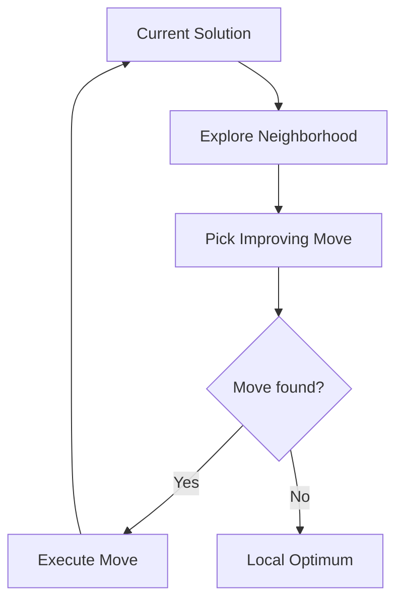

# Local Search

Local search is the main family of improvement procedures in Mork. It starts from a feasible solution, explores a `Neighborhood<M, S, I>`, executes an improving move, and repeats until no improving move remains or time runs out.

In the current API, the concrete strategies are:

- `LocalSearchBestImprovement<M, S, I>`
- `LocalSearchCachedBestImprovement<M, S, I>`
- `LocalSearchFirstImprovement<M, S, I>`


## Overview

`LocalSearch<M, S, I>` is the shared base class for local-search improvers. It combines:

- an `Objective<M, S, I>` used to evaluate moves;
- a `Neighborhood<M, S, I>` that generates candidate moves;
- a strategy-specific `getMove(solution)` implementation that decides which improving move to execute next.


```mermaid
graph TD
    A[Current Solution] --> B[Explore Neighborhood]
    B --> C[Pick Improving Move]
    C --> D{Move found?}
    D -->|Yes| E[Execute Move]
    E --> A
    D -->|No| F[Local Optimum]
```

## How it works in Mork

The shared loop in `LocalSearch` is:

```text
improve(solution):
    while time remains:
        move = getMove(solution)
        if move == null:
            stop
        move.execute(solution)
```

The important design point is that `LocalSearch` does not generate moves itself. Move generation lives in the `Neighborhood`, while the concrete subclass decides how to select the next move from the explored neighborhood.

## Using a neighborhood

`Neighborhood<M, S, I>` is the extension point used by local search.

```java
public class MyNeighborhood
        extends Neighborhood<MyMove, MySolution, MyInstance> {

    @Override
    public ExploreResult<MyMove, MySolution, MyInstance> explore(MySolution solution) {
        return ExploreResult.fromList(
            solution.getCandidates().stream()
                .map(candidate -> new MyMove(solution, candidate))
                .toList()
        );
    }
}
```

The neighborhood can return:

- a list-backed result, which is convenient when all moves are already materialized;
- or a streamed result, which is useful when moves should be generated lazily.

That distinction matters because the concrete local-search strategies exploit both forms differently.

## Creating a local search improver

The simplest way is to instantiate one of the three concrete classes with a neighborhood. 
Cached best improvement also requires a positive cache size and moves that implement `RefreshableMove`.

```java
var bestImprovement = new LocalSearchBestImprovement<MyMove, MySolution, MyInstance>(
    new MyNeighborhood()
);

var firstImprovement = new LocalSearchFirstImprovement<MyMove, MySolution, MyInstance>(
    new MyNeighborhood()
);

var cachedBestImprovement = new LocalSearchCachedBestImprovement<
    MyRefreshableMove, MySolution, MyInstance
>(new MyRefreshableNeighborhood(), 32);
```

If needed, you can also provide an explicit objective instead of relying on the main objective from the execution context.

```java
var ls = new LocalSearchBestImprovement<MyMove, MySolution, MyInstance>(
    myObjective,
    new MyNeighborhood()
);
```

## Strategy specifics

### LocalSearchBestImprovement

`LocalSearchBestImprovement<M, S, I>` explores the neighborhood and executes the **best improving move** available in the current iteration.

```text
BestImprovement(solution):
    moves = neighborhood.explore(solution)
    bestMove = best improving move in moves
    if bestMove exists:
        execute bestMove
    else:
        stop
```

Behavior in the current implementation:

- if the explored neighborhood is list-backed, Mork uses `objective.bestMove(...)`;
- if it is stream-backed, Mork reduces the stream using the objective;
- after selecting the best candidate, the move is executed only if it actually improves the solution.

Use `LocalSearchBestImprovement` when:

- neighborhood exploration is reasonably small or moderate;
- move quality matters more than per-iteration speed;
- you want the steepest-descent style behavior.

```java
var improver = new LocalSearchBestImprovement<MyMove, MySolution, MyInstance>(
    new MyNeighborhood()
);
```

### LocalSearchCachedBestImprovement

`LocalSearchCachedBestImprovement<M, S, I>` reduces repeated full-neighborhood explorations by retaining several promising moves. Its move type must extend `Move<S, I>` and implement `RefreshableMove<M, S, I>`.

When the cache is empty, the strategy explores the full neighborhood, retains the best `cacheSize` improving moves, executes the best one, and caches the remainder. On later iterations, it refreshes cached moves in their original best-first order and executes the first refreshed move that still improves the current solution. If the cache has no usable move, it explores the full neighborhood again.

```text
CachedBestImprovement(solution):
    while cached moves remain:
        candidate = remove next cached move
        refreshed = candidate.refresh(solution)
        if refreshed exists and improves:
            return refreshed

    moves = neighborhood.explore(solution)
    retained = best cacheSize improving moves
    if retained is empty:
        stop
    return best retained move and cache the rest
```

Note that cached candidates were ordered using their scores during the last full exploration. 
After the solution changes, that order may be stale. The returned move is always checked for improvement, but it is *not necessarily the best move* for the current solution. 
We recommend using `CachedBestImprovement` when neigborhoods are big, and applying a move does not produce massive changes to other move scores.

#### Refreshable moves
Note that because move are cached between iterations when using `CachedBestImprovement`, they will likely be stale and their score wrong after applying several moves.
For this reason, cached moves must implement the `refresh(solution)` method, which returns a new move bound to the current solution state, or `Optional.empty()` when the old move is no longer valid. Returning the old move instance after the solution has changed is wrong because `Move` instances are associated to the old solution state when they were created.

```java
public final class MyRefreshableMove
        extends Move<MySolution, MyInstance>
        implements RefreshableMove<MyRefreshableMove, MySolution, MyInstance> {

    private final int candidate;

    @Override
    public Optional<MyRefreshableMove> refresh(MySolution solution) {
        if (!isStillApplicable(solution)) {
            return Optional.empty();
        }
        return Optional.of(new MyRefreshableMove(solution, candidate));
    }

    // Constructor, _execute(...), isStillApplicable(...), equals(...),
    // hashCode(...), and toString() omitted
}
```

Both list-backed and stream-backed neighborhoods are supported. A cache refill consumes the complete exploration result because it must identify the top candidates. The cache is cleared at the beginning of every `improve(...)` call, so candidates are never reused across separate searches.

An example of how to initialize a `LocalSearchCachedBestImprovement` using a cache size of 32 and the main objective is:

```java
var improver = new LocalSearchCachedBestImprovement<
    MyRefreshableMove, MySolution, MyInstance
>(new MyRefreshableNeighborhood(), 32);
```

An explicit objective can also be supplied:

```java
var improver = new LocalSearchCachedBestImprovement<
    MyRefreshableMove, MySolution, MyInstance
>(myCustomObjective, new MyRefreshableNeighborhood(), 32);
```

`cacheSize` must be greater than zero; there is no default value. A size of `1` leaves no move candidates to reuse and therefore behaves like ordinary best improvement, performing a full exploration for each selected move. Larger values use `O(cacheSize)` memory and make each refill approximately `O(neighborhoodSize × log(cacheSize))`, but amortize that cost across several iterations.

Use `LocalSearchCachedBestImprovement` when:

- repeated full-neighborhood explorations are too expensive;
- top candidates often remain valid after another move executes, even if their score change;
- refreshing a candidate is cheaper than exploring the full neighborhood again;
- an improving move is sufficient and we do not need to find the best available move in each iteration.

Prefer ordinary best or first improvement local search when moves are broadly invalidated by solution changes, refreshing is expensive, or selecting the current best move on every iteration is important.

### LocalSearchFirstImprovement

`LocalSearchFirstImprovement<M, S, I>` explores the neighborhood and executes the **first move that improves** the current solution.

```text
FirstImprovement(solution):
    moves = neighborhood.explore(solution)
    for move in moves:
        if move improves:
            execute move
            stop iteration
    stop if no improving move exists
```

Behavior in the current implementation:

- if the neighborhood is list-backed, Mork scans the move list in order and returns the first improving move;
- if it is stream-backed, Mork filters improving moves and returns any matching candidate;
- if no improving move exists, the local search ends.

Use `LocalSearchFirstImprovement` when:

- neighborhoods are large;
- improving moves are usually easy to find;
- lower iteration cost matters more than picking the single best move every time.

```java
var improver = new LocalSearchFirstImprovement<MyMove, MySolution, MyInstance>(
    new MyNeighborhood()
);
```

## Choosing a local-search strategy

| Aspect                   | `LocalSearchBestImprovement`              | `LocalSearchCachedBestImprovement`                                              | `LocalSearchFirstImprovement`                                            |
|--------------------------|-------------------------------------------|---------------------------------------------------------------------------------|--------------------------------------------------------------------------|
| Selection rule           | Current best improving move               | Best move on refill; afterward, first refreshed cached move that still improves | First improving move found                                               |
| Neighborhood consumption | Complete every iteration                  | Complete when no cached move remains usable                                     | Stops early for lazy streams; list-backed moves are already materialized |
| Selection guarantee      | Best in the current explored neighborhood | Improving, but not necessarily current best                                     | First improving move in exploration order                                |
| Special contract         | None                                      | `RefreshableMove`                                                               | None                                                                     |
| Memory usage             | Constant                                  | `O(cacheSize)`                                                                  | Constant                                                                 |
| Good fit                 | Steepest descent                          | Expensive neighborhoods with reusable candidates                                | Improving moves have similar scores                                      |

## Using local search inside an algorithm

```java
// MultiStartAlgorithm wraps another Algorithm: build the base algorithm first...
var base = new SimpleAlgorithm<>("MultiStart+LS", constructive,
    new LocalSearchBestImprovement<>(new MyNeighborhood()));
// ...and then wrap it, configuring the number of iterations through the builder
var algorithm = new MultiStartAlgorithmBuilder<MySolution, MyInstance>()
    .withMaxIterations(100)
    .build(base);
```

Local search is also a common improvement phase in GRASP, VNS, and other multi-phase metaheuristics.

## Best practices

1. Put neighborhood logic in `Neighborhood` implementations, not inside the improver.
2. Generate moves lazily when the neighborhood can be large.
3. Use best improvement when you can afford broader exploration each iteration.
4. Use cached best improvement when moves can be refreshed cheaply and safely. Tune the cache size by balancing refill frequency, stale candidates, and memory use.
6. Use first improvement when iteration speed and quick progress are more important, or when the score change is roughly similar between improving moves.
7. Make sure candidate moves remain valid for the current solution state.

## Related Java classes

- `es.urjc.etsii.grafo.improve.ls.LocalSearch`
- `es.urjc.etsii.grafo.improve.ls.LocalSearchBestImprovement`
- `es.urjc.etsii.grafo.improve.ls.LocalSearchCachedBestImprovement`
- `es.urjc.etsii.grafo.improve.ls.LocalSearchFirstImprovement`
- `es.urjc.etsii.grafo.solution.RefreshableMove`
- `es.urjc.etsii.grafo.solution.neighborhood.Neighborhood`
- `es.urjc.etsii.grafo.improve.Improver`
