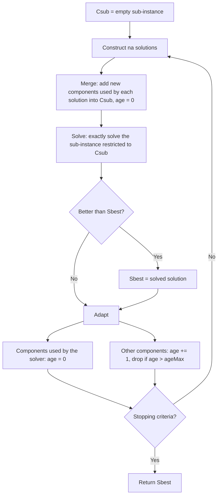

# CMSA (Construct, Merge, Solve & Adapt)

CMSA is a hybrid matheuristic that combines a probabilistic constructive heuristic with an exact method. Instead of applying the exact method to the whole problem instance, which is usually intractable, CMSA repeatedly restricts the search to a small, promising subset of solution components (an edge, an item-to-bin assignment, etc.), and solves that much smaller sub-instance to optimality (or as close to optimality as possible) at every iteration.

For further information about CMSA see: Blum, C., Pinacho, P., López-Ibáñez, M., & Lozano, J. A. (2016). Construct, Merge, Solve and Adapt: A new algorithm for combinatorial optimization. Computers & Operations Research, 68, 75-88. [https://doi.org/10.1016/j.cor.2015.10.014](https://doi.org/10.1016/j.cor.2015.10.014)

For an in-depth treatment of CMSA, including guidance on modelling the sub-instance solved at every iteration for different combinatorial optimization problems, see: Blum, C. (2024). Construct, Merge, Solve & Adapt: A Hybrid Metaheuristic for Combinatorial Optimization. Computational Intelligence Methods and Applications. Springer. [https://doi.org/10.1007/978-3-031-60103-3](https://doi.org/10.1007/978-3-031-60103-3)

## Algorithm Overview



## Algorithm Outline

```
Csub = {}          // sub-instance: solution components with a chance of being part of a good solution
Sbest = null
repeat until stopping criterion is met:
    // Construct & Merge
    for na times:
        S' = ProbabilisticConstruct(instance)
        Csub = Csub U usedComponents(S')       // merge new components into the sub-instance, age = 0

    // Solve
    S* = Solve(instance restricted to Csub)    // exact method, e.g. ILP solver, DP, branch and bound
    if S* is better than Sbest: Sbest = S*

    // Adapt
    for each component c in Csub:
        if c in S*: age(c) = 0
        else:
            age(c) = age(c) + 1
            if age(c) > ageMax: Csub = Csub \ {c}

return Sbest
```

Components that keep being selected by the exact method stay in `Csub` indefinitely, since their age is reset to zero every time they are chosen again. Components that are no longer useful eventually age out and are dropped, which keeps the sub-instance small across iterations. This adaptive behaviour is what gives CMSA its name, and what makes it different from just repeatedly solving a brand new random restricted sub-instance from scratch at every iteration: the sub-instance progressively evolves towards the components that matter for a good solution.

## Mork implementation

CMSA is implemented in [`CMSA`](https://github.com/rmartinsanta/mork/blob/master/common/src/main/java/es/urjc/etsii/grafo/algorithms/cmsa/CMSA.java), and depends on two problem-specific components:

- [`CMSAConstructive`](https://github.com/rmartinsanta/mork/blob/master/common/src/main/java/es/urjc/etsii/grafo/algorithms/cmsa/CMSAConstructive.java): a regular [`Constructive`](../constructors) that additionally knows how to extract the set of solution components used by any given solution. Solution components can be represented using any type that properly implements `equals`/`hashCode`, for example a record such as `record Edge(int from, int to)`.
- [`CMSASolver`](https://github.com/rmartinsanta/mork/blob/master/common/src/main/java/es/urjc/etsii/grafo/algorithms/cmsa/CMSASolver.java): solves, exactly or as close to exactly as possible, the sub-instance induced by a given set of solution components, within a time budget.

!!! info
    Mork does not bundle any exact solver. `CMSASolver` implementations are expected to encode the restricted sub-instance and delegate to whatever exact method is available and fits the problem: a MIP/ILP solver such as CPLEX, Gurobi, SCIP or OR-Tools, a specialized dynamic programming procedure, or, since the restricted sub-instance is expected to stay small thanks to the aging mechanism, an exhaustive branch and bound search.

```java
public class MyCMSAConstructive extends CMSAConstructive<MySolution, MyInstance> {
    @Override
    public MySolution construct(MySolution solution) {
        // Biased-randomized / probabilistic construction, similar to a GRASP constructive
        // but usually with more randomization, as the goal is to sample good components, not
        // to build the best possible single solution.
        ...
        return solution;
    }

    @Override
    public Set<Object> usedComponents(MySolution solution) {
        // Return the components (edges, assignments, etc.) used in the given solution
        return solution.usedEdges();
    }
}

public class MyCMSASolver extends CMSASolver<MySolution, MyInstance> {
    @Override
    public MySolution solve(MyInstance instance, Set<Object> restrictedComponents, long maxDurationInMillis) {
        // Build and solve the sub-instance induced by restrictedComponents, e.g. calling an ILP solver
        ...
    }
}
```

A `CMSA` instance can be built directly, or using `CMSABuilder`:

```java
var cmsa = new CMSABuilder<MySolution, MyInstance>()
        .withConstructive(new MyCMSAConstructive())
        .withSolver(new MyCMSASolver())
        .withSolutionsPerIteration(30) // na
        .withAgeMax(5)
        .withSolverTimeLimitInMillis(1000)
        .withMaxIterations(1000)
        .build();
```
