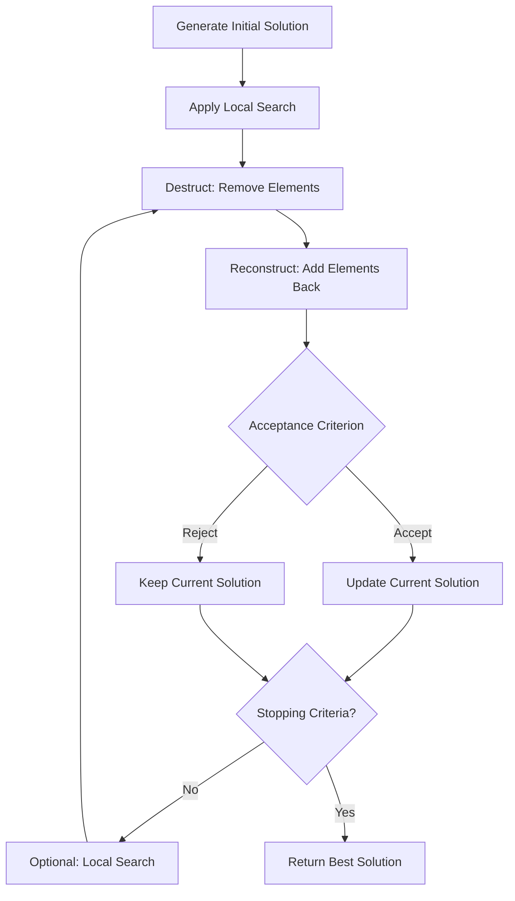

# Iterated Greedy (IG)

Iterated Greedy is a simple yet powerful metaheuristic that iteratively destructs parts of a solution and reconstructs them, keeping the better solution at each iteration. It's particularly effective for sequencing and scheduling problems.

## Algorithm Overview

IG operates in cycles, alternating between destruction and reconstruction phases, optionally followed by local search improvement.



## Algorithm Outline

```
s = Construct()
s = LocalSearch(s)
best = s

while (not StoppingCriteria()) {
    s' = Destruct(s, d)        // Remove d elements
    s' = Reconstruct(s')       // Add elements back
    s' = LocalSearch(s')       // Optional improvement
    
    if (AcceptanceCriterion(s, s')) {
        s = s'
        if (s.isBetterThan(best)) {
            best = s
        }
    }
}
return best
```

## Key Components

### Destruction Phase

The destruction operator removes `d` elements from the solution:

- **Random Destruction**: Remove random elements
- **Worst Destruction**: Remove elements contributing most to objective
- **Related Destruction**: Remove related/similar elements

### Reconstruction Phase

The reconstruction operator adds removed elements back:

- **Greedy Reconstruction**: Insert at best position
- **Random Reconstruction**: Insert at random positions
- **GRASP Reconstruction**: Randomized greedy insertion

### Acceptance Criterion

Determines whether to accept the new solution:

- **Better Only**: Accept only if improvement
- **Simulated Annealing**: Probabilistic acceptance
- **Random Walk**: Always accept

## How to Use

### Basic Example

```java
// Define destruction operator
Destructive<MySolution, MyInstance> destructor = 
    new RandomDestructor<>(4);  // Remove 4 elements

// Define reconstruction operator
Reconstructive<MySolution, MyInstance> reconstructor = 
    new GreedyReconstructor<>();

// Optional: local search
Improver<MySolution, MyInstance> improver = 
    new MyLocalSearch();

// Build Iterated Greedy
var ig = new IteratedGreedy<>(
    "IG",
    constructor,      // Initial construction
    destructor,       // Destruction phase
    reconstructor,    // Reconstruction phase
    improver          // Optional improvement
);
```

### With Acceptance Criterion

```java
// Simple: accept only improvements
AcceptanceCriterion<MySolution, MyInstance> acceptance = 
    (current, candidate) -> candidate.isBetterThan(current);

// Or: SA-like acceptance
AcceptanceCriterion<MySolution, MyInstance> saAcceptance = 
    (current, candidate) -> {
        if (candidate.isBetterThan(current)) return true;
        double delta = candidate.getScore() - current.getScore();
        double temp = 100.0; // Could vary over time
        return Math.random() < Math.exp(-delta / temp);
    };

var ig = new IteratedGreedy<>(
    "IG-SA",
    constructor,
    destructor,
    reconstructor,
    improver,
    saAcceptance
);
```

### Adaptive Destruction Size

```java
// Vary destruction size over iterations
var adaptiveDestructor = new AdaptiveDestructor<MySolution, MyInstance>() {
    private int iteration = 0;
    
    @Override
    public MySolution destruct(MySolution solution) {
        iteration++;
        // Start with small destruction, increase over time
        int d = Math.min(2 + iteration / 100, 10);
        return removeElements(solution, d);
    }
};
```

## Implementation Notes

### Choosing Destruction Size

The parameter `d` (destruction size) is critical:

- **Small `d` (2-5)**: Intensification, small changes
- **Medium `d` (5-10)**: Balanced exploration
- **Large `d` (>10)**: Diversification, larger changes

### Performance Considerations

```java
// Efficient: reuse partial solutions
var cachedReconstructor = new CachedReconstructor<>(baseReconstructor);

// Consider not always using local search
var conditionalLS = new ConditionalImprover<>(
    localSearch,
    (solution) -> iteration % 10 == 0  // LS every 10 iterations
);
```

### Common Variants

**Iterated Local Search (ILS)**: Special case where destruction is very limited (d=1 or 2)

**Iterated Greedy with Random Restarts**: Periodically restart from a new random solution

## Related Java Classes

- **[`IteratedGreedy<S, I>`](../../../../apidocs/es/urjc/etsii/grafo/algorithms/IteratedGreedy.html)**: Main IG implementation
- **[`Destructive<S, I>`](../../../../apidocs/es/urjc/etsii/grafo/shake/Destructive.html)**: Interface for destruction operators
- **[`Reconstructive<S, I>`](../../../../apidocs/es/urjc/etsii/grafo/create/Reconstructive.html)**: Base class for reconstruction
- **[`DestroyRebuild<S, I>`](../../../../apidocs/es/urjc/etsii/grafo/shake/DestroyRebuild.html)**: Combined destroy-rebuild operator

## Example Use Cases

### Flow Shop Scheduling

```java
// Remove jobs from schedule
var destructor = new RemoveJobsDestructor<>(5);

// Reinsert using NEH-like heuristic
var reconstructor = new NEHReconstructor<>();

var ig = new IteratedGreedy<>(
    "FlowShop-IG",
    nehConstructor,
    destructor,
    reconstructor,
    new FirstImprovementLS<>()
);
```

### Permutation-based Problems

```java
// Remove random positions
var destructor = new RandomPositionDestructor<>(3);

// Insert at best positions
var reconstructor = new BestPositionReconstructor<>();

var ig = new IteratedGreedy<>(
    "Permutation-IG",
    randomConstructor,
    destructor,
    reconstructor,
    null  // No local search
);
```

## Best Practices

1. **Tune `d` parameter**: Critical for performance
2. **Balance phases**: Too much destruction → random search; too little → local search
3. **Local search**: Not always necessary, can be expensive
4. **Track best**: Always keep the best solution found
5. **Time control**: Check `TimeControl.isTimeUp()` in the loop

## References

[1] Ruiz, R., & Stützle, T. (2007). A simple and effective iterated greedy algorithm for the permutation flowshop scheduling problem. *European Journal of Operational Research*, 177(3), 2033-2049.

[2] Jacobs, L. W., & Brusco, M. J. (1995). Note: A local-search heuristic for large set-covering problems. *Naval Research Logistics*, 42(7), 1129-1140.

[3] Stützle, T. (1998). Applying iterated local search to the permutation flow shop problem. *Technical Report AIDA-98-04*, Darmstadt University of Technology.
