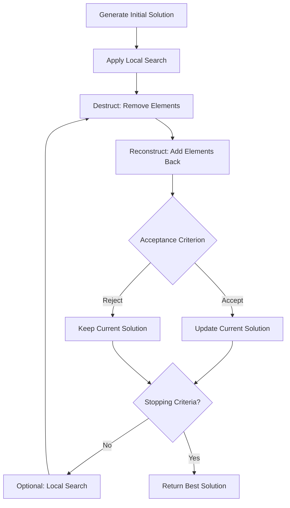

# Iterated Greedy (IG)

Iterated Greedy is a simple yet powerful metaheuristic that iteratively destructs parts of a solution and reconstructs them, keeping the better solution at each iteration. 
## Algorithm Overview

IG operates in cycles, alternating between destruction and reconstruction phases, optionally followed by local search improvement.


```mermaid
graph TD
    A[Generate Initial Solution] --> B[Apply Local Search]
    B --> C[Destruct: Remove Elements]
    C --> D[Reconstruct: Add Elements Back]
    D --> E{Acceptance Criterion}
    E -->|Accept| F[Update Current Solution]
    E -->|Reject| G[Keep Current Solution]
    F --> H{Stopping Criteria?}
    G --> H
    H -->|No| I[Optional: Local Search]
    I --> C
    H -->|Yes| J[Return Best Solution]
```

## Algorithm Outline

```
s = Construct()
s = LocalSearch(s)
best = s

while (not StoppingCriteria()) {
    s' = Destruct(s, 1)        // Apply destructive with strength 1. Destruction strength is fixed in IG
    s' = Reconstruct(s')       // Rebuild solution to make it feasible
    s' = LocalSearch(s')       // Optional improvement phase
    
    if (isBetter(s', best)) {
        best = s'
    }
}
return best
```
