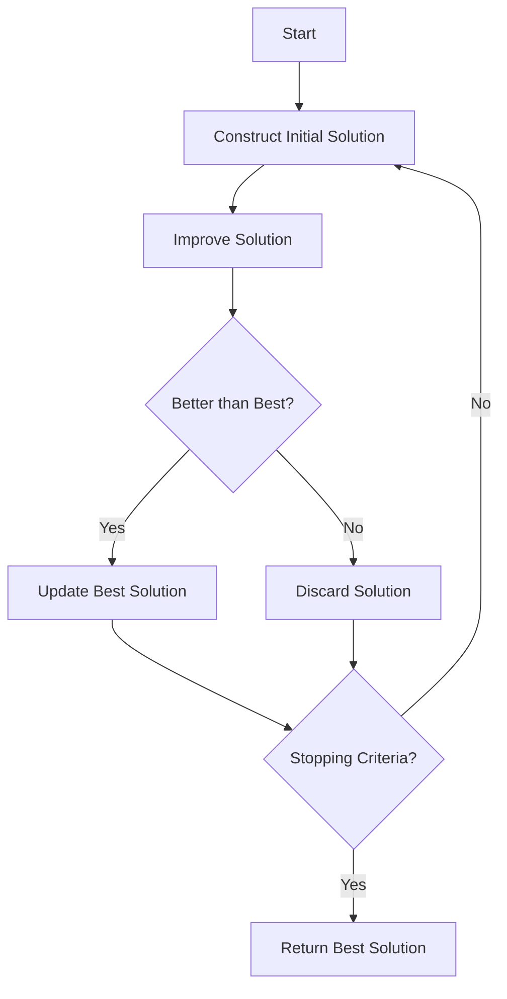

# Multi-Start Algorithm

Multi-Start is a simple yet effective metaheuristic strategy that repeatedly generates and improves solutions, keeping track of the best solution found. It's one of the easiest metaheuristics to implement and often serves as a baseline for comparison.

## Algorithm Overview

Multi-Start alternates between construction and improvement phases, typically using different random seeds or initial configurations each time.



## Algorithm Outline

```
best = null

while (not StoppingCriteria()) {
    s = Construct()
    s = Improve(s)
    
    if (best == null || s.isBetterThan(best)) {
        best = s
    }
}

return best
```

## Key Components

### Construction Phase

Generates initial solutions using various strategies:

- **Random**: Completely random solutions
- **Greedy**: Deterministic greedy construction
- **GRASP**: Randomized greedy with alpha parameter
- **Mixed**: Alternate between different constructive methods

### Improvement Phase

Improves each constructed solution:

- **Local Search**: Best/first improvement
- **VND**: Variable neighborhood descent
- **Simulated Annealing**: For more exploration
- **None**: Pure multi-start without improvement

### Stopping Criteria

Determines when to stop:

- **Time limit**: Stop after time expires
- **Iteration limit**: Stop after N iterations
- **No improvement**: Stop after K iterations without improvement
- **Target reached**: Stop when objective threshold is met

## How to Use

### Basic Example

```java
// Constructor
Constructive<MySolution, MyInstance> constructor = 
    new MyGRASPConstructive(0.3);  // alpha = 0.3

// Improver
Improver<MySolution, MyInstance> improver = 
    new MyLocalSearch();

// Build Multi-Start
var multiStart = new MultiStartAlgorithm<>(
    "MultiStart-GRASP",
    constructor,
    improver,
    100  // iterations
);
```

### With Time Limit

```java
// Use TimeControl for stopping
var multiStart = new MultiStartAlgorithm<MySolution, MyInstance>(
    "MultiStart-Timed",
    constructor,
    improver
) {
    @Override
    protected boolean shouldContinue(int iteration) {
        return !TimeControl.isTimeUp() && iteration < 1000;
    }
};
```

### Without Improvement Phase

```java
// Pure multi-start: just construct multiple solutions
var pureMultiStart = new MultiStartAlgorithm<>(
    "PureMultiStart",
    constructor,
    null,  // No improvement
    500
);
```

### With Alternating Constructors

```java
// Cycle through different constructive methods
List<Constructive<MySolution, MyInstance>> constructors = List.of(
    new RandomConstructive<>(),
    new GreedyConstructive<>(),
    new GRASPConstructive<>(0.2),
    new GRASPConstructive<>(0.5)
);

var multiStart = new MultiStartAlgorithm<MySolution, MyInstance>(
    "MultiStart-Mixed"
) {
    private int iteration = 0;
    
    @Override
    protected MySolution construct(MyInstance instance) {
        var constructor = constructors.get(iteration % constructors.size());
        iteration++;
        return constructor.construct(newSolution(instance));
    }
    
    @Override
    protected MySolution improve(MySolution solution) {
        return localSearch.improve(solution);
    }
    
    @Override
    protected boolean shouldContinue(int iter) {
        return iter < 200;
    }
};
```

## Implementation Notes

### Tracking Progress

```java
public class MonitoredMultiStart<S extends Solution<S, I>, I extends Instance> 
        extends MultiStartAlgorithm<S, I> {
    
    private int improvementCount = 0;
    private int iterationsSinceImprovement = 0;
    
    @Override
    public S algorithm(I instance) {
        S best = null;
        int iteration = 0;
        
        while (shouldContinue(iteration)) {
            S solution = construct(instance);
            solution = improve(solution);
            
            if (best == null || solution.isBetterThan(best)) {
                best = solution;
                improvementCount++;
                iterationsSinceImprovement = 0;
                log.info("New best at iteration {}: {}", iteration, best.getScore());
            } else {
                iterationsSinceImprovement++;
            }
            
            iteration++;
        }
        
        log.info("Total improvements: {}", improvementCount);
        return best;
    }
}
```

### Performance Considerations

**Parallel Multi-Start**: Easy to parallelize since iterations are independent

```java
// Note: Framework handles parallelization automatically
// Just configure in application.yml:
// executor:
//   parallel: true
//   threads: 4
```

**Memory Efficiency**: Don't store all solutions, just the best

**Early Stopping**: Stop if no improvement for K iterations

```java
@Override
protected boolean shouldContinue(int iteration) {
    return !TimeControl.isTimeUp() 
        && iteration < maxIterations
        && iterationsSinceImprovement < patienceLimit;
}
```

## Variants

### GRASP (Greedy Randomized Adaptive Search Procedure)

GRASP is essentially Multi-Start with a specific type of randomized greedy constructor:

```java
var grasp = new MultiStartAlgorithm<>(
    "GRASP",
    new GRASPConstructive<>(0.3),
    new BestImprovementLS<>(),
    100
);
```

### Iterated Local Search (ILS)

ILS is Multi-Start but starts from a perturbed version of the current solution instead of from scratch. See [Iterated Greedy](iterated-greedy.md) for more details.

### Random Restart

Pure random construction without improvement:

```java
var randomRestart = new MultiStartAlgorithm<>(
    "RandomRestart",
    new RandomConstructive<>(),
    null,  // No improvement
    10000
);
```

## Related Java Classes

- **[`MultiStartAlgorithm<S, I>`](../../../../apidocs/es/urjc/etsii/grafo/algorithms/multistart/MultiStartAlgorithm.html)**: Main multi-start implementation
- **[`Algorithm<S, I>`](../../../../apidocs/es/urjc/etsii/grafo/algorithm/Algorithm.html)**: Base class for all algorithms
- **[`Constructive<S, I>`](../../../../apidocs/es/urjc/etsii/grafo/create/Constructive.html)**: Base class for constructive methods
- **[`Improver<S, I>`](../../../../apidocs/es/urjc/etsii/grafo/improve/Improver.html)**: Base class for improvement methods

## Example Use Cases

### TSP with GRASP

```java
var tspMultiStart = new MultiStartAlgorithm<>(
    "TSP-GRASP",
    new NearestNeighborGRASP<>(0.25),  // alpha = 0.25
    new TwoOptLS<>(),
    200
);
```

### VRP with Random Initialization

```java
var vrpMultiStart = new MultiStartAlgorithm<>(
    "VRP-Random",
    new RandomVRPConstructive<>(),
    new SwapImprovementLS<>(),
    500
);
```

### Knapsack Problem

```java
var knapsackMultiStart = new MultiStartAlgorithm<>(
    "Knapsack-Greedy",
    new ValueDensityGRASP<>(0.3),
    new FlipImprover<>(),
    1000
);
```

## Best Practices

1. **Choose appropriate constructor**: Balance between speed and quality
2. **Tune GRASP alpha**: If using GRASP, alpha ∈ [0.1, 0.5] typically works well
3. **Use time control**: Prefer time-based stopping over fixed iterations
4. **Log progress**: Track when improvements occur
5. **Compare with baselines**: Multi-Start is a good baseline for new algorithms
6. **Consider parallelization**: Multi-Start is embarrassingly parallel

## When to Use Multi-Start

**Good for:**
- Quick baseline implementation
- Problems where construction phase is fast
- Embarrassingly parallel execution
- Benchmarking other algorithms

**Not ideal for:**
- Problems where construction is expensive
- When solutions need to evolve (use evolutionary algorithms instead)
- When local search is very expensive (use metaheuristics with fewer evaluations)

## References

[1] Martí, R., Resende, M. G., & Ribeiro, C. C. (2013). Multi-start methods for combinatorial optimization. *European Journal of Operational Research*, 226(1), 1-8.

[2] Feo, T. A., & Resende, M. G. (1995). Greedy randomized adaptive search procedures. *Journal of Global Optimization*, 6(2), 109-133.

[3] Lourenço, H. R., Martin, O. C., & Stützle, T. (2003). Iterated local search. In *Handbook of Metaheuristics* (pp. 320-353). Springer.
