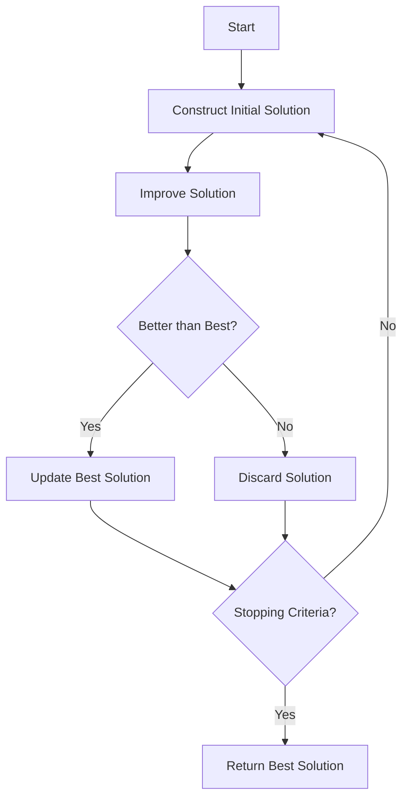

# Multi-Start Algorithm

Multi-Start is a simple yet effective metaheuristic strategy that repeatedly generates and improves solutions, keeping track of the best solution found. It's one of the easiest metaheuristics to implement and often serves as a baseline for comparison.

## Algorithm Overview

Multi-Start alternates between construction and improvement phases, typically using different random seeds or initial configurations each time.


```mermaid
graph TD
    A[Start] --> B[Construct Initial Solution]
    B --> C[Improve Solution]
    C --> D{Better than Best?}
    D -->|Yes| E[Update Best Solution]
    D -->|No| F[Discard Solution]
    E --> G{Stopping Criteria?}
    F --> G
    G -->|No| B
    G -->|Yes| H[Return Best Solution]
```

## Algorithm Outline

```
best = null

while (not StoppingCriteria()) {
    s = Construct()
    s = Improve(s)
    
    if (best == null || s.isBetterThan(best)) {
        best = s
    }
}

return best
```
