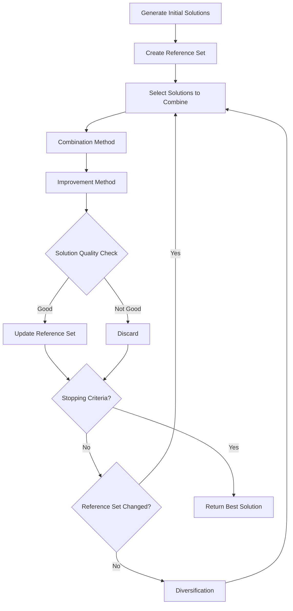

# Scatter Search

Scatter Search is a population-based metaheuristic that operates on a set of diverse, high-quality solutions (reference set). It systematically combines solutions to create new candidate solutions and maintains solution diversity.

## Algorithm Overview

Scatter Search maintains a reference set of solutions and iteratively improves them through combination, improvement, and diversification.



## Algorithm Outline

```
P = GenerateInitialPopulation(popSize)
RefSet = SelectDiverseElite(P, refSetSize)

while (not StoppingCriteria()) {
    NewSolutions = {}
    
    // Generate new solutions by combining reference solutions
    for each pair (s1, s2) in RefSet {
        s' = Combine(s1, s2)
        s' = Improve(s')
        NewSolutions.add(s')
    }
    
    // Update reference set
    RefSet = UpdateRefSet(RefSet, NewSolutions)
    
    // Diversification if needed
    if (no improvement) {
        RefSet = Diversify(RefSet)
    }
}

return best solution in RefSet
```

## Key Components

### Reference Set

The reference set contains the elite solutions used for combination:

- **Size**: Typically 5-20 solutions
- **Quality**: Top solutions based on objective value
- **Diversity**: Solutions should be different from each other

### Combination Method

Creates new solutions by combining two or more reference solutions:

- **Path Relinking**: Create intermediate solutions between two solutions
- **Crossover**: Exchange components between solutions
- **Voting**: Select components that appear in multiple solutions

### Improvement Method

Applied to newly generated solutions:

- **Local Search**: Best/first improvement
- **Simulated Annealing**: For more exploration
- **VND**: Multiple neighborhood structures

### Diversification

Ensures the reference set doesn't become too homogeneous:

- **Random Generation**: Add random solutions
- **Frequency-based**: Penalize frequently used components
- **Distance-based**: Generate solutions far from current set

## How to Use

### Basic Example

```java
// Population generator
PopulationGenerator<MySolution, MyInstance> popGen = 
    new RandomPopulationGenerator<>(100);  // 100 initial solutions

// Combination method
CombinationMethod<MySolution, MyInstance> combiner = 
    new PathRelinkingCombiner<>();

// Improvement method
Improver<MySolution, MyInstance> improver = 
    new MyLocalSearch();

// Diversification method
DiversificationMethod<MySolution, MyInstance> diversifier = 
    new RandomDiversification<>();

// Build Scatter Search
var ss = new ScatterSearch<>(
    "ScatterSearch",
    popGen,
    combiner,
    improver,
    diversifier,
    10,   // refSetSize
    100   // maxIterations
);
```

### With Custom Reference Set Selection

```java
// Custom selection: balance quality and diversity
ReferenceSetSelector<MySolution, MyInstance> selector = 
    new BalancedReferenceSetSelector<>(
        0.7,  // 70% based on quality
        0.3   // 30% based on diversity
    );

var ss = new ScatterSearch<>(
    "CustomSS",
    popGen,
    combiner,
    improver,
    diversifier,
    selector,
    10,
    100
);
```

### Path Relinking Example

```java
// Path relinking: generate intermediate solutions
PathRelinking<MySolution, MyInstance> pathRelinking = 
    new PathRelinking<MySolution, MyInstance>() {
        @Override
        public List<MySolution> relink(MySolution from, MySolution to) {
            List<MySolution> path = new ArrayList<>();
            MySolution current = from.cloneSolution();
            
            while (!current.equals(to)) {
                // Apply move that makes current more similar to 'to'
                Move move = findBestMoveTowards(current, to);
                move.apply(current);
                path.add(current.cloneSolution());
            }
            
            return path;
        }
    };

var ss = new ScatterSearch<>(
    "SS-PathRelinking",
    popGen,
    pathRelinking,
    improver,
    diversifier,
    10,
    100
);
```

## Implementation Notes

### Reference Set Size

- **Small (5-10)**: Faster, more focused search
- **Large (15-20)**: More diversity, slower
- **Typical**: 10 solutions

### Population Initialization

```java
// Mixed initialization for diversity
var mixedPopGen = new MixedPopulationGenerator<>(
    List.of(
        new GreedyConstructive<>(),
        new RandomConstructive<>(),
        new GRASPConstructive<>(0.3)
    ),
    100  // total population size
);
```

### Measuring Diversity

```java
// Distance-based diversity
DiversityMeasure<MySolution> diversity = (s1, s2) -> {
    int differences = 0;
    for (int i = 0; i < s1.size(); i++) {
        if (s1.get(i) != s2.get(i)) {
            differences++;
        }
    }
    return differences;
};
```

### Performance Tips

- **Lazy Improvement**: Don't always apply full local search
- **Caching**: Store previously evaluated solutions
- **Parallel Evaluation**: Evaluate combinations in parallel
- **Early Stopping**: Stop if reference set hasn't changed in N iterations

## Related Java Classes

- **[`ScatterSearch<S, I>`](../../../../apidocs/es/urjc/etsii/grafo/algorithms/scattersearch/ScatterSearch.html)**: Main SS implementation
- **[`ReferenceSet<S, I>`](../../../../apidocs/es/urjc/etsii/grafo/algorithms/scattersearch/ReferenceSet.html)**: Container for reference solutions
- **[`CombinationMethod<S, I>`](../../../../apidocs/es/urjc/etsii/grafo/algorithms/scattersearch/CombinationMethod.html)**: Interface for solution combination
- **[`DiversificationMethod<S, I>`](../../../../apidocs/es/urjc/etsii/grafo/algorithms/scattersearch/DiversificationMethod.html)**: Interface for diversification

## Example Use Cases

### Graph Coloring

```java
// Combine by voting on vertex colors
var combiner = new VotingCombiner<GraphSolution, GraphInstance>() {
    @Override
    public GraphSolution combine(GraphSolution s1, GraphSolution s2) {
        GraphSolution result = new GraphSolution(s1.getInstance());
        for (int vertex = 0; vertex < s1.getVertexCount(); vertex++) {
            // Assign the more frequent color
            int color1 = s1.getColor(vertex);
            int color2 = s2.getColor(vertex);
            result.setColor(vertex, mostFrequent(color1, color2));
        }
        return result;
    }
};
```

### Scheduling Problems

```java
// Combine job sequences
var combiner = new OrderCrossover<ScheduleSolution, ScheduleInstance>();

// Reference set with good makespan solutions
var selector = new QualityBasedSelector<>(10);

var ss = new ScatterSearch<>(
    "Schedule-SS",
    popGen,
    combiner,
    new VND<>(),
    new RandomDiversification<>(),
    selector,
    10,
    500
);
```

## Best Practices

1. **Balance quality and diversity** in reference set
2. **Efficient combination**: Avoid expensive operations
3. **Selective improvement**: Not every solution needs full LS
4. **Monitor convergence**: Track reference set changes
5. **Diversification**: Apply when search stagnates

## References

[1] Glover, F., Laguna, M., & Martí, R. (2000). Fundamentals of scatter search and path relinking. *Control and Cybernetics*, 29(3), 653-684.

[2] Laguna, M., & Martí, R. (2003). *Scatter search: Methodology and implementations in C*. Springer.

[3] Martí, R., Laguna, M., & Glover, F. (2006). Principles of scatter search. *European Journal of Operational Research*, 169(2), 359-372.
