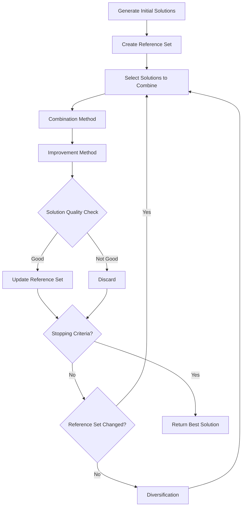

# Scatter Search

Scatter Search is a population-based metaheuristic that operates on a set of diverse, high-quality solutions (reference set). It systematically combines solutions to create new candidate solutions and maintains solution diversity.

## Algorithm Overview

Scatter Search maintains a reference set of solutions and iteratively improves them through combination, improvement, and diversification.


```mermaid
graph TD
    A[Generate Initial Solutions] --> B[Create Reference Set]
    B --> C[Select Solutions to Combine]
    C --> D[Combination Method]
    D --> E[Improvement Method]
    E --> F{Solution Quality Check}
    F -->|Good| G[Update Reference Set]
    F -->|Not Good| H[Discard]
    G --> I{Stopping Criteria?}
    H --> I
    I -->|No| J{Reference Set Changed?}
    J -->|Yes| C
    J -->|No| K[Diversification]
    K --> C
    I -->|Yes| L[Return Best Solution]
```

## Algorithm Outline

```
P = GenerateInitialPopulation(popSize)
RefSet = SelectDiverseElite(P, refSetSize)

while (not StoppingCriteria()) {
    NewSolutions = {}
    
    // Generate new solutions by combining reference solutions
    for each pair (s1, s2) in RefSet {
        s' = Combine(s1, s2)
        s' = Improve(s')
        NewSolutions.add(s')
    }
    
    // Update reference set
    RefSet = UpdateRefSet(RefSet, NewSolutions)
    
    // Diversification if enabled (also known as soft-restart)
    if (no improvement) {
        RefSet = Diversify(RefSet)
    }
}

return best solution in RefSet
```
