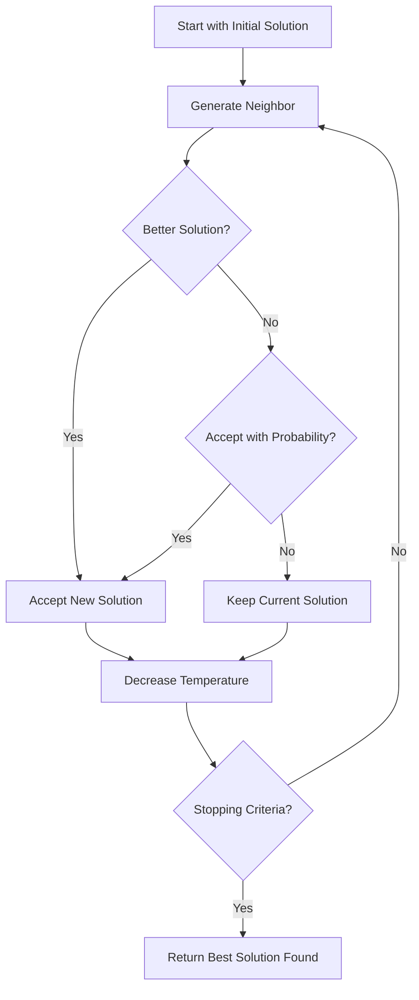

# Simulated Annealing (SA)

Simulated Annealing is a probabilistic metaheuristic inspired by the annealing process in metallurgy. It accepts worse solutions with a probability that decreases over time, allowing the algorithm to escape local optima early in the search while converging to good solutions later.

## Algorithm Overview

Simulated Annealing explores the solution space by occasionally accepting worse solutions based on a temperature parameter that gradually decreases (cools down) over time.



## Algorithm Outline

```
s = GenerateInitialSolution()
T = InitialTemperature
while (not StoppingCriteria()) {
    s' = GenerateNeighbor(s)
    delta = score(s') - score(s)
    
    if (delta < 0 || random() < exp(-delta / T)) {
        s = s'
    }
    
    T = CoolingSchedule(T)
}
return best solution found
```

## Key Components

### Temperature Control

The temperature parameter controls the probability of accepting worse solutions:

- **High Temperature**: More likely to accept worse solutions (exploration)
- **Low Temperature**: Less likely to accept worse solutions (exploitation)

### Cooling Schedules

Mork provides several cooling strategies:

| Strategy | Formula | Description |
|----------|---------|-------------|
| **Exponential** | `T(k+1) = α * T(k)` | Geometric decrease, where 0 < α < 1 (e.g., 0.95) |
| **Linear** | `T(k+1) = T(k) - β` | Constant decrease by β |
| **Logarithmic** | `T(k) = T₀ / log(k+1)` | Slower decrease, theoretical convergence guarantees |

## How to Use

### Basic Example

```java
// Define temperature schedule
CoolingSchedule<MySolution, MyInstance> cooling = 
    new ExponentialCooling<>(1000.0, 0.95);  // Initial temp = 1000, alpha = 0.95

// Create neighborhood explorer
NeighborhoodExplorer<MySolution, MyInstance> explorer = 
    new MyNeighborhoodExplorer();

// Build Simulated Annealing
var sa = new SimulatedAnnealing<>(
    "SA",
    cooling,
    explorer,
    10000  // max iterations
);

// Use in your algorithm
Solution solution = constructive.construct(instance);
solution = sa.improve(solution);  // SA can be used as an improver
```

### With Custom Acceptance Criterion

```java
// Custom acceptance function
AcceptanceCriterion<MySolution, MyInstance> acceptance = 
    (current, candidate, temperature) -> {
        double delta = candidate.getScore() - current.getScore();
        return delta < 0 || Math.random() < Math.exp(-delta / temperature);
    };

var sa = new SimulatedAnnealing<>(
    "CustomSA",
    cooling,
    explorer,
    acceptance,
    10000
);
```

## Implementation Notes

### As an Algorithm vs As an Improver

Simulated Annealing can be used in two ways:

1. **As a standalone algorithm**: Combines construction + SA improvement
2. **As an improver component**: Can be plugged into other metaheuristics

### Best Practices

- **Initial Temperature**: Should be high enough to accept ~50-80% of worse moves initially
- **Cooling Rate**: Slower cooling (e.g., α = 0.99) often gives better results but takes longer
- **Stopping Criteria**: Use time limits or a minimum temperature threshold
- **Track Best**: Always keep track of the best solution found, as SA can end in a non-optimal state

### Performance Tips

```java
// Efficient: reuse neighbor generation
var explorer = new CachedNeighborhoodExplorer<>(baseExplorer);

// Consider adaptive cooling
var adaptiveCooling = new AdaptiveCooling<>(
    initialTemp, 
    minTemp,
    acceptanceRateTarget  // e.g., 0.3 for 30% acceptance
);
```

## Related Java Classes

- **[`SimulatedAnnealing<S, I>`](../../../../apidocs/es/urjc/etsii/grafo/improve/sa/SimulatedAnnealing.html)**: Main SA implementation
- **[`CoolingSchedule<S, I>`](../../../../apidocs/es/urjc/etsii/grafo/improve/sa/CoolingSchedule.html)**: Interface for temperature schedules
- **[`AcceptanceCriterion<S, I>`](../../../../apidocs/es/urjc/etsii/grafo/improve/sa/AcceptanceCriterion.html)**: Interface for acceptance criteria
- **[`Improver<S, I>`](../../../../apidocs/es/urjc/etsii/grafo/improve/Improver.html)**: Base class for improvement methods

## Example Use Cases

### TSP (Traveling Salesman Problem)

```java
var cooling = new ExponentialCooling<>(100.0, 0.95);
var explorer = new TwoOptNeighborhood<>();
var sa = new SimulatedAnnealing<>("TSP-SA", cooling, explorer, 50000);
```

### VRP (Vehicle Routing Problem)

```java
var cooling = new LinearCooling<>(500.0, 0.1);
var explorer = new SwapRoutesNeighborhood<>();
var sa = new SimulatedAnnealing<>("VRP-SA", cooling, explorer, 100000);
```

## References

[1] Kirkpatrick, S., Gelatt, C. D., & Vecchi, M. P. (1983). Optimization by simulated annealing. *Science*, 220(4598), 671-680.

[2] Černý, V. (1985). Thermodynamical approach to the traveling salesman problem: An efficient simulation algorithm. *Journal of Optimization Theory and Applications*, 45(1), 41-51.

[3] Van Laarhoven, P. J., & Aarts, E. H. (1987). *Simulated annealing: Theory and applications*. Springer.
