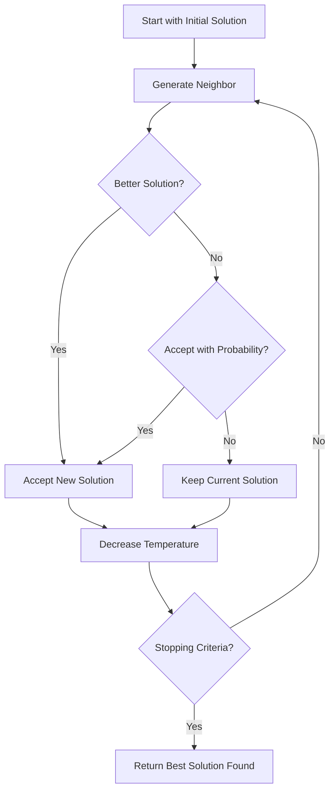

# Simulated Annealing (SA)

Simulated Annealing is a probabilistic metaheuristic inspired by the annealing process in metallurgy. It accepts worse solutions with a probability that decreases over time, allowing the algorithm to escape local optima early in the search while converging to good solutions later.

## Algorithm Overview

Simulated Annealing explores the solution space by occasionally accepting worse solutions based on a temperature parameter that gradually decreases (cools down) over time.


```mermaid
graph TD
    A[Start with Initial Solution] --> B[Generate Neighbor]
    B --> C{Better Solution?}
    C -->|Yes| D[Accept New Solution]
    C -->|No| E{Accept with Probability?}
    E -->|Yes| D
    E -->|No| F[Keep Current Solution]
    D --> G[Decrease Temperature]
    F --> G
    G --> H{Stopping Criteria?}
    H -->|No| B
    H -->|Yes| I[Return Best Solution Found]
```

## Algorithm Outline

```
s = GenerateInitialSolution()
T = InitialTemperature
while (not StoppingCriteria()) {
    s' = GenerateNeighbor(s)
    delta = score(s') - score(s)
    
    if (delta < 0 || random() < exp(-delta / T)) {
        s = s'
    }
    
    T = CoolingSchedule(T)
}
return best solution found
```

All SA parameters are configurable, including the cooling schedule and the acceptance criterion. Check its builder for full details.