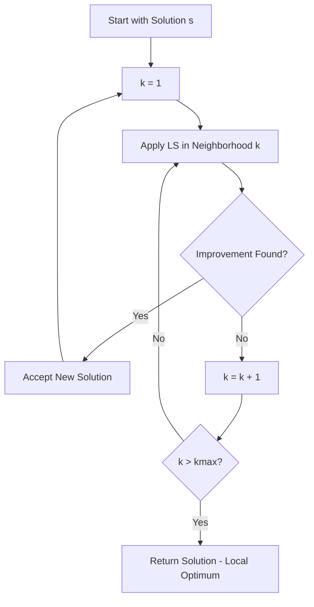

# Variable Neighborhood Descent (VND)

Variable Neighborhood Descent (VND) is a deterministic improvement method that systematically explores multiple neighborhood structures to escape local optima. Unlike VNS, VND doesn't use random shakes—it systematically tries different neighborhoods until no improvement is found.

## Algorithm Overview

VND cycles through a set of neighborhood structures, applying local search in each until a local optimum with respect to all neighborhoods is reached.



## Algorithm Outline

```
VND(solution s) {
    k = 1
    while (k <= kmax) {
        s' = LocalSearch(s, neighborhood_k)
        
        if (s'.isBetterThan(s)) {
            s = s'
            k = 1  // Restart from first neighborhood
        } else {
            k = k + 1  // Try next neighborhood
        }
    }
    return s
}
```

## Key Concepts

### Systematic Exploration

VND explores neighborhoods in a **deterministic order**:

1. Start with the first neighborhood
2. Apply local search
3. If improvement found, restart from first neighborhood
4. If no improvement, try next neighborhood
5. Stop when all neighborhoods exhausted

### Neighborhood Ordering

The order matters! Common strategies:

- **Simple to Complex**: Start with fast, simple neighborhoods
- **Complex to Simple**: Start with more thorough neighborhoods
- **Most Effective First**: Based on empirical performance
- **Problem-Specific**: Order based on problem structure

### Difference from VNS

| Aspect | VND | VNS |
|--------|-----|-----|
| **Exploration** | Deterministic | Stochastic (uses shake) |
| **Usage** | Local search component | Complete metaheuristic |
| **Speed** | Faster (no random perturbations) | Slower (includes shakes) |
| **Typical Use** | Inside other algorithms | Standalone algorithm |

## How to Use

### Basic Example

```java
// Define multiple local search operators (neighborhoods)
List<Improver<MySolution, MyInstance>> improvers = List.of(
    new SwapLS<>(),           // Neighborhood 1: swap two elements
    new InsertLS<>(),         // Neighborhood 2: move one element
    new TwoOptLS<>()          // Neighborhood 3: 2-opt moves
);

// Build VND
var vnd = new VND<>(
    "VND-3Neighborhoods",
    improvers
);

// Use as an improver
Solution improved = vnd.improve(solution);
```

### With Custom Neighborhood Order

```java
// Order neighborhoods by expected effectiveness
var vnd = new VND<>(
    "VND-Ordered",
    List.of(
        new FastGreedySwap<>(),      // Fast, often effective
        new TwoOpt<>(),               // Medium speed
        new ThreeOpt<>(),             // Slower, more thorough
        new OrOpt<>()                 // Comprehensive
    )
);
```

### Inside VNS

```java
// VND is commonly used as the improvement method in VNS
var vnd = new VND<>("VND", List.of(swap, insert, twoOpt));

var vns = new VNSBuilder<MySolution, MyInstance>()
    .withConstructive(constructor)
    .withImprover(vnd)  // Use VND as the improver
    .withShake(shake)
    .withNeighChange(5)
    .build("VNS-with-VND");
```

### Conditional Neighborhoods

```java
// Only explore expensive neighborhoods if cheap ones fail
var vnd = new ConditionalVND<MySolution, MyInstance>(
    "Adaptive-VND"
) {
    @Override
    protected List<Improver<MySolution, MyInstance>> selectNeighborhoods(
            MySolution solution, int attemptsSinceImprovement) {
        
        if (attemptsSinceImprovement < 3) {
            // Try fast neighborhoods first
            return List.of(fastSwap, fastInsert);
        } else {
            // If stuck, try more expensive neighborhoods
            return List.of(fastSwap, fastInsert, twoOpt, threeOpt);
        }
    }
};
```

## Implementation Notes

### Creating Neighborhood Operators

Each neighborhood should implement the `Improver` interface:

```java
public class SwapLS<S extends Solution<S, I>, I extends Instance> 
        extends Improver<S, I> {
    
    @Override
    public S improve(S solution) {
        boolean improved = true;
        
        while (improved) {
            improved = false;
            
            for (int i = 0; i < solution.size(); i++) {
                for (int j = i + 1; j < solution.size(); j++) {
                    double delta = evaluateSwap(solution, i, j);
                    
                    if (delta < 0) {  // Improvement found
                        applySwap(solution, i, j);
                        improved = true;
                        break;
                    }
                }
                if (improved) break;  // First improvement
            }
        }
        
        return solution;
    }
}
```

### Performance Optimization

```java
// Cache expensive calculations
var cachedVND = new VND<>(
    "Cached-VND",
    List.of(
        new CachedImprover<>(swap),
        new CachedImprover<>(insert),
        new CachedImprover<>(twoOpt)
    )
);

// Limit iterations per neighborhood
var limitedVND = new VND<MySolution, MyInstance>(
    "Limited-VND"
) {
    @Override
    protected MySolution applyNeighborhood(
            MySolution solution, Improver<MySolution, MyInstance> improver, int k) {
        
        int maxIterations = 1000 / (k + 1);  // Fewer iterations for later neighborhoods
        return improver.improve(solution, maxIterations);
    }
};
```

### Tracking Effectiveness

```java
public class MonitoredVND<S extends Solution<S, I>, I extends Instance> 
        extends VND<S, I> {
    
    private Map<String, Integer> neighborhoodImprovements = new HashMap<>();
    
    @Override
    public S improve(S solution) {
        int k = 0;
        S current = solution;
        
        while (k < improvers.size()) {
            S improved = improvers.get(k).improve(current);
            
            if (improved.isBetterThan(current)) {
                String name = improvers.get(k).getClass().getSimpleName();
                neighborhoodImprovements.merge(name, 1, Integer::sum);
                current = improved;
                k = 0;  // Restart
            } else {
                k++;
            }
        }
        
        log.info("Neighborhood effectiveness: {}", neighborhoodImprovements);
        return current;
    }
}
```

## Related Java Classes

- **[`VND<S, I>`](../../../../apidocs/es/urjc/etsii/grafo/improve/VND.html)**: Main VND implementation
- **[`Improver<S, I>`](../../../../apidocs/es/urjc/etsii/grafo/improve/Improver.html)**: Base class for improvement methods
- **[`SequentialImprover<S, I>`](../../../../apidocs/es/urjc/etsii/grafo/improve/SequentialImprover.html)**: Chain multiple improvers
- **[`VNS<S, I>`](../../../../apidocs/es/urjc/etsii/grafo/algorithms/vns/VNS.html)**: Variable Neighborhood Search

## Example Use Cases

### TSP with Multiple Neighborhoods

```java
var vnd = new VND<>(
    "TSP-VND",
    List.of(
        new TwoOptLS<>(),         // 2-opt: swap two edges
        new OrOptLS<>(1),         // Or-opt-1: relocate one city
        new OrOptLS<>(2),         // Or-opt-2: relocate two consecutive cities
        new ThreeOptLS<>()        // 3-opt: more complex moves
    )
);
```

### VRP with Route and Inter-Route Neighborhoods

```java
var vnd = new VND<>(
    "VRP-VND",
    List.of(
        new IntraRouteSwap<>(),      // Within route swaps
        new IntraRouteRelocate<>(),  // Within route relocations
        new InterRouteSwap<>(),      // Between route swaps
        new InterRouteRelocate<>(),  // Between route relocations
        new TwoOptStar<>()           // Cross exchange
    )
);
```

### Scheduling Problem

```java
var vnd = new VND<>(
    "Schedule-VND",
    List.of(
        new JobSwapLS<>(),           // Swap jobs in sequence
        new JobInsertLS<>(),         // Move job to different position
        new BlockSwapLS<>(),         // Swap blocks of jobs
        new ResourceReassignLS<>()   // Change resource assignments
    )
);
```

## Best Practices

1. **Order matters**: Start with fast, effective neighborhoods
2. **Balance speed and quality**: Don't use too many expensive neighborhoods
3. **3-5 neighborhoods**: Usually sufficient for most problems
4. **Test neighborhood effectiveness**: Monitor which neighborhoods find improvements
5. **Consider problem structure**: Order should reflect problem characteristics
6. **Use first improvement**: In each neighborhood, accept first improvement for speed

## When to Use VND

**Good for:**
- Problems with multiple natural neighborhood structures
- As improvement method inside other metaheuristics
- When deterministic behavior is desired
- Fast improvement without randomness

**Not ideal for:**
- Single neighborhood problems (use simple local search)
- When strong diversification is needed (use VNS instead)
- Very large neighborhoods (computational cost)

## References

[1] Hansen, P., & Mladenović, N. (2001). Variable neighborhood search: Principles and applications. *European Journal of Operational Research*, 130(3), 449-467.

[2] Mladenović, N., & Hansen, P. (1997). Variable neighborhood search. *Computers & Operations Research*, 24(11), 1097-1100.

[3] Hansen, P., Mladenović, N., Brimberg, J., & Pérez, J. A. M. (2010). Variable neighborhood search. In *Handbook of Metaheuristics* (pp. 61-86). Springer.
