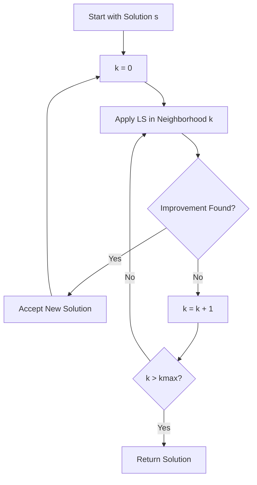

# Variable Neighborhood Descent (VND)

Variable Neighborhood Descent (VND) is a deterministic improvement method that systematically explores multiple neighborhood structures to escape local optima. Unlike VNS, VND doesn't use shakes. 

## Algorithm Overview

VND cycles through a set of improvement methods, usually local searches, until a local optimum with respect to all neighborhoods is reached.


```mermaid
graph TD
    A[Start with Solution s] --> B[k = 0]
    B --> C[Apply LS in Neighborhood k]
    C --> D{Improvement Found?}
    D -->|Yes| E[Accept New Solution]
    E --> B
    D -->|No| F[k = k + 1]
    F --> G{k > kmax?}
    G -->|No| C
    G -->|Yes| H[Return Solution]
```

The solution returned by a VND method is a local optimum for all its configured improvement methods.
A key difference between a sequence of improvement methods (for example, using `Improver::serial`) is that VND always resets to the first improvement when the solution improves.

## Algorithm Outline

```
VND(solution s) {
    k = 0
    while (k <= kmax) {
        s' = improvers[k].improve(s)
 
        if (s'.isBetterThan(s)) {
            s = s'
            k = 0  // Restart when improved
        } else {
            k = k + 1 
        }
    }
    return s
}
```
