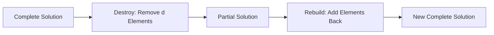

# Destroy-Rebuild

Destroy-Rebuild is a combined shake operator that first destroys part of a solution and then immediately rebuilds it. It combines [Destructive](destructive.md) and [Reconstructive](../constructors/reconstructive.md) operations into a single perturbation method.

## Overview

Destroy-Rebuild implements Large Neighborhood Search (LNS) principles: remove parts of the solution and rebuild them, potentially in a better configuration.



## Key Concept

Destroy-Rebuild is a **composite shake** that:
1. Applies a **destructive** operator to remove elements
2. Applies a **reconstructive** operator to add them back
3. Returns a **complete** solution (unlike pure destruction)

## Base Implementation

```java
public class DestroyRebuild<S extends Solution<S, I>, I extends Instance> 
        extends Shake<S, I> {
    
    private final Destructive<S, I> destructor;
    private final Reconstructive<S, I> reconstructor;
    
    public DestroyRebuild(
            Destructive<S, I> destructor, 
            Reconstructive<S, I> reconstructor) {
        super("DestroyRebuild");
        this.destructor = destructor;
        this.reconstructor = reconstructor;
    }
    
    @Override
    public S shake(S solution) {
        // 1. Destroy: create partial solution
        S partial = destructor.shake(solution);
        
        // 2. Rebuild: complete the solution
        S rebuilt = reconstructor.reconstruct(partial);
        
        return rebuilt;
    }
}
```

## How to Use

### Basic Usage

```java
// Define destruction strategy
Destructive<MySolution, MyInstance> destructor = 
    new RandomDestructor<>(5);  // Remove 5 elements

// Define reconstruction strategy
Reconstructive<MySolution, MyInstance> reconstructor = 
    new GreedyReconstructor<>();  // Add back greedily

// Combine into shake
var destroyRebuild = new DestroyRebuild<>(destructor, reconstructor);

// Use in VNS
var vns = new VNSBuilder<MySolution, MyInstance>()
    .withConstructive(constructor)
    .withImprover(improver)
    .withShake(destroyRebuild)  // Use as perturbation
    .build("VNS");
```

### Multiple Destroy-Rebuild Operators

```java
// Different operators for different neighborhoods in VNS
var shake1 = new DestroyRebuild<>(
    new RandomDestructor<>(3),      // Small destruction
    new GreedyReconstructor<>()
);

var shake2 = new DestroyRebuild<>(
    new WorstDestructor<>(6),       // Medium destruction
    new GRASPReconstructor<>(0.3)
);

var shake3 = new DestroyRebuild<>(
    new RelatedDestructor<>(10),    // Large destruction
    new RandomReconstructor<>()
);

// Use in VND or adaptive VNS
var adaptiveShake = new AdaptiveShake<>(
    List.of(shake1, shake2, shake3)
);
```

### With Local Search

```java
// Destroy-rebuild followed by improvement
public class DestroyRebuildLS<S extends Solution<S, I>, I extends Instance> 
        extends Shake<S, I> {
    
    private final DestroyRebuild<S, I> destroyRebuild;
    private final Improver<S, I> improver;
    
    @Override
    public S shake(S solution) {
        S rebuilt = destroyRebuild.shake(solution);
        return improver.improve(rebuilt);
    }
}
```

## Destruction-Reconstruction Combinations

Different combinations yield different search behaviors:

| Destruction | Reconstruction | Behavior |
|-------------|----------------|----------|
| **Random** + **Greedy** | Diversification + Quality | Balanced |
| **Worst** + **GRASP** | Strategic + Randomized | Exploration |
| **Related** + **Greedy** | Clustered + Deterministic | Intensification |
| **Adaptive** + **Adaptive** | Both parameters vary | Reactive |

## Strategies

### 1. Random Destroy + Greedy Rebuild

```java
var shake = new DestroyRebuild<>(
    new RandomDestructor<>(d),
    new GreedyReconstructor<>()
);
```

**Effect**: Remove random elements, rebuild optimally

**Good for**: General purpose, balanced search

### 2. Worst Destroy + GRASP Rebuild

```java
var shake = new DestroyRebuild<>(
    new WorstDestructor<>(d),
    new GRASPReconstructor<>(0.3)
);
```

**Effect**: Remove bad elements, rebuild with randomization

**Good for**: Escaping poor solution regions

### 3. Related Destroy + Related Rebuild

```java
var shake = new DestroyRebuild<>(
    new RelatedDestructor<>(d),
    new SimilarityBasedReconstructor<>()
);
```

**Effect**: Restructure related components

**Good for**: Problems with structure (clusters, routes, etc.)

## Adaptive Destroy-Rebuild

```java
public class AdaptiveDestroyRebuild<S extends Solution<S, I>, I extends Instance>
        extends Shake<S, I> {
    
    private List<Destructive<S, I>> destructors;
    private List<Reconstructive<S, I>> reconstructors;
    private double[] weights;
    
    public AdaptiveDestroyRebuild(
            List<Destructive<S, I>> destructors,
            List<Reconstructive<S, I>> reconstructors) {
        super("AdaptiveDestroyRebuild");
        this.destructors = destructors;
        this.reconstructors = reconstructors;
        this.weights = new double[destructors.size()];
        Arrays.fill(weights, 1.0);
    }
    
    @Override
    public S shake(S solution) {
        // Select destructor based on weights
        int destructorIdx = selectWeighted(weights);
        int reconstructorIdx = selectWeighted(weights);
        
        // Apply selected operators
        S partial = destructors.get(destructorIdx).shake(solution);
        S rebuilt = reconstructors.get(reconstructorIdx).reconstruct(partial);
        
        // Update weights based on quality
        updateWeights(destructorIdx, reconstructorIdx, rebuilt);
        
        return rebuilt;
    }
}
```

## Parameter Tuning

### Destruction Size

```java
// Small destruction: fine-grained search
var smallShake = new DestroyRebuild<>(
    new RandomDestructor<>(2),      // Remove 2
    new GreedyReconstructor<>()
);

// Large destruction: exploration
var largeShake = new DestroyRebuild<>(
    new RandomDestructor<>(10),     // Remove 10
    new GRASPReconstructor<>(0.5)
);

// Adaptive: vary destruction size
var adaptiveShake = new DestroyRebuild<>(
    new AdaptiveDestructor<>(solution -> calculateDestructionSize(solution)),
    new GreedyReconstructor<>()
);
```

### Reconstruction Randomness

```java
// Deterministic: same input → same output
var deterministicShake = new DestroyRebuild<>(
    new RandomDestructor<>(d),
    new GreedyReconstructor<>()
);

// Randomized: same input → different outputs
var randomizedShake = new DestroyRebuild<>(
    new RandomDestructor<>(d),
    new GRASPReconstructor<>(0.3)  // alpha = 0.3
);
```

## Related Java Classes

- **[`DestroyRebuild<S, I>`](../../../../apidocs/es/urjc/etsii/grafo/shake/DestroyRebuild.html)**: Main implementation
- **[`Destructive<S, I>`](../../../../apidocs/es/urjc/etsii/grafo/shake/Destructive.html)**: Destruction operators
- **[`Reconstructive<S, I>`](../../../../apidocs/es/urjc/etsii/grafo/create/Reconstructive.html)**: Reconstruction methods
- **[`Shake<S, I>`](../../../../apidocs/es/urjc/etsii/grafo/shake/Shake.html)**: Base shake interface
- **[`VNS<S, I>`](../../../../apidocs/es/urjc/etsii/grafo/algorithms/vns/VNS.html)**: Can use as perturbation

## Example Use Cases

### TSP Destroy-Rebuild

```java
// Destroy: remove segment
var destructor = new TSPSegmentDestructor(5);

// Rebuild: cheapest insertion
var reconstructor = new TSPCheapestInsertionReconstructor();

var shake = new DestroyRebuild<>(destructor, reconstructor);
```

### VRP Destroy-Rebuild

```java
// Destroy: remove customers from worst routes
var destructor = new VRPWorstRouteDestructor(8);

// Rebuild: insert with regret heuristic
var reconstructor = new VRPRegretReconstructor();

var shake = new DestroyRebuild<>(destructor, reconstructor);
```

### Scheduling Destroy-Rebuild

```java
// Destroy: unschedule jobs on critical path
var destructor = new CriticalPathDestructor(6);

// Rebuild: schedule with earliest due date
var reconstructor = new EDDReconstructor();

var shake = new DestroyRebuild<>(destructor, reconstructor);
```

## Best Practices

1. **Match destruction size**: Larger destruction for more diversification
2. **Reconstruction quality**: Balance between greedy and randomized
3. **Combine strategies**: Use multiple destroy-rebuild pairs
4. **Adaptive selection**: Learn which combinations work best
5. **Time consideration**: Destruction+reconstruction can be expensive
6. **Maintain feasibility**: Both phases must preserve validity

## Performance Considerations

**Cost**: O(d × eval) where:
- d = number of elements destroyed
- eval = cost of evaluating insertions

**Memory**: Usually works in-place after initial clone

**Tradeoff**: Larger d → more expensive but potentially better solutions

## When to Use

**Good for:**
- Problems with insertable/removable elements
- When simple moves are too local
- Large neighborhood search scenarios
- Problems with structure to exploit

**Consider alternatives when:**
- Destruction/reconstruction is very expensive
- Problem structure doesn't suit partial solutions
- Simple perturbations are sufficient

## References

[1] Shaw, P. (1998). Using constraint programming and local search methods to solve vehicle routing problems. In *CP* (Vol. 98, pp. 417-431).

[2] Pisinger, D., & Ropke, S. (2007). A general heuristic for vehicle routing problems. *Computers & Operations Research*, 34(8), 2403-2435.

[3] Ropke, S., & Pisinger, D. (2006). An adaptive large neighborhood search heuristic for the pickup and delivery problem with time windows. *Transportation Science*, 40(4), 455-472.
