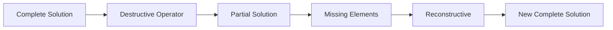

# Destructive

Destructive operators remove elements from a solution, creating a partial solution that must later be completed. They are commonly used in destruction-reconstruction metaheuristics like Iterated Greedy.

## Overview

Destructive methods implement the **destruction phase** where parts of a solution are removed. The resulting partial solution is then reconstructed by a [Reconstructive](../constructors/reconstructive.md) method.



## Base Destructive Interface

```java
public interface Destructive<S extends Solution<S, I>, I extends Instance> 
        extends Shake<S, I> {
    
    /**
     * Destroy part of the solution
     * @param solution Complete solution to partially destroy
     * @return Partial solution with some elements removed
     */
    @Override
    S shake(S solution);  // Also called destruct() in implementations
}
```

## Key Concept: Partial Solutions

Unlike regular shakes, destructive operators create **incomplete** solutions:

```java
@Override
public S shake(S solution) {
    S partial = solution.cloneSolution();
    
    // Remove d elements
    var toRemove = selectElementsToRemove(partial, d);
    for (Element element : toRemove) {
        partial.remove(element);
    }
    
    // partial is now incomplete!
    assert !partial.isComplete();
    
    return partial;
}
```

## Destruction Strategies

### 1. Random Destruction

Remove random elements:

```java
public class RandomDestructor<S extends Solution<S, I>, I extends Instance> 
        implements Destructive<S, I> {
    
    private final int d;  // Number of elements to remove
    
    public RandomDestructor(int d) {
        this.d = d;
    }
    
    @Override
    public S shake(S solution) {
        S partial = solution.cloneSolution();
        
        // Remove d random elements
        List<Element> elements = new ArrayList<>(partial.getElements());
        Collections.shuffle(elements);
        
        for (int i = 0; i < Math.min(d, elements.size()); i++) {
            partial.remove(elements.get(i));
        }
        
        return partial;
    }
}
```

### 2. Worst Destruction

Remove elements contributing most to objective:

```java
public class WorstDestructor<S extends Solution<S, I>, I extends Instance> 
        implements Destructive<S, I> {
    
    private final int d;
    
    public WorstDestructor(int d) {
        this.d = d;
    }
    
    @Override
    public S shake(S solution) {
        S partial = solution.cloneSolution();
        
        // Sort elements by their contribution (worst first)
        var elements = partial.getElements().stream()
            .sorted(Comparator.comparingDouble(e -> -evaluateContribution(e, partial)))
            .collect(Collectors.toList());
        
        // Remove d worst elements
        for (int i = 0; i < Math.min(d, elements.size()); i++) {
            partial.remove(elements.get(i));
        }
        
        return partial;
    }
    
    private double evaluateContribution(Element element, S solution) {
        // How much does this element contribute to the objective?
        return solution.evaluateRemoval(element);
    }
}
```

### 3. Related Destruction

Remove elements that are related/similar:

```java
public class RelatedDestructor<S extends Solution<S, I>, I extends Instance> 
        implements Destructive<S, I> {
    
    private final int d;
    
    @Override
    public S shake(S solution) {
        S partial = solution.cloneSolution();
        
        // Pick a random seed element
        Element seed = partial.getRandomElement();
        partial.remove(seed);
        
        // Remove d-1 elements most related to seed
        var remaining = new ArrayList<>(partial.getElements());
        remaining.sort(Comparator.comparingDouble(e -> 
            -similarity(seed, e, partial)));
        
        for (int i = 0; i < Math.min(d - 1, remaining.size()); i++) {
            partial.remove(remaining.get(i));
        }
        
        return partial;
    }
    
    protected abstract double similarity(Element e1, Element e2, S solution);
}
```

### 4. Shaw Removal (Cluster-based)

Remove elements that are similar to each other:

```java
public class ShawDestructor<S extends Solution<S, I>, I extends Instance> 
        implements Destructive<S, I> {
    
    @Override
    public S shake(S solution) {
        S partial = solution.cloneSolution();
        
        Element seed = partial.getRandomElement();
        List<Element> toRemove = new ArrayList<>();
        toRemove.add(seed);
        
        // Build cluster of related elements
        while (toRemove.size() < d) {
            Element mostRelated = findMostRelatedNotRemoved(
                toRemove, 
                partial.getElements()
            );
            if (mostRelated != null) {
                toRemove.add(mostRelated);
            } else {
                break;
            }
        }
        
        // Remove cluster
        toRemove.forEach(partial::remove);
        
        return partial;
    }
}
```

## Use in Iterated Greedy

```java
// Destructor removes d elements
Destructive<MySolution, MyInstance> destructor = 
    new RandomDestructor<>(4);

// Reconstructor adds them back
Reconstructive<MySolution, MyInstance> reconstructor = 
    new GreedyReconstructor<>();

// Combine in IG
var ig = new IteratedGreedy<>(
    "IG",
    constructor,
    destructor,     // Destruction phase
    reconstructor,  // Reconstruction phase
    improver
);
```

## Use in DestroyRebuild Shake

```java
// Combined operator for VNS
var destroyRebuild = new DestroyRebuild<>(
    new WorstDestructor<>(5),
    new GRASPReconstructor<>(0.3)
);

var vns = new VNSBuilder<MySolution, MyInstance>()
    .withConstructive(constructor)
    .withImprover(improver)
    .withShake(destroyRebuild)
    .build("VNS");
```

## Parameter: Destruction Size (d)

The number of elements to remove is crucial:

| Size | Effect | Use Case |
|------|--------|----------|
| **Small (1-3)** | Minor perturbation | Intensification |
| **Medium (4-10)** | Balanced | General purpose |
| **Large (>10)** | Major restructuring | Diversification |
| **Percentage (10-30%)** | Adaptive to problem size | Variable-size problems |

### Adaptive Destruction Size

```java
public class AdaptiveDestructor<S extends Solution<S, I>, I extends Instance> 
        implements Destructive<S, I> {
    
    private double destructionRatio = 0.2;  // 20% of elements
    
    @Override
    public S shake(S solution) {
        S partial = solution.cloneSolution();
        int d = (int) (solution.size() * destructionRatio);
        
        // Remove d elements randomly
        var toRemove = selectRandomElements(partial, d);
        toRemove.forEach(partial::remove);
        
        return partial;
    }
    
    public void setDestructionRatio(double ratio) {
        this.destructionRatio = ratio;
    }
}
```

## Related Java Classes

- **[`Destructive<S, I>`](../../../../apidocs/es/urjc/etsii/grafo/shake/Destructive.html)**: Destruction interface
- **[`DestroyRebuild<S, I>`](../../../../apidocs/es/urjc/etsii/grafo/shake/DestroyRebuild.html)**: Combined destroy-rebuild
- **[`Reconstructive<S, I>`](../../../../apidocs/es/urjc/etsii/grafo/create/Reconstructive.html)**: Reconstruction methods
- **[`IteratedGreedy<S, I>`](../../../../apidocs/es/urjc/etsii/grafo/algorithms/IteratedGreedy.html)**: Uses destructors
- **[`Shake<S, I>`](../../../../apidocs/es/urjc/etsii/grafo/shake/Shake.html)**: Base shake interface

## Example Use Cases

### TSP Segment Destruction

```java
public class TSPSegmentDestructor implements Destructive<TSPSolution, TSPInstance> {
    
    private final int segmentLength;
    
    @Override
    public TSPSolution shake(TSPSolution solution) {
        TSPSolution partial = solution.cloneSolution();
        
        // Remove a continuous segment
        int start = random.nextInt(solution.size() - segmentLength);
        for (int i = 0; i < segmentLength; i++) {
            partial.removeCity(start);  // Always remove at start since list shifts
        }
        
        return partial;
    }
}
```

### VRP Route Destruction

```java
public class VRPRouteDestructor implements Destructive<VRPSolution, VRPInstance> {
    
    private final int numCustomers;
    
    @Override
    public VRPSolution shake(VRPSolution solution) {
        VRPSolution partial = solution.cloneSolution();
        
        // Remove customers from random routes
        for (int i = 0; i < numCustomers; i++) {
            Route route = partial.getRandomNonEmptyRoute();
            Customer customer = route.getRandomCustomer();
            partial.unassignCustomer(customer);
        }
        
        return partial;
    }
}
```

### Job Shop Destruction

```java
public class JobShopDestructor implements Destructive<ScheduleSolution, ScheduleInstance> {
    
    @Override
    public ScheduleSolution shake(ScheduleSolution solution) {
        ScheduleSolution partial = solution.cloneSolution();
        
        // Remove jobs from critical path
        var criticalJobs = partial.getCriticalPathJobs();
        int toRemove = Math.min(d, criticalJobs.size());
        
        Collections.shuffle(criticalJobs);
        for (int i = 0; i < toRemove; i++) {
            partial.unscheduleJob(criticalJobs.get(i));
        }
        
        return partial;
    }
}
```

## Best Practices

1. **Maintain feasibility**: Even partial solutions should be feasible
2. **Track removed elements**: Solution should know what's missing
3. **Parameterize destruction size**: Allow external control
4. **Problem-specific**: Design destruction strategies based on problem structure
5. **Balance randomness**: Mix random and strategic element selection
6. **Efficient removal**: Use efficient data structures for element removal

## Performance Considerations

- **Removal cost**: O(d) removals, each potentially O(n)
- **Element selection**: Pre-sort or use priority queues for efficiency
- **Memory**: Clone solution or modify in-place depending on needs

## References

[1] Ruiz, R., & Stützle, T. (2007). A simple and effective iterated greedy algorithm for the permutation flowshop scheduling problem. *European Journal of Operational Research*, 177(3), 2033-2049.

[2] Shaw, P. (1998). Using constraint programming and local search methods to solve vehicle routing problems. In *CP* (Vol. 98, pp. 417-431).

[3] Ropke, S., & Pisinger, D. (2006). An adaptive large neighborhood search heuristic for the pickup and delivery problem with time windows. *Transportation Science*, 40(4), 455-472.
