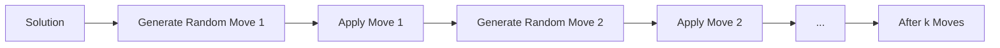

# Random Move Shake

Random Move Shake is a simple perturbation method that applies a sequence of random moves to a solution. It's one of the most straightforward shake implementations and serves as a baseline perturbation strategy.

## Overview

Random Move Shake perturbs a solution by applying random valid moves without considering whether they improve the objective function.



## Algorithm Outline

```
RandomMoveShake(solution, k):
    perturbed = clone(solution)
    
    for (i = 0; i < k; i++) {
        move = generateRandomMove(perturbed)
        apply(move, perturbed)
    }
    
    return perturbed
```

## How to Use

### Basic Implementation

```java
public class RandomMoveShake<S extends Solution<S, I>, I extends Instance> 
        extends Shake<S, I> {
    
    private final int numMoves;
    
    public RandomMoveShake(int numMoves) {
        super("RandomMove-" + numMoves);
        this.numMoves = numMoves;
    }
    
    @Override
    public S shake(S solution) {
        S perturbed = solution.cloneSolution();
        
        for (int i = 0; i < numMoves; i++) {
            Move move = generateRandomMove(perturbed);
            move.apply(perturbed);
        }
        
        return perturbed;
    }
    
    protected Move generateRandomMove(S solution) {
        var allMoves = solution.getAllPossibleMoves();
        return allMoves.get(ThreadLocalRandom.current().nextInt(allMoves.size()));
    }
}
```

### With Move Types

```java
public abstract class TypedRandomMoveShake<S extends Solution<S, I>, I extends Instance>
        extends RandomMoveShake<S, I> {
    
    protected enum MoveType { SWAP, INSERT, REVERSE }
    
    @Override
    protected Move generateRandomMove(S solution) {
        // Randomly select move type
        MoveType type = MoveType.values()[
            ThreadLocalRandom.current().nextInt(MoveType.values().length)
        ];
        
        switch (type) {
            case SWAP:
                return generateRandomSwap(solution);
            case INSERT:
                return generateRandomInsert(solution);
            case REVERSE:
                return generateRandomReverse(solution);
            default:
                throw new IllegalStateException();
        }
    }
    
    protected abstract Move generateRandomSwap(S solution);
    protected abstract Move generateRandomInsert(S solution);
    protected abstract Move generateRandomReverse(S solution);
}
```

### Parameterized by Neighborhood

```java
public class NeighborhoodRandomShake<S extends Solution<S, I>, I extends Instance>
        extends Shake<S, I> {
    
    private final int k;  // Neighborhood parameter
    
    public NeighborhoodRandomShake(int k) {
        super("RandomShake-" + k);
        this.k = k;
    }
    
    @Override
    public S shake(S solution) {
        S perturbed = solution.cloneSolution();
        
        // Apply k random moves from neighborhood k
        for (int i = 0; i < k; i++) {
            Move move = generateRandomMoveFromNeighborhood(perturbed, k);
            move.apply(perturbed);
        }
        
        return perturbed;
    }
    
    protected Move generateRandomMoveFromNeighborhood(S solution, int neighborhood) {
        // Different move types based on neighborhood
        switch (neighborhood) {
            case 1: return generateSmallMove(solution);
            case 2: return generateMediumMove(solution);
            case 3: return generateLargeMove(solution);
            default: return generateRandomMove(solution);
        }
    }
}
```

## Use Cases

### In VNS

```java
// Create random shake with increasing intensity
var shake = new RandomMoveShake<>(5);

var vns = new VNSBuilder<MySolution, MyInstance>()
    .withConstructive(constructor)
    .withImprover(improver)
    .withShake(shake)
    .withNeighChange((sol, k) -> k >= 10 ? VNSNeighChange.STOPNOW : k + 1)
    .build("VNS");
```

### Multiple Neighborhoods in VNS

```java
// Different random shake for each neighborhood
var vns = new VNSBuilder<MySolution, MyInstance>()
    .withConstructive(constructor)
    .withImprover(improver)
    .withShake(new NeighborhoodRandomShake<>())  // Uses k from VNS
    .withNeighChange(5)
    .build("VNS");
```

### In Iterated Local Search

```java
var ils = new IteratedLocalSearch<>(
    "ILS",
    constructor,
    improver,
    new RandomMoveShake<>(3),  // Light perturbation
    100
);
```

## Move Types

### Common Random Moves

**Swap**: Exchange two elements
```java
protected Move generateRandomSwap(S solution) {
    int i = random.nextInt(solution.size());
    int j = random.nextInt(solution.size());
    return new SwapMove(i, j);
}
```

**Insert/Relocate**: Move element to different position
```java
protected Move generateRandomInsert(S solution) {
    int from = random.nextInt(solution.size());
    int to = random.nextInt(solution.size());
    return new InsertMove(from, to);
}
```

**Reverse/2-opt**: Reverse a segment
```java
protected Move generateRandomReverse(S solution) {
    int i = random.nextInt(solution.size());
    int j = random.nextInt(solution.size());
    if (i > j) { int temp = i; i = j; j = temp; }
    return new ReverseMove(i, j);
}
```

## Shake Strength

Control perturbation intensity via number of moves:

| Number of Moves | Intensity | Use Case |
|-----------------|-----------|----------|
| **1-2** | Very light | Fine-tuning |
| **3-5** | Light | General VNS |
| **6-10** | Medium | Escaping local optima |
| **>10** | Heavy | Strong diversification |

### Adaptive Strength

```java
public class AdaptiveRandomShake<S extends Solution<S, I>, I extends Instance>
        extends RandomMoveShake<S, I> {
    
    private int baseNumMoves;
    private int currentStrength;
    private int iterationsSinceImprovement;
    
    @Override
    public S shake(S solution) {
        // Increase strength if stuck
        int movesToApply = baseNumMoves + (iterationsSinceImprovement / 10);
        
        S perturbed = solution.cloneSolution();
        for (int i = 0; i < movesToApply; i++) {
            Move move = generateRandomMove(perturbed);
            move.apply(perturbed);
        }
        
        return perturbed;
    }
    
    public void recordImprovement(boolean improved) {
        if (improved) {
            iterationsSinceImprovement = 0;
        } else {
            iterationsSinceImprovement++;
        }
    }
}
```

## Implementation Variants

### With Feasibility Check

```java
@Override
public S shake(S solution) {
    S perturbed = solution.cloneSolution();
    
    int appliedMoves = 0;
    int attempts = 0;
    int maxAttempts = numMoves * 10;
    
    while (appliedMoves < numMoves && attempts < maxAttempts) {
        Move move = generateRandomMove(perturbed);
        
        // Only apply if maintains feasibility
        if (move.isFeasible(perturbed)) {
            move.apply(perturbed);
            appliedMoves++;
        }
        
        attempts++;
    }
    
    return perturbed;
}
```

### Weighted Move Selection

```java
public class WeightedRandomShake<S extends Solution<S, I>, I extends Instance>
        extends RandomMoveShake<S, I> {
    
    private Map<Class<? extends Move>, Double> moveWeights;
    
    @Override
    protected Move generateRandomMove(S solution) {
        // Select move type based on weights
        Class<? extends Move> selectedType = selectWeighted(moveWeights);
        return createMove(selectedType, solution);
    }
    
    public void updateWeights(Class<? extends Move> moveType, double quality) {
        // Update weight based on success
        moveWeights.merge(moveType, quality, (old, val) -> 0.9 * old + 0.1 * val);
    }
}
```

## Related Java Classes

- **[`RandomMoveShake<S, I>`](../../../../apidocs/es/urjc/etsii/grafo/shake/RandomMoveShake.html)**: Framework implementation
- **[`Shake<S, I>`](../../../../apidocs/es/urjc/etsii/grafo/shake/Shake.html)**: Base shake interface
- **[`VNS<S, I>`](../../../../apidocs/es/urjc/etsii/grafo/algorithms/vns/VNS.html)**: Uses shake as perturbation
- **[`Move`]**: Interface for solution modifications

## Example Implementations

### TSP Random Moves

```java
public class TSPRandomShake extends RandomMoveShake<TSPSolution, TSPInstance> {
    
    @Override
    protected Move generateRandomMove(TSPSolution solution) {
        int type = random.nextInt(3);
        
        switch (type) {
            case 0:  // Swap two cities
                int i = random.nextInt(solution.size());
                int j = random.nextInt(solution.size());
                return new TSPSwapMove(i, j);
                
            case 1:  // 2-opt
                int a = random.nextInt(solution.size());
                int b = random.nextInt(solution.size());
                if (a > b) { int temp = a; a = b; b = temp; }
                return new TSP2OptMove(a, b);
                
            case 2:  // Relocate city
                int from = random.nextInt(solution.size());
                int to = random.nextInt(solution.size());
                return new TSPRelocateMove(from, to);
                
            default:
                throw new IllegalStateException();
        }
    }
}
```

### VRP Random Moves

```java
public class VRPRandomShake extends RandomMoveShake<VRPSolution, VRPInstance> {
    
    @Override
    protected Move generateRandomMove(VRPSolution solution) {
        // 50% intra-route, 50% inter-route
        if (random.nextBoolean()) {
            return generateIntraRouteMove(solution);
        } else {
            return generateInterRouteMove(solution);
        }
    }
    
    private Move generateIntraRouteMove(VRPSolution solution) {
        Route route = solution.getRandomRoute();
        int i = random.nextInt(route.size());
        int j = random.nextInt(route.size());
        return new IntraRouteSwap(route, i, j);
    }
    
    private Move generateInterRouteMove(VRPSolution solution) {
        Route route1 = solution.getRandomRoute();
        Route route2 = solution.getRandomRoute();
        int pos1 = random.nextInt(route1.size());
        int pos2 = random.nextInt(route2.size());
        return new InterRouteSwap(route1, pos1, route2, pos2);
    }
}
```

## Best Practices

1. **Clone first**: Always clone the solution before modifying
2. **Feasibility**: Ensure moves maintain solution validity
3. **Parameterize strength**: Allow control over number of moves
4. **Move diversity**: Use multiple move types for better exploration
5. **Efficient generation**: Generate moves quickly without evaluation
6. **No evaluation**: Don't evaluate moves, apply them randomly

## Comparison with Other Shakes

| Shake Type | Cost | Quality | Diversity |
|------------|------|---------|-----------|
| **Random Move** | Low | Medium | High |
| **Destroy-Rebuild** | High | High | High |
| **Single Move** | Very Low | Low | Low |
| **Guided Moves** | Medium | High | Medium |

## When to Use

**Good for:**
- Fast perturbations needed
- When any diversification helps
- Simple baseline shake
- Large solution spaces

**Consider alternatives when:**
- Need targeted perturbations
- Problem has specific structure to exploit
- Moves are expensive to apply
- Need guaranteed minimum perturbation quality

## References

[1] Hansen, P., & Mladenović, N. (2001). Variable neighborhood search: Principles and applications. *European Journal of Operational Research*, 130(3), 449-467.

[2] Lourenço, H. R., Martin, O. C., & Stützle, T. (2003). Iterated local search. In *Handbook of Metaheuristics* (pp. 320-353). Springer.
