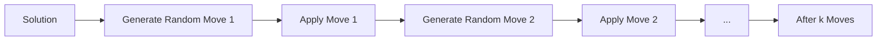

# Random Move Shake

Random Move Shake is a simple perturbation method that applies a sequence of random moves to a solution. It's one of the most straightforward shake implementations and serves as a baseline perturbation strategy.

## Overview

Random Move Shake perturbs a solution by applying random valid moves without considering whether they improve the objective function.


```mermaid
graph LR
    A[Solution] --> B[Generate Random Move 1]
    B --> C[Apply Move 1]
    C --> D[Generate Random Move 2]
    D --> E[Apply Move 2]
    E --> F[...]
    F --> G[After k Moves]
```

## Algorithm Outline

```
RandomMoveShake(solution, k):
    perturbed = clone(solution)
    
    for (i = 0; i < k; i++) {
        move = generateRandomMove(perturbed)
        apply(move, perturbed)
    }
    
    return perturbed
```
