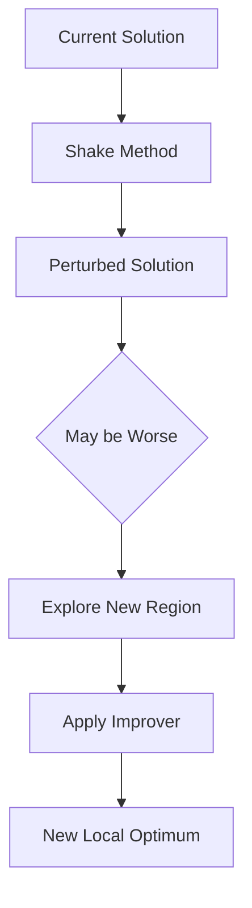

# Shake / Perturbation Methods

Shake methods (also called perturbation or diversification methods) are algorithm components that modify solutions in ways that may worsen their objective value. Unlike improvers, shakes are allowed to—and expected to—return worse solutions.

## Overview

Shakes help algorithms escape local optima by perturbing solutions. They introduce diversification into the search process.



## Base Shake Interface

```java
public abstract class Shake<S extends Solution<S, I>, I extends Instance> 
        extends AlgorithmComponent {
    
    /**
     * Perturb the given solution
     * @param solution Solution to shake
     * @return Perturbed solution (may be worse)
     */
    public abstract S shake(S solution);
}
```

## Key Principle: Diversification

**Critical difference from Improvers**: Shakes CAN return worse solutions:

```java
@Override
public S shake(S solution) {
    S perturbed = applyPerturbation(solution);
    
    // No requirement that perturbed is better!
    // perturbed.getScore() can be > solution.getScore()
    
    return perturbed;
}
```

## Common Shake Types

| Shake Type | Description | Documentation |
|------------|-------------|---------------|
| **Random Moves** | Apply random modifications | [Random Move](random-move.md) |
| **Destructive** | Remove elements from solution | [Destructive](destructive.md) |
| **Destroy-Rebuild** | Destroy part and reconstruct | [Destroy-Rebuild](destroy-rebuild.md) |
| **Large Moves** | Apply significant structural changes | See examples below |

## When to Use Shakes

Shakes are essential in:

- **Variable Neighborhood Search (VNS)**: Core perturbation mechanism
- **Iterated Local Search (ILS)**: Escape local optima between LS phases
- **Simulated Annealing**: Random moves with probabilistic acceptance
- **Iterated Greedy**: Destruction phase

## How to Use

### In VNS

```java
var shake = new MyShake();

var vns = new VNSBuilder<MySolution, MyInstance>()
    .withConstructive(constructor)
    .withImprover(improver)
    .withShake(shake)  // Perturbation mechanism
    .withNeighChange(5)
    .build("VNS");
```

### In Iterated Local Search

```java
var ils = new IteratedLocalSearch<>(
    "ILS",
    constructor,
    improver,
    shake,  // Perturbation between LS phases
    100
);
```

### Standalone

```java
// Escape from local optimum
var localOptimum = improver.improve(solution);
var perturbed = shake.shake(localOptimum);
var newLocalOptimum = improver.improve(perturbed);
```

## Implementation Guidelines

### Basic Pattern

```java
public class MyShake<S extends Solution<S, I>, I extends Instance> 
        extends Shake<S, I> {
    
    private final int strength;
    
    public MyShake(int strength) {
        super("MyShake");
        this.strength = strength;
    }
    
    @Override
    public S shake(S solution) {
        // Clone to avoid modifying original
        S perturbed = solution.cloneSolution();
        
        // Apply 'strength' random moves
        for (int i = 0; i < strength; i++) {
            Move randomMove = generateRandomMove(perturbed);
            randomMove.apply(perturbed);
        }
        
        return perturbed;
    }
    
    private Move generateRandomMove(S solution) {
        // Generate a random valid move
        var moves = solution.getAllPossibleMoves();
        return moves.get(ThreadLocalRandom.current().nextInt(moves.size()));
    }
}
```

### With Adaptive Strength

```java
public class AdaptiveShake<S extends Solution<S, I>, I extends Instance> 
        extends Shake<S, I> {
    
    private int baseStrength;
    private int currentStrength;
    
    public AdaptiveShake(int baseStrength) {
        super("AdaptiveShake");
        this.baseStrength = baseStrength;
        this.currentStrength = baseStrength;
    }
    
    @Override
    public S shake(S solution) {
        S perturbed = solution.cloneSolution();
        
        // Apply current strength moves
        for (int i = 0; i < currentStrength; i++) {
            Move move = generateRandomMove(perturbed);
            move.apply(perturbed);
        }
        
        return perturbed;
    }
    
    /**
     * Increase shake strength if stuck
     */
    public void increaseStrength() {
        currentStrength = Math.min(currentStrength + 1, baseStrength * 3);
    }
    
    /**
     * Reset to base strength when improvement found
     */
    public void reset() {
        currentStrength = baseStrength;
    }
}
```

### Parameterized by Neighborhood

```java
public class NeighborhoodShake<S extends Solution<S, I>, I extends Instance> 
        extends Shake<S, I> {
    
    private final int k;  // Neighborhood index
    
    public NeighborhoodShake(int k) {
        super("Shake-" + k);
        this.k = k;
    }
    
    @Override
    public S shake(S solution) {
        S perturbed = solution.cloneSolution();
        
        // Different shake depending on k
        switch (k) {
            case 1:
                applySmallPerturbation(perturbed);
                break;
            case 2:
                applyMediumPerturbation(perturbed);
                break;
            case 3:
                applyLargePerturbation(perturbed);
                break;
            default:
                applyRandomPerturbation(perturbed, k);
        }
        
        return perturbed;
    }
}
```

## Shake Strength

The **strength** or **intensity** of a shake determines how much the solution changes:

| Strength | Perturbation | Use Case |
|----------|--------------|----------|
| **Small (1-3 moves)** | Minor changes | Fine-grained exploration |
| **Medium (4-10 moves)** | Moderate changes | Balance exploration/exploitation |
| **Large (>10 moves)** | Major changes | Strong diversification |

## Design Considerations

### 1. Preserve Feasibility

Ensure shaken solutions remain feasible:

```java
@Override
public S shake(S solution) {
    S perturbed = solution.cloneSolution();
    
    // Apply moves
    for (int i = 0; i < strength; i++) {
        Move move = generateRandomMove(perturbed);
        // Only apply if maintains feasibility
        if (move.isFeasible(perturbed)) {
            move.apply(perturbed);
        }
    }
    
    return perturbed;
}
```

### 2. Controllable Intensity

Allow external control of shake strength:

```java
public interface ParameterizedShake<S extends Solution<S, I>, I extends Instance> 
        extends Shake<S, I> {
    
    S shake(S solution, int intensity);
}
```

### 3. Problem-Specific Perturbations

Design shakes that exploit problem structure:

```java
// TSP: reverse random segments
public class TSPSegmentReverse extends Shake<TSPSolution, TSPInstance> {
    @Override
    public TSPSolution shake(TSPSolution solution) {
        TSPSolution perturbed = solution.cloneSolution();
        int i = random.nextInt(perturbed.size());
        int j = random.nextInt(perturbed.size());
        if (i > j) {
            int temp = i; i = j; j = temp;
        }
        perturbed.reverse(i, j);
        return perturbed;
    }
}
```

## Related Java Classes

- **[`Shake<S, I>`](../../../../apidocs/es/urjc/etsii/grafo/shake/Shake.html)**: Base shake class
- **[`Destructive<S, I>`](../../../../apidocs/es/urjc/etsii/grafo/shake/Destructive.html)**: Destruction operators
- **[`DestroyRebuild<S, I>`](../../../../apidocs/es/urjc/etsii/grafo/shake/DestroyRebuild.html)**: Combined destroy-rebuild
- **[`RandomMoveShake<S, I>`](../../../../apidocs/es/urjc/etsii/grafo/shake/RandomMoveShake.html)**: Random move perturbation
- **[`VNS<S, I>`](../../../../apidocs/es/urjc/etsii/grafo/algorithms/vns/VNS.html)**: Uses shake as core component

## Example Use Cases

### TSP Random Swap

```java
public class TSPRandomSwap extends Shake<TSPSolution, TSPInstance> {
    private final int numSwaps;
    
    @Override
    public TSPSolution shake(TSPSolution solution) {
        TSPSolution perturbed = solution.cloneSolution();
        
        for (int i = 0; i < numSwaps; i++) {
            int idx1 = random.nextInt(perturbed.size());
            int idx2 = random.nextInt(perturbed.size());
            perturbed.swap(idx1, idx2);
        }
        
        return perturbed;
    }
}
```

### VRP Route Shake

```java
public class VRPRouteShake extends Shake<VRPSolution, VRPInstance> {
    @Override
    public VRPSolution shake(VRPSolution solution) {
        VRPSolution perturbed = solution.cloneSolution();
        
        // Move random customers between routes
        for (int i = 0; i < 3; i++) {
            Customer customer = perturbed.getRandomCustomer();
            Route newRoute = perturbed.getRandomRoute();
            perturbed.moveCustomer(customer, newRoute);
        }
        
        return perturbed;
    }
}
```

## Best Practices

1. **Clone solutions**: Don't modify the input solution
2. **Maintain feasibility**: Ensure perturbed solutions are valid
3. **Parameterize strength**: Allow control over perturbation intensity
4. **Problem-aware**: Design shakes that respect problem structure
5. **Efficient operations**: Use fast move types for perturbations
6. **Test effectiveness**: Monitor if shakes help escape local optima

## Common Patterns

### Progressive Intensity

```java
// Start with small perturbations, increase if stuck
int strength = 1;
while (!improved && strength < maxStrength) {
    perturbed = shake(solution, strength);
    improved = improver.improve(perturbed).isBetterThan(best);
    strength++;
}
```

### Random Walk

```java
// Pure random walk: always accept perturbed solution
for (int iter = 0; iter < maxIter; iter++) {
    solution = shake(solution);
    trackBest(solution);
}
```

## References

[1] Hansen, P., & Mladenović, N. (2001). Variable neighborhood search: Principles and applications. *European Journal of Operational Research*, 130(3), 449-467.

[2] Lourenço, H. R., Martin, O. C., & Stützle, T. (2003). Iterated local search. In *Handbook of Metaheuristics* (pp. 320-353). Springer.

[3] Gendreau, M., & Potvin, J. Y. (Eds.). (2010). *Handbook of metaheuristics* (Vol. 2). Springer.
