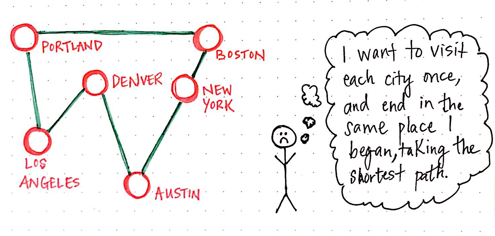
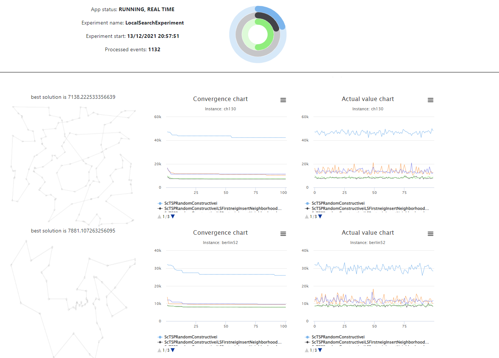

# Step-by-step example for the Travelling Salesman Problem (TSP) with Mork

## What is the Travelling Salesman Problem?

The traveling salesman problem (commonly denoted as TSP) asks the following question: "Given a list of cities and the
distances between each pair of cities, what is the shortest possible route that visits each city exactly once and
returns to the origin city?" It is an NP-hard problem in combinatorial optimization, important in theoretical computer
science and operations research.



Obtained
from *[The Trials And Tribulations Of The Traveling Salesman](https://medium.com/basecs/the-trials-and-tribulations-of-the-traveling-salesman-56048d6709d)*
.

## 1. Environment set up

### 1.1 Prerequisites

- Java 17 is required to run. Please download and install a recent JDK.
- [Maven](https://maven.apache.org/)
- This is not really a prerequisite, but we recommend using an IDE, such as [IntelliJ IDEA](https://www.jetbrains.com/idea/).
  

> 💡 *Tip:* Use SDKMAN to easily manage your JDKs and SDKs. Have a look to the official *[web page](https://sdkman.io/)*.

### 1.2 Download problem instances

In order to test the proposed algorithms for the TSP we will use the standard instances for the problem, that can be
easily obtained from *[TSPLIB](http://elib.zib.de/pub/mp-testdata/tsp/tsplib/tsplib.html)*.  
*[TSPLIB](http://elib.zib.de/pub/mp-testdata/tsp/tsplib/tsplib.html)* is a library of sample instances for the TSP  (and
related problems) from various sources and of various types. Particularly, we will use
the *[TSPLIB Symmetric Traveling Salesman Problem Instances](http://elib.zib.de/pub/mp-testdata/tsp/tsplib/tsp/index.html)*. For the moment, you will only need to download the following
files: [berlin52](http://elib.zib.de/pub/mp-testdata/tsp/tsplib/tsp/berlin52.tsp),
[eil101](http://elib.zib.de/pub/mp-testdata/tsp/tsplib/tsp/eil101.tsp),
[ch130](http://elib.zib.de/pub/mp-testdata/tsp/tsplib/tsp/ch130.tsp)
and [st70](http://elib.zib.de/pub/mp-testdata/tsp/tsplib/tsp/st70.tsp). Have a quick look at the structure of the files.

### 1.3 Using the quick start project generator

Go to *[https://generator.mork-optimization.com/](https://generator.mork-optimization.com/)*, set "TSP" in the Project Name field
and click on generate your project. In a few seconds you will be able to download your project. Then, extract the zip
file and import it in your favorite IDE.


> 💡 *Tip:* Some IDEs, allow you to select the `pom.xml` file when you select the option to import an existing project. If such a possibility exists, we highly recommend **importing the project as a maven project**. Some examples of how to import a [Maven](https://maven.apache.org/) project in the most important editors can be found in: [Eclipse](https://www.eclipse.org/m2e/), [IntelliJ](https://www.jetbrains.com/help/idea/maven-importing.html), or [NetBeans](https://netbeans.apache.org/wiki/MavenBestPractices.asciidoc).


For your future project, remember to choose a valid name, i.e., check that it starts with an Uppercase letter followed by
any alphanumeric characters or underscores, without spaces.

### 1.4 A quick look

The project is organized in the following folders

- 📁 **.run**

If you are using  [IntelliJ](https://www.jetbrains.com/idea/), you might have noticed that there are two default
configuration files: `Performance.run.xml` and `Validation.run.xml`. The main difference between both run configurations
is whether the assertions are enabled. In validation mode, assertions try to check the correctness of the problem implementation, by detecting common mistakes.
For more information see the specific doc page about [MorK validations](../features/validations.md) and [the official Java documentation](https://docs.oracle.com/javase/8/docs/technotes/guides/language/assert.html).
You may run your own run configurations, the main class is located at `es.urjc.etsii.grafo.<problemname>.Main` by default.

- 📁 **docker** :

Docker template and helper scripts to easily build, run and deploy your application using containers. For a detailed description, see [MorK containers](../features/docker.md).

- 📁 **instances**

This folder should contain everything related with the instances of the problem. In this case, since we are tackling
the TSP, this folder will contain the TSP instances. Therefore, you should put the downloaded instances (*.tsp files) from  
*[TSPLIB Symmetric Traveling Salesman Problem Instances](http://elib.zib.de/pub/mp-testdata/tsp/tsplib/tsp/index.html)*  
in this folder.

- 📁 **src/main**:
- 📁 **java/es.urjc.etsii.grafo.TSP**
    - 📁 **algorithms**: algorithmic components, i.e, constructive, local search, metaheuristics, etc.
    - 📁 **experiments**: defines experiments to execute to test the proposed algorithms and strategies.
    - 📁 **model**: contains the basic elements of the studied problem: solution, instance, etc.
    - 📁 **drawing**: helper class to draw solutions in the web frontend.
- 📁 **resources**
    - 📁 **irace**: irace is a software package that implements a number of automatic configuration procedures.
    - 📁 **static**: contains files to generate a localhost web page which allow the researcher to see the
      solution-quality convergence and the best solution found.
    - 📝 application.yml: this file contains the global configuration of the project, such as which experiment should be
      executed, which instances should be used, among others. For a detailed configuration description, see [MorK configuration](../features/config.md).
- 📝 .gitignore: this file tells Git which files to ignore when pushing your project to [GitHub](https://github.com/) or any other remote server.
- 📝 pom.xml: Maven configuration file, contains the project description and its dependencies. 

## 2. Our first step: reading instances

This Mork project aims to approach the Traveling Salesman Problem (TSP). Given a set of points, (that can be considered
as locations or cities), the TSP consists in finding a roundtrip of minimal total length visiting each node exactly once. In
this section you will learn, what an instance is, how to define an instance of the problem, and how to read an instance
from a file.

A problem instance contains all the input data needed to create solutions for a problem. Focusing on the problem at hand, an instance represents a map of cities or locations, all of them connected to each other. In this particular problem, all locations are defined by x/y coordinates.

At this point, you should have downloaded the instance
files ([berlin52.tsp](http://elib.zib.de/pub/mp-testdata/tsp/tsplib/tsp/berlin52.tsp)
, [eil101](http://elib.zib.de/pub/mp-testdata/tsp/tsplib/tsp/eil101.tsp)
, [ch130](http://elib.zib.de/pub/mp-testdata/tsp/tsplib/tsp/ch130.tsp)
and [st70](http://elib.zib.de/pub/mp-testdata/tsp/tsplib/tsp/st70.tsp)), and placed them at the instance folder of the project.

Have a look to any of those four files. The structure is the same for each of them. Particularly, these files have the 
following` <keyword>:<value>` structure, where `<keyword>` denotes an alphanumerical keyword and `<value>` denotes 
alphanumerical or numerical data:

- NAME : `<string>` // Identifies the data file.
- TYPE : `<string>` // Specifies the type of the data. In this case will be TSP.
- COMMENT :` <string>` // Additional comments.
- DIMENSION : `<integer>` // Number of its nodes (cities, locations, etc.)
- EDGE WEIGHT TYPE : `<string>` // Specifies how the edge weights (or distances) are given.
- NODE COORD SECTION :   `<integer> <real> <real>` // Node coordinates are given in this section.

Notice that the five instances selected have EDGE WEIGHT TYPE = EUC_2D, which means that the distance between two
points _i_ and _j_ is computed using the [Euclidean distance](https://en.wikipedia.org/wiki/Euclidean_distance): 

$$
{\displaystyle d(i,j)={\sqrt {(j_{1}-i_{1})^{2}+(j_{2}-i_{2})^{2}}}.}
$$

If you are interested in a deep description of the instances to test the proposed algorithm with other type of instance,
have a look to the [TSPLIB documentation](http://comopt.ifi.uni-heidelberg.de/software/TSPLIB95/tsp95.pdf).

Then, open file `TSPInstance.java` located in `src/main/java/es/urjc/etsii/grafo/TSP/model`. This class will represent 
an instance of the problem, i.e., a list of x/y coordinates. Therefore, we will carry out the following tasks:

- Define a structure that represents 2D coordinates.
- Define an attribute (in the `TSPInstance` class) that represents the list of locations and the distance between locations.
- Implement the class constructor and getter methods.

Try it yourself, and compare it with our code (there is more than one possible implementation, everyone thinks different!)

The resultant class could be something similar to:

```  
public class TSPInstance extends Instance {  
  
  /**  
   * List of coordinates 
   */  
   private final Coordinate[] locations;  
  
  
  /**  
   * Distance between all coordinates 
   */  
   private final double[][] distances;  
  
  /**  
   * Constructor 
   * @param name name of the instance  
   * @param locations list of coordiantes  
   */  
   protected TSPInstance(String name, Coordinate[] locations, double[][] distances) {  
      super(name);  
      this.locations = locations;  
      this.distances = distances;  
  }  
   
  /**  
   * Get the list of locations 
   * @return list of locations  
   */  
   public Coordinate[] getLocations() {  
      return locations;  
  }  
  
  /**  
   * Get the number of locations of the instance 
   * @return number of locations  
   */  
   public int numberOfLocations() {  
      return locations.length;  
   }  
  
  /**  
   * 2D coordinate 
   */  
   public record Coordinate(double x, double y) {}  
  
  
  /**  
   * Get coordinate of a specific location (that represents a city, place, facility...) * * @param id of the location  
   * @return the location coordinate  
   */  
   public Coordinate getCoordinate(int id) {  
      return this.locations[id];  
  }  
  
  
  /**  
   * Return the euclidean distance between two locations i and j. * * @param i first location  
   * @param j second location  
   * @return the euclidean distance  
   */
   public double getDistance(int i, int j) {  
      return this.distances[i][j];  
   }  
   
}
```  

> 💡 _Tip_: is this the first time you have come across record? You don't know what you're missing!! Record classes, which are a special kind of class, help to model plain data aggregates with less ceremony than normal classes. Have a look to the [Java documentation](https://docs.oracle.com/en/java/javase/16/language/records.html) abut record classes.


**⚠️IMPORTANT : after exiting the instance constructor method, i.e., the instance is defined and generated, it MUST BE
IMMUTABLE.**

Next, lets move on to the `TSPInstanceImporter.java` file. This class responsibility is generating problem instances given
some files. To this end, we will need to implement the method: `importInstance(BufferedReader reader, String filename)`
. This method receives as input parameters the buffered reader, managed by the framework, and the filename, returning the constructed instance.
Considering the TSP instance file structure, we will need to read the file line by line,
storing the list of coordinates and the distance between each pair of coordinates, and finally, calling the instance constructor. The
resultant class will be the following:

```
public class TSPInstanceImporter extends InstanceImporter<TSPInstance> {

    @Override
    public TSPInstance importInstance(BufferedReader reader, String filename) throws IOException {
        Scanner sc = new Scanner(reader).useLocale(Locale.US);
        String name = sc.nextLine().split(":")[1].trim();
        String type = sc.nextLine().split(":")[1];
        String comment = sc.nextLine().split(":")[1];
        int dimension = Integer.parseInt(sc.nextLine().split(":")[1].trim());
        String edgeWeightType = sc.nextLine().split(":")[1];
        String nodeCoordSection = sc.nextLine();
        TSPInstance.Coordinate[] locations = new TSPInstance.Coordinate[dimension];
        while (!sc.hasNext("EOF")) {
            int id = sc.nextInt() - 1;
            double x = sc.nextDouble();
            double y = sc.nextDouble();
            locations[id] = new TSPInstance.Coordinate(x, y);
        }
        double[][] distances = getMatrixOfDistances(locations);
        return new TSPInstance(name, locations, distances);
    }


    /**
     * Calculate all euclidean distances between all locations
     *
     * @param locations list of locations
     * @return a matrix of distances
     */
    private double[][] getMatrixOfDistances(TSPInstance.Coordinate[] locations) {
        var dimension = locations.length;
        double[][] distances = new double[dimension][dimension];
        for (int i = 0; i < dimension; i++) {
            for (int j = i+1; j < dimension; j++) {
                var distance = this.calculateEuclideanDistance(locations[i], locations[j]);
                distances[i][j] = distance;
                distances[j][i] = distance;
            }
        }
       return distances;
    }


    /**
     * Calculate the Euclidian distance of two given coordinates
     *
     * @param i first coordinate
     * @param j second coordinate
     * @return the euclidean distance between two coordiantes
     */
    public double calculateEuclideanDistance(TSPInstance.Coordinate i, TSPInstance.Coordinate j) {
        var di = i.x() - j.x();
        var dj = i.y() - j.y();
        return Math.sqrt((di * di) + (dj * dj));
    }
}
```

> 💡 _Tip_: You may use the BufferedReader as given, or initialize a Scanner from the BufferedReader. However, both approaches cannot be used at the same time (i.e, sometimes reading from the buffered reader and sometimes from the scanner), as it may result in missing input data.


## 3. Modelling solution

The next task is to define the TSP solution class. In this case, a solution corresponds to a circular path passing through each
of the instance locations. To define a solution in Mork we must edit the `TSPSolution` class. The objects of this class
represent the candidate solutions that are handled throughout the optimization algorithm developed. The simplest
implementation of a circular path is through an array of integers, where the index represents the order (or position) in
the path of the location (identified by the ID) referenced by that array index. It should be noted that an array type
structure is very appropriate for this purpose, since it allows direct access to its components. An efficient
implementation must take this type of details into account. In addition to this array, we will define another class
attribute that represents the objective function value of the solution, i.e., the route length.

    private double distance;  
 
    private final int[] route;

The main methods of the `TSPSolution` class are the following:

### Constructors

By default, two constructors must be implemented. The first one initializes a solution given an instance. The second one
initializes a solution given another solution, and it is used for cloning data. For example:

```
public TSPSolution(TSPInstance ins) {  
  super(ins);  
  this.route = new int[ins.numberOfLocations()];  
  Arrays.fill(route, -1);  
}
    
public TSPSolution(TSPSolution s) {  
   super(s);  
   this.route = s.route.clone();  
   this.distance = s.distance;  
}
```

### Objective function methods

We will also need a method to calculate the objective function of the solution. In Mork, there are two main
procedures to manage the objective function of the solution:

- `public double getScore()` : get the objective function of the solution. This procedure may behave like a getter method, returning cached score without performing any calculation.
- `public double recalculateScore()`: recalculate solution objective function. **Make sure this method does not have side effects** (a common mistake is updating caches while executing recalculateScore). If this method does have side effects, something that may happen is that two subsequent calls to `recalculateScore()` may return different results.

```  
public double getScore() {  
   return this.distance;  
}

public double recalculateScore() {  
   double distance = 0;  
   for (int i = 0; i < this.route.length; i++) {  
      var j = (i + 1) % this.route.length;  
      distance += this.getInstance().getDistance(route[i], route[j]);  
  }  
  return distance;  
}
```

> 🙋 *FAQ: If both methods should return the same value, why have two implementations?*
By using both implementations, the framework can validate when running in Validation mode 
that the implementation is correct, and that incremental score calculation works as expected, 
without slowing down execution when running in Performance mode.

### Moving methods

The solution class must have the necessary methods to operate and edit a solution. In this case, since it is a path,
methods to exchange the order of two locations (classic interchange movement), to establish a position in the path of a
specific location (classic interchange movement), or even to randomize a path make sense for the TSP.

```    
   /**  
    * Shuffle route 
    */
    public void shuffleRoute() {  
       ArrayUtil.shuffle(route);  
    }  
      
      
    /**  
     * Swap classical move: 
     * Swap the position in the route of two locations, given its actual positions. 
     * Example: actual route : [a,b,c,d,e,f], pi = 0,  pj= 1, resultant route= [b,a,c,d,e,f] 
     * Example: actual route : [a,b,c,d,e,f], pi = 1,  pj= 4, resultant route= [a,e,c,d,b,f] 
     * When the operation is performed, the objective function (this.distance) is updated
     * @param pi actual position of the location  
     * @param pj desired position  
     */
     public void swapLocationOrder(int pi, int pj) {  
        var i = this.route[pi];  
        var j = this.route[pj];  
        this.distance = this.distance - getDistanceContribution(pi) - getDistanceContribution(pj);  
        this.route[pi] = j;  
        this.route[pj] = i;  
        this.distance = this.distance + getDistanceContribution(pi) + getDistanceContribution(pj);  
    }  
      
      
    /**  
     * Insert classical move: 
     * Deletes a location from and array (given its position) and inserts it in the specified position. 
     * Example: actual route : [a,b,c,d,e,f], pi = 0,  pj= 1, resultant route= [b,a,c,d,e,f] 
     * Example: actual route : [a,b,c,d,e,f], pi = 1,  pj= 4, resultant route=[a,c,d,e,b,f] 
     * Example: actual route : [a,b,c,d,e,f], pi = 5   pj= 3, resultant route= [a,b,c,f,d,e] 
     * When the operation is performed, the objective function (this.distance) is updated * 
     * @param pi actual position of the location  
     * @param pj desired position  
     */
     public void insertLocationAtPiInPj(int pi, int pj) {  
        ArrayUtil.deleteAndInsert(this.route, pi, pj);  
        this.distance = this.recalculateScore();  
    }
```

> 💡 _Tip_: Take a look at the Javadocs of the util classes such as `CollectionUtil` and `ArrayUtil`, they may contain commonly used methods that are not implemented in the Java API. Are you missing some methods? Open an issue or submit a pull request!


## 4. Our first algorithms and experiments

In this section we will generate our first solutions for the TSP. To do so, we will perform the following tasks:

1. Implement a constructive that generates random solutions.
2. Define an experiment.
3. Run Mork: understanding the application.yml, the web interface and results.

### Constructive procedures

Constructive procedures are methods that generate solutions to a problem. To implement a constructive we are going to
use as an example the constructive procedure located in the `constructives` folder. Every constructive proposed for the
TSP must extend `Constructive<TSPSolution, TSPInstance>`.

A simple implementation of a randomized constructive is shown below:

```
    @Override
    public TSPSolution construct(TSPSolution solution) {
        for (int i = 0; i < solution.getInstance().numberOfLocations(); i++) {
            solution.setOrderOfLocation(i, i);
        }
        solution.shuffleRoute();
        solution.notifyUpdate();
        solution.setScore(solution.recalculateScore());
        return solution;
    }
```

### Define an experiment

Once the constructive procedure has been defined, let's define an experiment. Each of the experiments to be executed for the TSP should
be located in the 'experiments' folder and must extend the `AbstractExperiment<TSPSolution, TSPInstance>` class. To
define an experiment it is necessary to implement the method `getAlgorithms()`; which returns a list of algorithms. In
this case, we are only interested in testing a simple algorithm, a constructive procedure. Therefore, the resulting
experiment would look like this:

```
public class ConstructiveExperiment extends AbstractExperiment<TSPSolution, TSPInstance> {

    public ConstructiveExperiment(SolverConfig solverConfig) {
        super(solverConfig);
    }

    @Override
    public List<Algorithm<TSPSolution, TSPInstance>> getAlgorithms() {

        var algorithms = new ArrayList<Algorithm<TSPSolution, TSPInstance>>();

        algorithms.add(new SimpleAlgorithm<>(new TSPRandomConstructive()));

        return algorithms;
    }
}
```

### Run Mork

To run Mork it is necessary to configure the run parameters. To do so, go to `application.yml` file, located at
src/main/resources/. This file contains a list of well-documented properties. In this case we are going to focus just on
some of them:

- instances: in this property the path of the location of the instances should be indicated (either a specific instance or a folder of instances, or even a folder with folders of instances). It is possible to indicate a path for each
  experiment. In this case we set `default: 'instances'`.
- maximizing: since the TSP is a minimization optimization problem, maximizing is set to false: `maximizing: false`.
- experiments: this property determines which experiment or experiments should be executed. To do so, you can optionally use
  a regex expression. For a single experiment execution, just specify the class
  name: `experiments: 'ConstructiveExperiment'`. 

Have a look to the rest of configuration parameters and feel free to change whatever you want. 
A more detailed explanation of how configuration works can be found at [this link](../features/config.md).

Now we are ready to execute. Use your IDE to run the provided main method, IntelliJ should autodetect and create two configurations (Validation and Performance). You will see a lot of text and numbers in the console, don't worry, you can analyze them
carefully when the program finishes, it is not difficult to understand. While the algorithm is running, go
to: *[http://localhost:8080/](http://localhost:8080/)*. In that website, you will be able to visualize the convergence
chart and the actual value chart for each of the instance executed. In addition, you will be able to visualize the best
solution found (as soon as we learn how to do it in the next sections).

> 💡 _Tip_: when all experiments finish, the web server stops. If you wish to keep the webserver running, set: `event.webserver.stopOnExecutionEnd: false` in the application.yml file.

When the execution ends, go to the results folder and check that an Excel file (*.xlsx) has been correctly generated. The
Excel file contains two sheets: a summary of the results and raw results. Particularly, the summary file should report
the following data (exactly the same, Mork experiments are fully reproducible)

|                | ScTSPRandomConstructive |                |         |                |
|----------------|-------------------------|----------------|---------|----------------|
| Instance names | Min. score              | Sum Total T(s) | hasBest | Min. %Dev2Best |
| berlin52       | 25944.86163             | 0.002271       | 1       | 0              |
| ch130          | 42393.82045             | 0.0022626      | 1       | 0              |
| eil101         | 3094.175908             | 0.0024924      | 1       | 0              |
| st70           | 3285.619063             | 0.0015071      | 1       | 0              |

### Local Searches

In this section you will be able to implement local search procedures and define more complex experiments. A local
search algorithm starts from a candidate solution and then iteratively moves to a neighbor solution. As an example, we
will define to classical neighborhood based on the swap and insert movement. To this end, we will perform the following
tasks:

1. Implement a neighborhood structure.
2. Implement the insert/swap operator.
3. Define a Local Search experiment.

#### Implement a neighborhood structure

A neighborhoods represents all potential solutions that can be reached for a given solution applying a movement. In general, Neighborhoods can be explored using two different strategies:

1. Eager exploration: Movements in this neighborhood are generated at once, using a list (`List<>`) of EagerMoves. Convenient, but may waste computer resources when the improve method is not a best improvement approach.
2. Lazy exploration:  Movements in this neighborhood are generated lazily under demand using `Streams` with LazyMoves. Generate moves only when they need to be evaluated.

**Eager Exploration**

To better explain eager exploration we are going to use the Insert classical move as an example. The insert operator consist
in removing a location from the route and insert it between other two locations (i.e., insert it at a specific position)
.

Have a look to the example depicted in the figure above. The location with ID=7 has been removed from the route, and it
is wanted to insert it between locations 2 and 3. The resulting route after the insertion is shown in the second array.


Given the insert operator, the neighborhood is defined as all possible insertions of all locations in any position of
the route. To this end, we first create a class named: `InsertNeighborhood` that must
extend `Neighborhood<InsertNeighborhood.InsertMove, TSPSolution, TSPInstance>`, and
where `InsertNeighborhood.InsertMove`is the insert move operator we have to define. Once the header of the class
has been defined, next task will be to implement the method `public ExploreResult<...> explore(TSPSolution solution)`. 
This method will generate all possible insert moves given a solution (i.e., insert all locations in each of the
positions of the route). A straightforward implementation is shown below:

```
    @Override
    public ExploreResult<InsertMove, TSPSolution, TSPInstance> explore(TSPSolution solution) {
        List<InsertMove> list = new ArrayList<>();
        for (int i = 0; i < solution.getInstance().numberOfLocations(); i++) {
            for (int j = 0; j < solution.getInstance().numberOfLocations(); j++) {
                list.add(new InsertMove(solution, i, j));
            }
        }
        return new ExploreResult<>(list);
    }
```

Next task is to implement the Insert move: `public static class InsertMove extends EagerMove<TSPSolution, TSPInstance>`.
Notice that this class has been nested in `InsertNeighborhood` class. As you may have noticed, the constructor of an
insert move receive tree parameters: the solution and two integers: the position in the route of the location to insert
in a desired position. Regardless of the type of movement intended (Eager or Lazy), the following methods have to be
implemented:

- `boolean _execute()`: execute the move, return false if the move is not applied for any reason, or the solution does not change
- `double getValue()`: this procedure calculates the difference between the value of the solution that would be obtained
  if the movement were carried out, and the value of the current target solution. This method does NOT perform the
  movement, the solution (and its structures) must not change.
- `boolean improves()` : returns true if applying the move results in a better solution than the current one.

The easiest implementation of this class is depicted below.

```
    public InsertMove(TSPSolution solution, int pi, int pj) {  
      super(solution);  
     this.pi = pi;  
     this.pj = pj;  
    }  
      
    protected boolean _execute() {  
      this.getSolution().insertLocationAtPiInPj(pi, pj);  
      return true;
    }  
      
    public double getValue() {  
      var s = this.getSolution().cloneSolution();  
      s.insertLocationAtPiInPj(pi, pj);  
     return s.getScore() - this.getSolution().getScore();  
    }
```

In this example, `getValue()` performed the insert move in a cloned solution of the current one. Then it returns the
difference in the objective function value between the cloned one (the neighbor solution) and the current one. This
procedure is extremely inefficient. An efficient way to perform this calculation will evaluate just the part of the
solution that has changed after the move. We depict a more efficient approach in the swap move example.

**Lazy exploration**

Movements in this neighborhood are generated lazily under demand
using [`Streams`](https://docs.oracle.com/javase/8/docs/api/java/util/stream/Stream.html) with `LazyMoves`. In this
neighborhood we will need to build an exhaustive stream to iterate over it. We will use the classical swap move operator
to define a Lazy Neighborhood. This move, exchange the position in the route of two locations, and can be easily
explained through the following picture.


The main difference between this neighborhood and the previous one is the way in which the movements are defined. In
this case, instead of generating a list of movements, we will define a Stream. The general idea of this neighborhood is that given a movement, 
the next movement can be generated (if it exists). In this way, movements are only generated if they are needed. How to do
it? First, we generate the Swap Neighborhood
class (`SwapNeighborhood extends Neighborhood<SwapNeighborhood.SwapMove, TSPSolution, TSPInstance>`) and implement
the explore method. This method need to generate only the initial `SwapMove` object.

```
    @Override
    public ExploreResult<SwapNeighborhood.SwapMove, TSPSolution, TSPInstance> explore(TSPSolution solution) {
        int initialVertex = RandomManager.getRandom().nextInt(solution.getInstance().numberOfLocations());
        return new ExploreResult<>(new SwapMove(solution, initialVertex, initialVertex, (initialVertex + 1) % solution.getInstance().numberOfLocations()));
    }
```

Again, the `SwapMove` class is a nested class in `LazyNeighborhood` class. The main difference between Lazy moves and
Eager moves is that in Lazy Moves the method `LazyMove<TSPSolution, TSPInstance> next()` must be implemented (in
addition to all previous detailed methods). This method is in charge of generate next move in the stream sequence. Given
a move, it generates the next move if exists, or null otherwise. In this particular example we would like to swap a pair
of locations of the instance. Notice that the swap between a location A and B is equal to the swap between B and A.
Therefore, this procedure should avoid generating already visited moves. Our proposed procedure is depicted next:

    public LazyMove<TSPSolution, TSPInstance> next() {  
      var nextPj = (pj + 1) % s.getInstance().numberOfLocations();  
      var nextPi = pi;  
      if (nextPj == initialPi) {  
        nextPi = (nextPi + 1) % s.getInstance().numberOfLocations();
        if (nextPi == (initialPi -1 + s.getInstance().numberOfLocations())/ + s.getInstance().numberOfLocations()) {  
          return null;  
        }  
        nextPj = (nextPi + 1) % s.getInstance().numberOfLocations();  
      }  
      return new SwapMove(s, initialPi, nextPi, nextPj);  
    }

An example of the stream generated by this procedure, given an instance with locations A, B, C, D and E, starting with
the swap A <->B, will be the following: A <-> B, A <-> C, A <-> D, A <-> E, B <-> C, B <-> D, B <-> E, C <-> D, C <-> E,
D <-> E, and finally, `null`.

#### Define a Local Search experiment

Define a local search experiment is as easy as define a constructive experiment. Copy the `ConstructiveExperiment` class
in the same folder and rename it to `LocalSearchExperiment`. In Mork, there are already implemented two different type of local searches: `LocalSearchFirstImprovement` and `LocalSearchBestImprovement`. The first one follows a first improvement
strategy, i.e., as soon as it finds a move that results on an improvement, it is executed. The second one follows the best
improvement strategy, it explores all solutions of a neighborhood and execute the best possible move, the move that
results in the best solution of the neighborhood. In this experiment we are going to define 5 algorithms:

- Random constructive:
- Insert Neighborhood following a first and best improvement strategy
  - Swap Neighborhood following a first and best improvement strategy

```
public List<Algorithm<TSPSolution, TSPInstance>> getAlgorithms() {  
  var algorithms = new ArrayList<Algorithm<TSPSolution, TSPInstance>>();
  algorithms.add(new SimpleAlgorithm<>(new TSPRandomConstructive()));  
  algorithms.add(new SimpleAlgorithm<>(new TSPRandomConstructive(),new LocalSearchFirstImprovement<>(super.isMaximizing(), new InsertNeighborhood())));  
  algorithms.add(new SimpleAlgorithm<>(new TSPRandomConstructive(),new LocalSearchBestImprovement<>(super.isMaximizing(), new InsertNeighborhood())));  
  algorithms.add(new SimpleAlgorithm<>(new TSPRandomConstructive(),new LocalSearchFirstImprovement<>(super.isMaximizing(), new SwapNeighborhood())));  
  algorithms.add(new SimpleAlgorithm<>(new TSPRandomConstructive(),new LocalSearchBestImprovement<>(super.isMaximizing(), new SwapNeighborhood())));  
  return algorithms;
}
```

Now is the moment to run this new experiment. Change the experiment property in the `application.yml` file and run it!
Remember to look to the interactive dashboard run in [localhost](http://localhost:8080/). Which is the best algorithm?

## 5. Visualizing solutions

In some cases you may be interested in seeing the solutions you are generating with your algorithms. This may allow you
to detect possible problems, such as errors in the calculation of the objective function, or to detect weaknesses of the
proposed methods.

This can be easily done with Mork. First, you have to look for a program/software to represent the solution you are
generating. Particularly, in the case of the TSP, a solution of the problem represents a circular route that cover a
set of locations.

A simple, easy and open source software to visualize graph is [Graphviz](https://graphviz.org/). Graph visualization is
a way of representing structural information as diagrams of abstract graphs and networks. There are many other cool
libraries you could use to visualize graphs such as [Highcharts](https://www.highcharts.com/)
,[Chart.js](https://www.chartjs.org/) or [D3.js](https://d3js.org/), among others. For the
moment, [Graphviz](https://graphviz.org/) is enough.

All methods needed to draw a solution are located in `/drawing/DotGenerator.java`. We are not going to focus on how the
graph is generated. We recommend the interested reader to have a look to [Graphviz documentation](https://graphviz.org/). An example Graphviz diagram of a solution for the
instance [berlin52](http://elib.zib.de/pub/mp-testdata/tsp/tsplib/tsp/berlin52.tsp) is illustrated in the following
figure. Additionally, the source code that generates that figure can be found [here](berlin52.dot.txt).


Next task is to generate that figure each time a new best solution is found. Obviously, we want to show that figure in
the dashboard launched in *[http://localhost:8080/](http://localhost:8080/)*. To do so, you will need to have just a bit
of knowledge of javascript. Therefore, go to `resources/static/app.js` and complete two
methods: `function onSolutionGenerated(event)` and  `function onInstanceProcessingStart(event)`.

```
function onInstanceProcessingStart(event) {
    [...]
    // Draw best solution found
    $('.best-solutions').prepend("<div id='best-solution-" + instanceName + "' class='text-center box-rendered-solution'></div>");
    bestValue = NaN;
    current_best_sol = $('#best-solution-' + instanceName);
     [...]
}   
    
function onSolutionGenerated(event) {
    [...]    
    // Change to > if maximizing
    if (isNaN(bestValue) || event.score < bestValue) {
        const chart_to_update = current_best_sol;
        bestValue = event.score;
        $.get("/api/generategraph/" + event.eventId, (response) => {
            chart_to_update.html(` <p class="text-center"> best solution is ${event.score}</p>` +
                ``
            );
        });
    }
    [...]
}
```

Now it is time to execute again or Local Search experiment and analyse how the solution and the solution quality
evolves over the time. The result should be similar than the following image:



## 6. _Irace_

In short, Irace is a software package that implements a number of automatic configuration procedures, that allows us to
easily tune our algorithms when manually testing each possible configuration is not viable. Irace is integrated in Mork,
so tuning your algorithms is extremely easy. More information in the guidelines provided in the published
article: ["The irace package: Iterated racing for automatic algorithm configuration"](https://doi.org/10.1016/j.orp.2016.09.002)
, or in the *irace* package
documentation: ["The irace Package: User Guide"](https://cran.r-project.org/web/packages/irace/vignettes/irace-package.pdf)
.

To implement irace, please, have a look to [the documentation](../features/irace.md) for further details. Anyway, in
this section, we will explain how to implement irace for the TSP. Particularly, we will generate an experiment to
determine which is the best local search for the TSP:
First or Best improvement local search, and Insert or Swap Neighborhood.

1. Configure an irace experiment.
2. Define the parameters to test.
3. Adjusting scenario options.

### Configure an irace experiment

To configure an irace experiment it is needed to create a class that
extends `IraceAlgorithmGenerator<TSPSolution, TSPInstance>`. In a Mork project, just one class, and only one, can
extend `IraceAlgorithmGenerator`.

This class must implement the
method `public Algorithm<TSPSolution, TSPInstance> buildAlgorithm(IraceRuntimeConfiguration config)`, in charge of
generate an Algorithm based on `IraceRuntimeConfiguration` object. This object contains the configuration of the
experiment and will be defined in the next section. To obtain the configuration parameter, the
method `String getValue(String s)` have to be called. In this case, two parameters has to be defined: the strategy of
the local search (first or best); and the neighborhood (insert or swap).

```
public class IraceExperiment extends IraceAlgorithmGenerator<TSPSolution, TSPInstance> {

    @Override
    public Algorithm<TSPSolution, TSPInstance> buildAlgorithm(IraceRuntimeConfiguration config) {

        var localSearchName = config.getValue("localsearch").orElseThrow();
        var localSearchStrategy = config.getValue("localSearchStrategy").orElseThrow();
        var localSearch = buildLocalSearch(localSearchName, localSearchStrategy);
        var constructive = new TSPRandomConstructive();
        return new SimpleAlgorithm<>(constructive, localSearch);
    }


    private LocalSearch<? extends Move<TSPSolution, TSPInstance>, TSPSolution, TSPInstance> buildLocalSearch(String localSearchName, String localSearchStrategy) {

        var neighborhood = switch (localSearchName) {
            case "insert" -> new InsertNeighborhood();
            case "swap" -> new SwapNeighborhood();
            default -> throw new IllegalArgumentException("Not implemented: " + localSearchName);
        };

        return switch (localSearchStrategy) {
            case "first" -> new LocalSearchFirstImprovement<>(false, neighborhood);
            case "best" -> new LocalSearchBestImprovement<>(false, neighborhood);
            default -> throw new IllegalArgumentException("Not implemented: " + localSearchStrategy);
        };
    }
}
```

### Define the parameters to test

Go to file `/resources/irace/parameters.txt`  and include at the end the two following lines:

```
## Configuration of the local searches
localsearch "localsearch=" c (swap, insert)
localSearchStrategy "localSearchStrategy=" c (first, best)
```

As you might have noticed, `localsearch` and `localSearchStrategy` matches with the lines:

```
var localSearchName = config.getValue("localsearch").orElseThrow();
var localSearchStrategy = config.getValue("localSearchStrategy").orElseThrow();
```

Be sure that you leave some empty lines at the end of the file (we don't why it crashes if there are no lines)

### Adjusting scenario options

Next, go to `/resources/irace/scenario.txt` and read carefully all configuration parameters. Some parameters you could
modify are: `trainInstancesDir`, `maxExperiments`, `targetRunnerParallel`, among others.

### Execute irace

To execute irace, first, go to `application.yml` and enable irace:

```yml
# Enable irace integration? Check IRACE Wiki section before enabling
irace:
enabled: false

# False: use GraalVM implementation, does not need R installed locally
# True: Use shell to execute R scripts, R/Rscript need to be locally installed and in path
shell: true
```

Now, it's the moment when you wait up to a few hours until it ends. The time it takes to find the best configuration depends
on the number of instances specified, as well as it sizes and the number of experiments that will be carried out. After it finishes, you may see something similar to:

```
# Best configurations (first number is the configuration ID; listed from best to worst according to the sum of ranks):
 localsearch localSearchStrategy
 2       insert               first
 [...]
```

Great! Irace has determined that the best neighborhood strategy was 'First improvement', exploring the neighborhood of
the inserts. These results are consistent with our experimentation.

### Did you use irace?

Please, do not forget to cite the original paper where Manuel López-Ibañez _et al._ published it:

```
López-Ibáñez, M., Dubois-Lacoste, J., Cáceres, L. P., Birattari, M., & Stützle, T. (2016). The irace package: Iterated
racing for automatic algorithm configuration. Operations Research Perspectives, 3, 43-58.
```

## 7. Testing in Mork

#### Asserts

I'm sure you've spent hours in front of your code trying to find that 🤬 bug. For that reason, we consider that it is
important that any operation must be validated, and check that the implemented procedures perform the desired
behavior.  
And how can this be done in Mork? There are many ways, testing is one way, but in this case, we are talking about **asserts**. The keyword or reserved word **assert** is
used to state that at a certain point in the code a certain condition must be true. For example, if you write a method
that calculates the speed of a particle, you might assert that the calculated speed is less than the speed of light. Not
using it yet? Take a look at
the [official documentation](https://docs.oracle.com/javase/7/docs/technotes/guides/language/assert.html) and start
using it right now. Experience has shown that writing assertions while programming is one of the quickest and most
effective ways to detect and correct bugs. As an added benefit, assertions serve to document the inner workings of your
program, enhancing maintainability. By default, assertions are disabled at runtime. To enable assertions use
the `-enableassertions`, or `-ea`, as a program argument.


