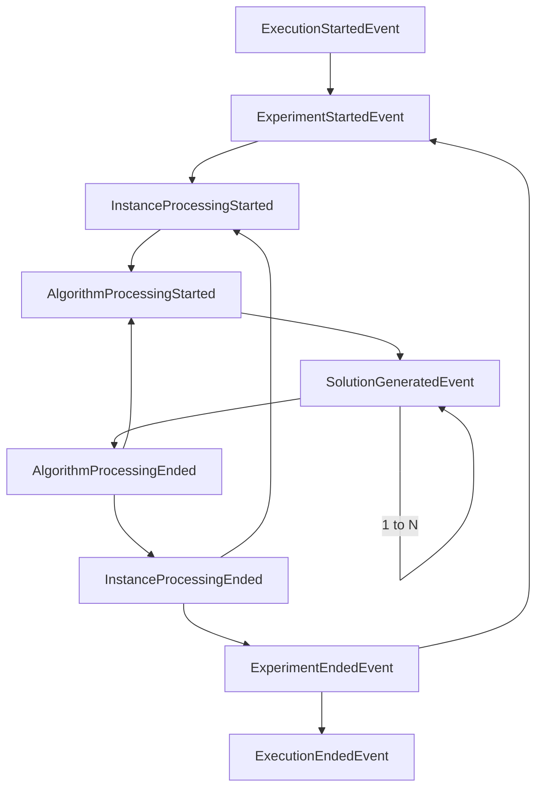

# Event system

## What
Events are actions or occurrences in any part of the application, that may or may not be handled by listeners. Events are propagated to event listeners asynchronously when certain actions happen (an instance is loaded, a solution is generated, an experiment ends, etc.)

## Why
Events allow users to easily extend the framework functionality without directly modifying it. Any application component can listen to events and react to them, even triggering events in response.
Although not being able to immediately execute a method when something happens may appear a disadvantage, the asynchronous nature of events allows us implement complex behaviour 
behind the scene, such as a concurrent or distributed experiment executor, while providing a very simple interface.

## Event guarantees

- Events are inmutable
- Events cannot be canceled or deleted once triggered
- All Mork events (in general, any event triggered by the framework) are guaranteed to be dispatched 
in the correct order, even if the execution order (such us when using a concurrent executor) is not defined.

## Event lifecycle
Event lifecycle or dispatch order. You may safely assume that the solver engine behaves like a state machine transitioning using the events defined in the diagram.




# Event types list
Most event names are self-explanatory, in case not:

| Event name                       | Explanation                                                                           |
|----------------------------------|---------------------------------------------------------------------------------------|
| `ExecutionStartedEvent`          | Fired once when solver is ready to start generating solutions                         |
| `ExperimentStartedEvent`         | Fired when starting each experiment                                                   |
| `InstanceProcessingStartedEvent` | An instance has been loaded and is going to be solved by different algorithms         |
| `AlgorithmProcessingStartdEvent` | A pair (instance, algorithm) is scheduled for execution                               |
| `SolutionGeneratedEvent`         | A solution has been generated for the tuple (Instance, AlgorithmConfig, Iteration)    |
| `AlgorithmProcessingEndedEvent`  | A pair (instance, algorithm) has finished executing                                   |
| `InstanceProcessingEndedEvent`   | An instance has been solved with all algorithm configurations and is no longer needed |
| `ExperimentEndedEvent`           | Experiment finalized, if there are no more experiments queued end                     |
| `ExecutionEndedEvent`            | All experiments done, fired before solver shutdowns                                   |


# Implementing an event listener

## Backend
Extend `AbstractEventListener` and create methods annotated by `@MorkEventListener.` For example, the telegram bot is implemented using a listener as follows:

```Java

public class TelegramEventListener extends AbstractEventListener {

    private final TelegramService telegramService;
    private volatile boolean errorNotified = false;

    public TelegramEventListener(TelegramService telegramService) {
        this.telegramService = telegramService;
    }

    // Notify user when experiment ends
    @MorkEventListener
    public void onExperimentEnd(ExperimentEndedEvent event) {
        if (!telegramService.ready()) return;
        telegramService.sendMessage(String.format("Experiment %s ended. Execution time: %s seconds", event.getExperimentName(), event.getExecutionTime() / 1_000_000_000));
    }

    // Notify user of the first error
    @MorkEventListener
    public void onError(ErrorEvent event) {
        if (!telegramService.ready()) return;
        // Only notify first error to prevent spamming
        if (!errorNotified) {
            errorNotified = true;
            var t = event.getThrowable();
            telegramService.sendMessage(String.format("Execution Error: %s. Further errors will NOT be notified.", t));
        }
    }

    // Stop Telegram bot when execution ends
    @MorkEventListener
    public void onExecutionEnd(ExecutionEndedEvent event) {
        telegramService.stop();
    }
}
```

If you want to listen to all framework events, use the superclass `MorkEvent`.

## Frontend
Implement the methods `onEventName()`. See `app.js` file in template project for example implementations.

If you want to listen to all framework events use the method `onAnyEvent()`.


# Using custom events
Triggering custom events is extremely easy, for example in custom algorithms such as genetic algorithms.

Just extend `MorkEvent` class, fill with data from any part of your code, and propagate to the framework using `EventPublisher.getInstance().publishEvent(event)`.
Remember that all events are processed asynchronously, and they MUST be immutable (i.e do not implement any setter).
