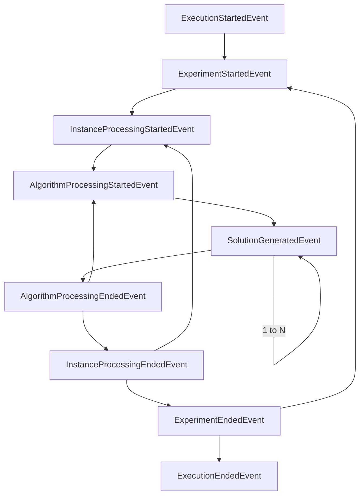

# Event system

## What
Events are actions or occurrences in any part of the application that may or may not be handled by listeners. Events are queued by Mork and dispatched from a single event dispatcher thread when certain actions happen (an instance is loaded, a solution is generated, an experiment ends, etc.). Framework event payloads are immutable Java records that implement the empty `MorkEvent` marker interface.

## Why
Events allow users to easily extend the framework functionality without directly modifying it. Any application component can listen to events and react to them, even triggering events in response.
Although not being able to immediately execute a method when something happens may appear a disadvantage, the dispatcher keeps user listener code outside the solver's critical path while preserving a simple interface.

## Event guarantees

- Event payloads are immutable. 
- Events cannot be canceled or deleted once accepted.
- All Mork events are assigned an increasing event ID during dispatch and are dispatched in queue order, even when the execution order itself is not deterministic, such as when using a concurrent executor.
- An exception from one Mork backend listener does not prevent the remaining Mork listeners from receiving the same event.

The event queue accepts up to 100,000 events. Publication is non-blocking and fails fast if that capacity is exhausted.

## Graceful draining

At shutdown, Mork rejects new events from external threads and drains every event that it already accepted. Events published recursively by a listener on the dispatcher thread are still accepted and processed. Draining has no timeout: it completes only when the queue, including recursively generated events, is completed. The Spring context is closed only after `ExecutionEndedEvent` has been published and the event publisher has finished draining.

## Event lifecycle
Event lifecycle or dispatch order. You may safely assume that the solver engine behaves like a state machine transitioning using the events defined in the diagram.


```mermaid
graph TD;
    ExecS[ExecutionStartedEvent];
    ExpS[ExperimentStartedEvent];
    InsS[InstanceProcessingStartedEvent];
    AlgS[AlgorithmProcessingStartedEvent];
    SolG[SolutionGeneratedEvent];
    AlgE[AlgorithmProcessingEndedEvent];
    InsE[InstanceProcessingEndedEvent];
    ExpE[ExperimentEndedEvent];
    ExecE[ExecutionEndedEvent];
    ExecS-->ExpS;
    ExpS-->InsS;
    InsS-->AlgS;
    AlgS-->SolG
    SolG-->AlgE;
    AlgE-->InsE;
    InsE-->ExpE;
    ExpE-->ExecE;
    
    SolG-->|1 to N| SolG;
    AlgE-->AlgS;
    InsE-->InsS;
    ExpE-->ExpS;
    
```


## Event types list
Most event names are self-explanatory, in case not:

| Event name                       | Explanation                                                                           |
|----------------------------------|---------------------------------------------------------------------------------------|
| `ExecutionStartedEvent`          | Fired once when solver is ready to start generating solutions                         |
| `ExperimentStartedEvent`         | Fired when starting each experiment                                                   |
| `InstanceProcessingStartedEvent` | An instance has been loaded and is going to be solved by different algorithms         |
| `AlgorithmProcessingStartedEvent` | A pair (instance, algorithm) is scheduled for execution                              |
| `SolutionGeneratedEvent`         | A solution has been generated for the tuple (Instance, AlgorithmConfig, Iteration)    |
| `AlgorithmProcessingEndedEvent`  | A pair (instance, algorithm) has finished executing                                   |
| `InstanceProcessingEndedEvent`   | An instance has been solved with all algorithm configurations and is no longer needed |
| `ExperimentEndedEvent`           | Experiment finalized, if there are no more experiments queued end                     |
| `ExecutionEndedEvent`            | All experiments done, fired before solver shutdowns                                   |


## Implementing an event listener

### Backend
Create methods annotated with `@MorkEventListener`. Classes with `@MorkEventListener` methods are discovered automatically, including annotated methods inherited through superclasses and interfaces; users do not need to extend a base listener class or add Spring annotations. For example, the Telegram bot can be implemented using a listener as follows:

```Java

public class TelegramEventListener {

    private final TelegramService telegramService;
    private volatile boolean errorNotified = false;

    public TelegramEventListener(TelegramService telegramService) {
        this.telegramService = telegramService;
    }

    // Notify user when experiment ends
    @MorkEventListener
    public void onExperimentEnd(ExperimentEndedEvent event) {
        if (!telegramService.ready()) return;
        telegramService.sendMessage(String.format("Experiment %s ended. Execution time: %s seconds", event.experimentName(), event.executionTime() / 1_000_000_000));
    }

    // Notify user of the first error
    @MorkEventListener
    public void onError(ErrorEvent event) {
        if (!telegramService.ready()) return;
        // Only notify first error to prevent spamming
        if (!errorNotified) {
            errorNotified = true;
            var t = event.throwable();
            telegramService.sendMessage(String.format("Execution Error: %s. Further errors will NOT be notified.", t));
        }
    }

    // Stop Telegram bot when execution ends
    @MorkEventListener
    public void onExecutionEnd(ExecutionEndedEvent event) {
        telegramService.stop();
    }
}
```

If you want to listen to all framework events, accept the marker interface `MorkEvent` as the listener parameter.

### Frontend

TODO: currently being rewritten

## Using custom events
Triggering custom events is extremely easy, for example in custom algorithms such as genetic algorithms.

Define an immutable record that implements `MorkEvent`, fill it with data from any part of your code, and propagate it to the framework using `MorkEventPublisher`.

```java
public record PopulationUpdatedEvent(
        int generation,
        double bestScore
) implements MorkEvent {}

public class GeneticAlgorithm extends Algorithm<MySolution, MyInstance> {

    private final MorkEventPublisher eventPublisher;

    public GeneticAlgorithm(MorkEventPublisher eventPublisher) {
        this.eventPublisher = eventPublisher;
    }

    @Override
    public MySolution algorithm(MyInstance instance) {
        // [...]
        eventPublisher.publish(new PopulationUpdatedEvent(generation, bestScore));
        // [...]
    }
}
```

Records are the preferred event payload type because their components are final and their accessors are unambiguous. If a record component is a mutable collection, make a defensive copy in the compact constructor.

## Event API
The REST and WebSocket APIs expose event envelopes. Transport metadata exists only in the envelope: `eventId` is assigned during ordered dispatch, `timestamp` is the event acceptance time, and `workerName` is the producer thread name. Payload JSON contains only event-specific data and does not duplicate `type`, `timestamp`, or `workerName`:

```json
{
  "eventId": 42,
  "type": "SolutionGeneratedEvent",
  "timestamp": 1782912345678,
  "workerName": "worker-1",
  "payload": {
    "resultId": "d290f1ee-6c54-4b01-90e6-d701748f0851",
    "experimentName": "default",
    "instanceName": "instance-01",
    "algorithmName": "myAlgorithm"
  }
}
```

Use the payload when reacting to event-specific fields. A result ID is a `UUID` in the Java API and is serialized as a JSON string. Use `resultId` from `SolutionGeneratedEvent` with `ResultStore.findSolution(UUID)` when server-side code needs the full solution.
