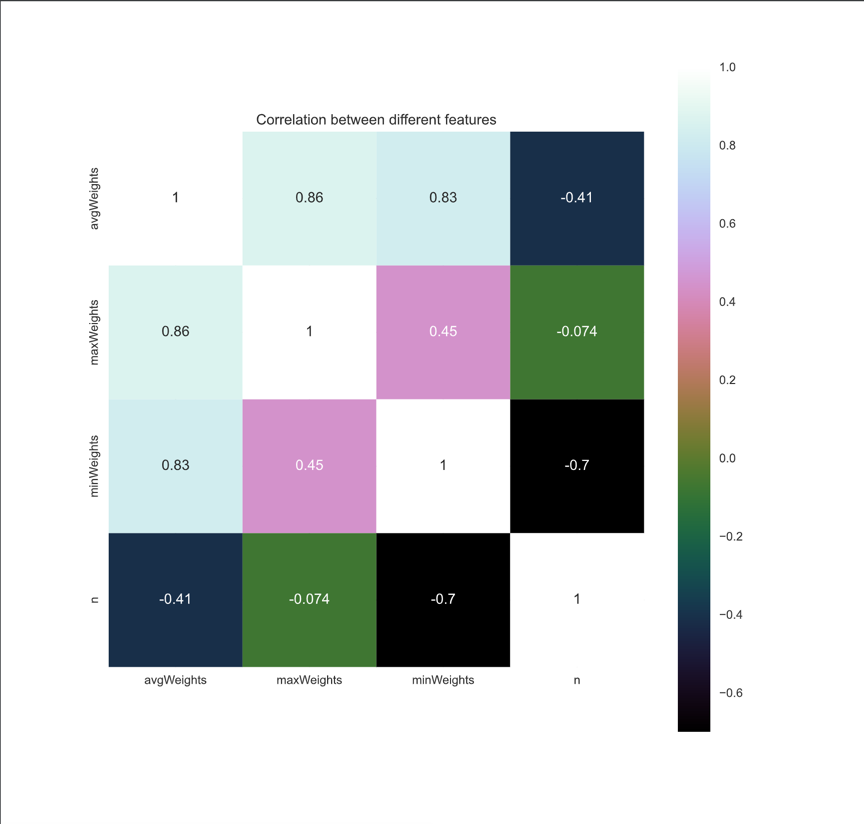
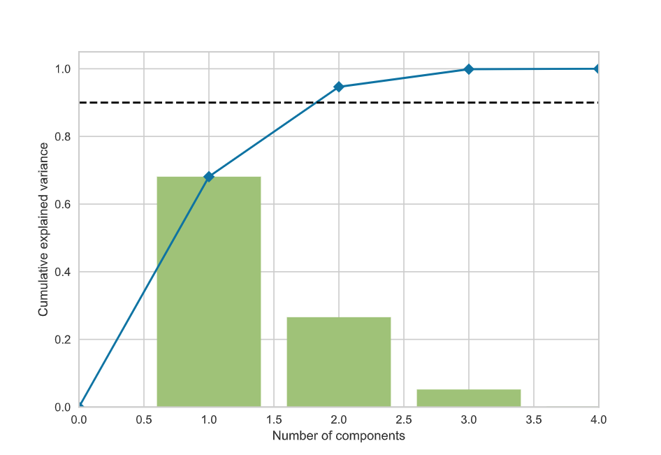
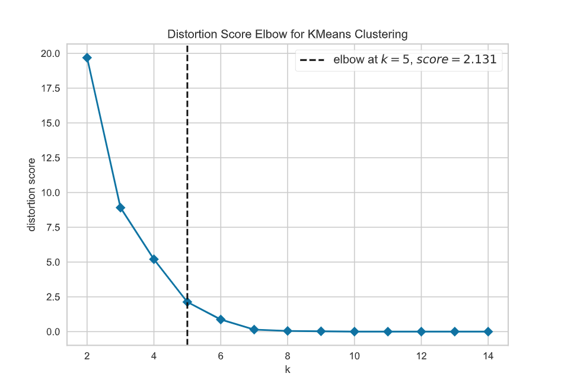
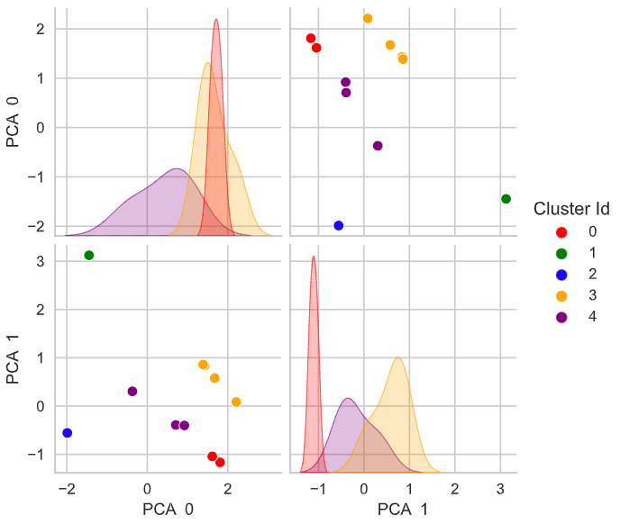

# Automatic instance selection

Since v0.18, Mork includes an automatic instance selector that can be used to decide which instances 
to use for the preliminary experimentation without user intervention.

## TL;DR

Any JAR file built con Mork v0.18 or later, can be invoked as follows:
```text
java -jar MyProblem.jar --instance-selector
```

**Demo**
<video controls style="width: 100%">
<source src="instance-selection.mp4" type="video/mp4">
</video>

## Requirements
Python3 and pip must be installed and available in PATH. 
Required Python dependencies for the instance selector are automatically installed using pip.

Moreover, the instance must declare at least one numeric property to use for classification. 
The more properties declared, the better. Any redundant information in instance properties will be 
automatically removed, see section [How it works](#how-it-works) for more information.

Instance properties can be easily declared during instance load or during instance construction using the method
`MyProblemInstance::setProperty(name,value)`. For example, in the DRFLP problem I declared the properties as follows:
```java
    @Override
    public DRFLPInstance importInstance(BufferedReader reader, String filename) {
        Scanner sc = new Scanner(reader);
        // Instance parsing code removed for simplicity
        ...
        
        var instance = new DRFLPInstance(filename, facilities, weights);
        double[] avgs = new double[n];
        for (int i = 0; i < weights.length; i++) {
            var row = weights[i];
            avgs[i] = (double) ArrayUtil.sum(row) / n;
        }
        instance.setProperty("n", n);
        instance.setProperty("avgWeights", ArrayUtil.sum(avgs) / n);
        instance.setProperty("minWeights", ArrayUtil.min(avgs));
        instance.setProperty("maxWeights", ArrayUtil.max(avgs));
        return instance;
    }
```

## Configuration
The behaviour of the instance selector can be easily configured, using the following properties:

| Property                           | Description                                                                                          | Default value                         |  
|------------------------------------|------------------------------------------------------------------------------------------------------|---------------------------------------|
| `instances.preliminar-percentage`  | Which proportion of the total set of instances should <br>be selected. Value must be in range (0, 1) | 0.15                                  |
| `instances.preliminar-output-path` | Where should be the preliminary instances be copied,<br> and where to save the generated diagrams    | output                                |
| `instances.for-selection`          | Path to the whole set of instances                                                                   | Property <br>`instances.path.default` |

For example, to use a 20% preliminary set size, and output results to folder preliminar-output, the command would be similar to:
```text
java -jar MyProblem.jar --instance-selector --instances.preliminar-percentage=0.2 --instances.preliminar-output-path=preliminar-output
```
## How it works

### Loading
The instance selector will load all instances specified in property `instances.for-selection`, or if not defined, `instances.path.default`.
If the folder contains folders inside, they will be recursively enumerated. For each instance, all declared properties are calculated, and non-numeric properties are ignored.
A CSV file with the raw property data is exported as `instance_properties.csv`, with a content similar to the following:
```csv
id,avgWeights,maxWeights,minWeights,n
A60_01.txt,2.00,3.86,0.46,60.0
A60_02.txt,1.14,2.7,0.26,60.0
A60_03.txt,0.96,2.68,0.13,60.0
A60_04.txt,0.51,1.18,0.0,60.0
A60_05.txt,0.63,1.41,0.05,60.0
A70_01.txt,1.09,2.74,0.18,70.0
A70_02.txt,1.28,2.64,0.12,70.0
A70_03.txt,1.03,2.2,0.15,70.0
A70_04.txt,0.67,1.31,0.14,70.0
A70_05.txt,3.19,6.71,0.47,70.0
sko56_01.txt,2.72,3.66,1.87,56.0
sko56_02.txt,2.72,3.66,1.87,56.0
sko56_03.txt,2.72,3.66,1.87,56.0
sko56_04.txt,2.72,3.66,1.87,56.0
sko56_05.txt,2.72,3.66,1.87,56.0
```

### Correlation and filtering
The data is then loaded by the Python script `instance_selector.py`, and the first step is 
calculating the correlation between each pair of properties, and exporting it to `$output/correlation.pdf`. Example:


### Principal Component Analysis
Then, characteristics are standardized and the PCA (Principal Component Analysis) method is used to reduce
the dimensionality of the characteristics set. 
To decide how many components should be used, we select the minimum number of components whose accumulated
explained variance ratio is greater than a configured preset, normally 90%, and the pca.pdf is generated 
containing a diagram detailing this step.


### Clustering
Once the dimensionality is reduced, the next step is clustering the instances, using the k-means++ algorithm.
Because the number of clusters is not known in advance, we use the elbow method to decide a reasonable number of clusters.
The elbow method is based on the fact that the distortion score for each clustering try will decrease as we increase
the number of clusters, with diminishing returns. 
We select the number of clusters where the slope of the curve has a significant change, visually, the elbow of the curve.
The diagram `kElbow.pdf` and `pairPlots.pdf` are generated. Te first one explains the decisions taken in this step for the current user execution, with a content similar to the following:


While the second one can be used to visually validate the quality of the clustering:


### Instance ranking
The last step consists on ranking the instances in each cluster according to their distance to the cluster centroid,
and selecting the top instances for each cluster, up to the number of instances requested. 
The amount of selected preliminary instances is the multiplication of the ratio defined by the user and the total number of instances detected.