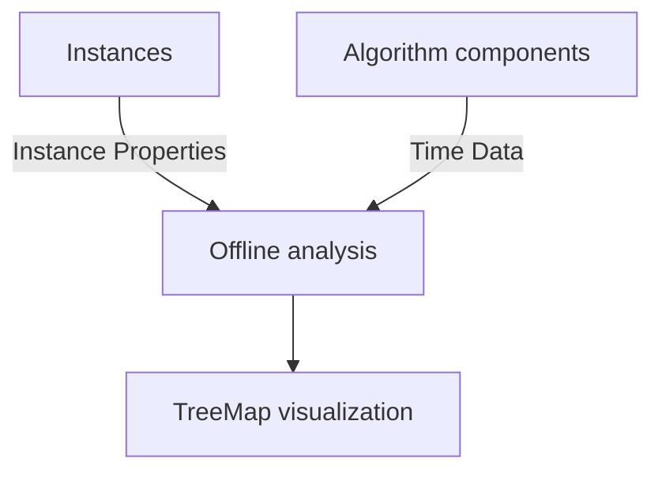

# Complexity Analysis

## Summary

The complexity analysis tool is designed to estimate the time complexity of each algorithm component
by collecting data on method execution times. It provides insights into how
each component scales according to the instance properties allowing developers to identify bottlenecks and optimize performance.

The main difference against a traditional profiler is that profilers measure the time spent in each method.
We further take this data and analyze it to understand how the execution time of each method changes with respect to the instance properties.



## Data inputs

### Instance properties 

### Time data

Each time an observed method is executed, the following data is collected:
```json
{
    "enter" : true,
    "when" : 90191241430166,
    "clazz" : "SimpleAlgorithm",
    "method" : "algorithm"
  }
```

and when the method finalizes:
```json
{
    "enter" : false,
    "when" : 90191243185083,
    "clazz" : "SimpleAlgorithm",
    "method" : "algorithm"
  }
```

This way, we can calculate the time spent in each method by subtracting the timestamps of the `enter` and `exit` events.
Data can be stacked, for example if the algorithm calls a constructor method, the data will look like this:
```json
[
  {
    "enter": true,
    "when": 90191241430166,
    "clazz": "SimpleAlgorithm",
    "method": "algorithm"
  },
  {
    "enter": true,
    "when": 90191241446083,
    "clazz": "SleepyConstructive",
    "method": "construct"
  },
  {
    "enter": false,
    "when": 90191243185083,
    "clazz": "SleepyConstructive",
    "method": "construct"
  },
  {
    "enter": false,
    "when": 90191243186083,
    "clazz": "SimpleAlgorithm",
    "method": "algorithm"
  }
]
```

## Offline analysis

Data is imported directly from the JSON files generated by exporting the solutions.
By offline analysis, we mean that the analysis is performed after the algorithm has been executed, not during its execution, and therefore can be done with different configurations and parameters without requiring the algorithm to be run again.

For each algorithm component that has been used, we try to fit complexity functions against each instance property individually.
Fitting is performed using `curve_fit` from scipy, and the quality of the fit is measured using the configured metric (MSE by default).
The best fit for each algorithm component is stored and then used to generate a treemap visualization.

If the experiment has been run multiple times, all data is loaded and execution times are averaged for each algorithm component.

## Output


### TreeMap visualization

### Fitness chart