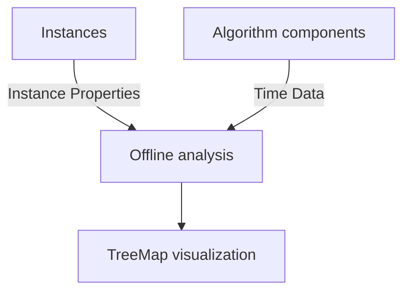

# Complexity Analysis

## Summary

The complexity analysis tool is designed to estimate the time complexity of each algorithm component
by collecting data on method execution times. It provides insights into how
each component scales according to the instance properties allowing developers to identify bottlenecks and optimize performance.

The main difference against a traditional profiler is that profilers measure the time spent in each method.
We further take this data and analyze it to understand how the execution time of each method changes with respect to the instance properties.


```mermaid
flowchart TD
    A[Instances] -->|Instance Properties| C[Time Data]
    B[Algorithm components] -->|Time Data| C[Offline analysis]
    C --> E[TreeMap visualization]
```

## Data inputs

### Instance properties

Instance properties (also called *instance features*) are the numeric characteristics of each
instance that the tool uses as the independent variables when fitting complexity functions — for
example the number of nodes or edges of a graph, the number of jobs, the instance size, etc.

These are the same properties you expose from your `Instance` class through `setProperty(key, value)`
(or by overriding `customProperties()`). The analysis reads one value per property and instance and
tries to explain the measured execution times as a function of them.

!!! note
    An instance property is only usable if it takes at least a handful of different values across the
    analyzed instances (5 by default). Properties that are constant, or that barely change, are
    discarded because they cannot explain how the execution time scales. The tool can fit against a
    single property or a pair of properties, penalizing two-property fits to avoid overfitting.

### Time data

Each time an observed method is executed, the following data is collected:
```json
{
    "enter" : true,
    "when" : 90191241430166,
    "clazz" : "SimpleAlgorithm",
    "method" : "algorithm"
  }
```

and when the method finalizes:
```json
{
    "enter" : false,
    "when" : 90191243185083,
    "clazz" : "SimpleAlgorithm",
    "method" : "algorithm"
  }
```

This way, we can calculate the time spent in each method by subtracting the timestamps of the `enter` and `exit` events.
Data can be stacked, for example if the algorithm calls a constructor method, the data will look like this:
```json
[
  {
    "enter": true,
    "when": 90191241430166,
    "clazz": "SimpleAlgorithm",
    "method": "algorithm"
  },
  {
    "enter": true,
    "when": 90191241446083,
    "clazz": "SleepyConstructive",
    "method": "construct"
  },
  {
    "enter": false,
    "when": 90191243185083,
    "clazz": "SleepyConstructive",
    "method": "construct"
  },
  {
    "enter": false,
    "when": 90191243186083,
    "clazz": "SimpleAlgorithm",
    "method": "algorithm"
  }
]
```

## Offline analysis

Data is imported directly from the JSON files generated by exporting the solutions.
By offline analysis, we mean that the analysis is performed after the algorithm has been executed, not during its execution, and therefore can be done with different configurations and parameters without requiring the algorithm to be run again.

For each algorithm component that has been used, we try to fit complexity functions against each instance property individually.
Fitting is performed using `curve_fit` from scipy, and the quality of the fit is measured using the configured metric (MSE by default).
The best fit for each algorithm component is stored and then used to generate a treemap visualization.

If the experiment has been run multiple times, all data is loaded and execution times are averaged for each algorithm component.

## Output


### TreeMap visualization

The main output is an interactive **treemap**: each box represents an algorithm component, nested
following the call hierarchy (an algorithm contains its constructive, its improver, and so on). Every
box is annotated with the best complexity function found for that component with respect to the
instance properties, so you can see at a glance which components dominate the running time and how
each one scales.

The treemap is interactive: only the top levels are shown initially, and clicking a component expands
its children, letting you drill down into the parts of the algorithm that matter most.

### Fitness chart

For any component you can open a **fitness chart** that plots the measured execution times (as data
points) against the fitted complexity function (as a curve). When the best fit depends on a single
instance property the chart is a 2D plot; when it depends on two properties it becomes a 3D surface.

This chart is how you judge the quality of a fit: if the curve follows the data points closely the
estimated complexity is trustworthy, whereas a poor fit hints that the component's cost depends on
some property that is not being measured, or that more (or larger) instances are needed.
